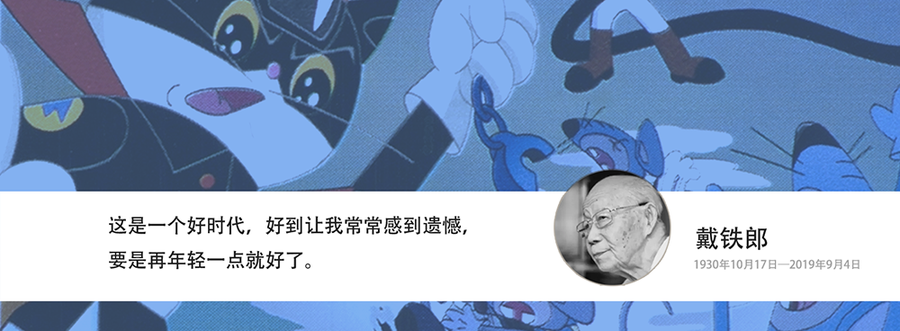

# 知识库       
> 终身学习，终身成长
> 

***

## [全流程美术](/全流程美术/README.md)

全流程知识笔记。以Maya为主体平台，部分使用3dsmax。涵盖了中英文学习资料，抛去细枝末节，关注核心知识点。结合项目开发，有更深度的定制。

## [游戏引擎](/游戏引擎/README.md)

包含Unity,Unreal等主流游戏引擎的学习和实践案例。

## [游戏设计](/游戏设计)

对游戏设计的学习和总结。

## [插件工具](/插件工具)
收集整理实用插件

## [编程及AI](/技术美术)

包含编程等和美术交叉的部分领域。

## [读书笔记](/读书笔记)

一些读书的笔记。

## [个人项目](/项目实践)

作者的项目

## [作者介绍](/作者)

是一个人是故事，也是一个时代里小人物的学习成长史。
