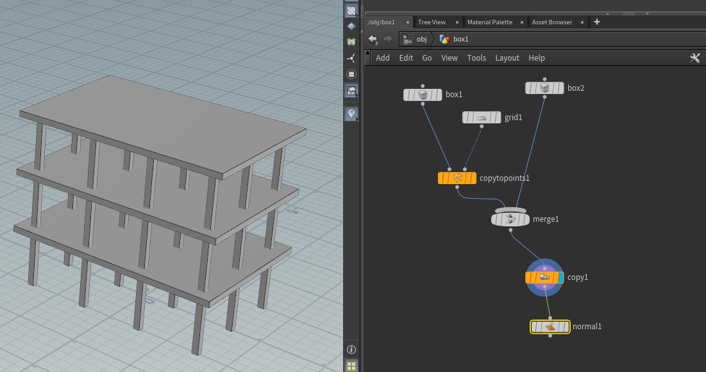
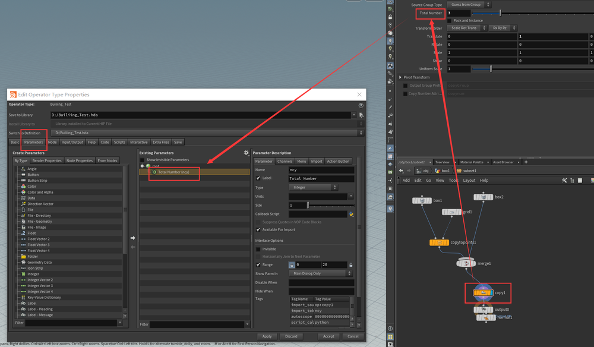
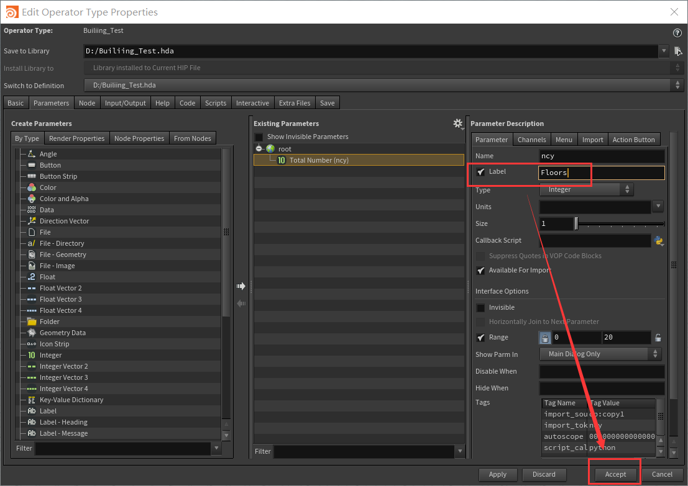
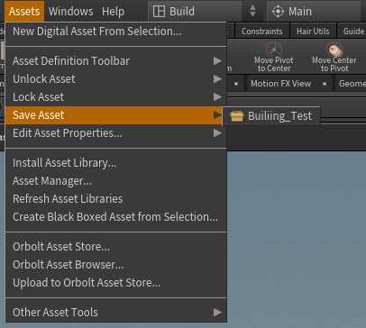
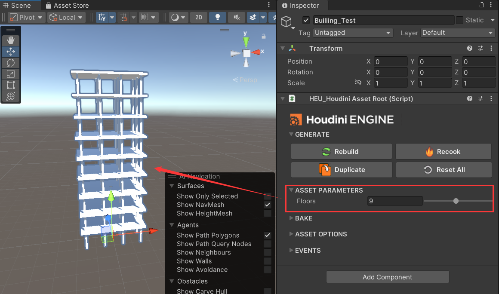

# Houdini Engine | Create an Asset for Unity

## 创建节点网  
  
设置一个楼层的复制参数来验证   
## 打包设置参数  
  
选择全部节点后，点击创建HDA    
     
设置参数。把节点的属性拖到root下，暴露参数   
   
并修改变量名   
    
最后需要保存HDA  
##  Unity导入  
- 先安装`Visual Scripting`包，Houdini Engine for Unity对此有依赖
- 再安装`Houdini Engine for Unity`(Unity 版本在 2021.1 及以上)   
- 坑爹的需要Houdini版本和Houdini Enginer版本匹配。而Unity商店导入的是一个固定老版本  
需要从Houdini 安装目录导入package   
  > C:\Program Files\Side Effects Software\Houdini 19.5.303\engine\unity   

   
可以使用了。接着导入HDA  
    
Houdini中设置的参数可以在Unity中使用了   
