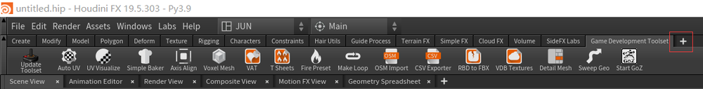
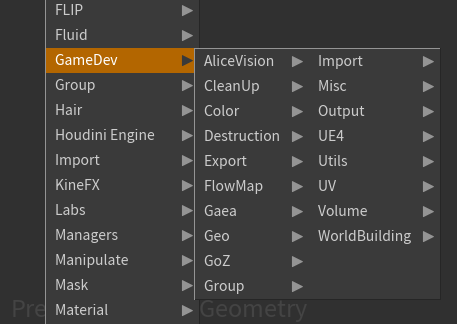
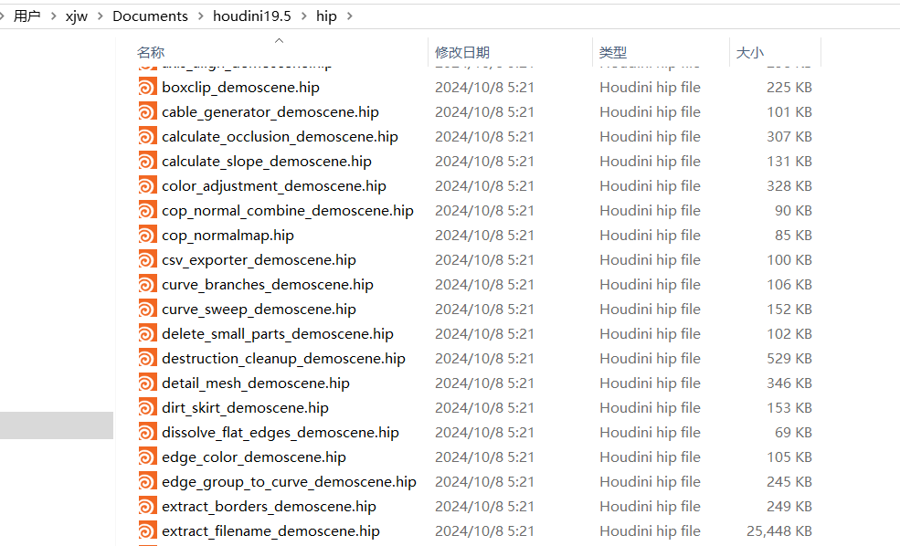
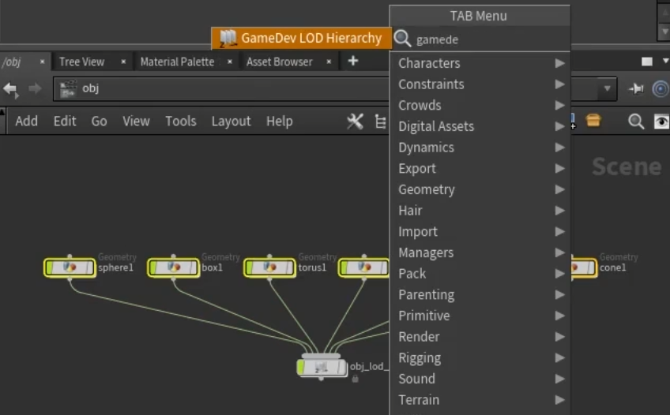
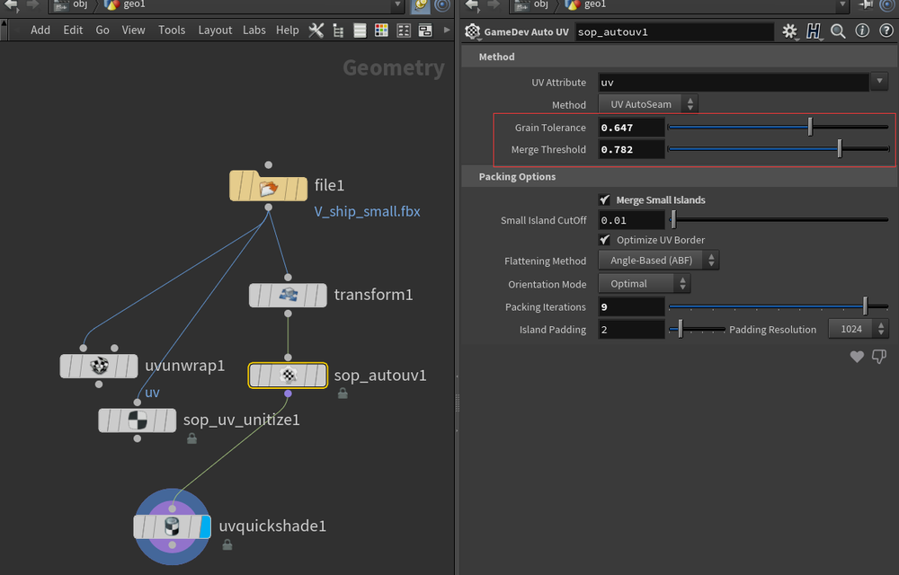
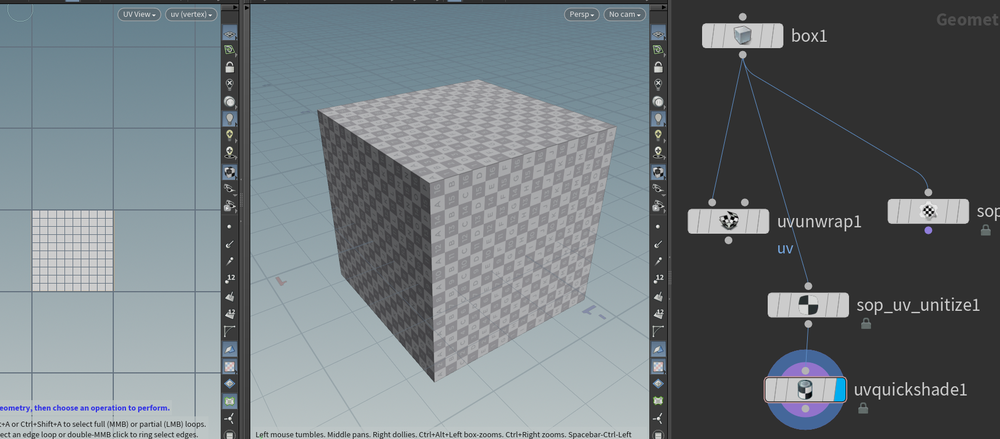
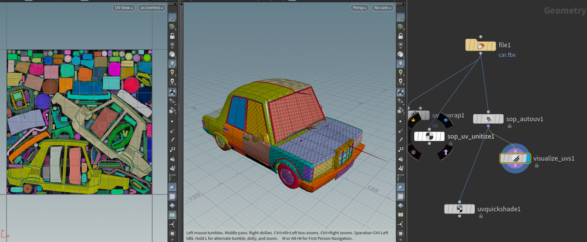
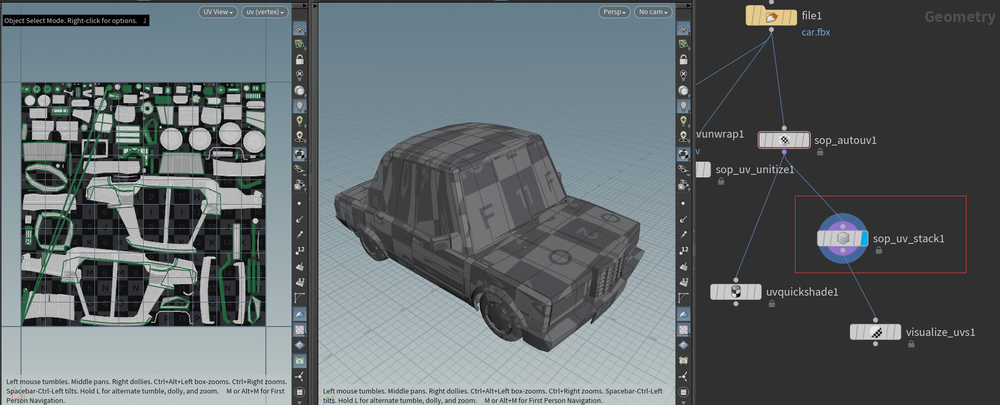

# Game Development Toolset
一个HDA的游戏开发工具集。超过90个工具。它包含素材架、数字资源、自定义桌面和脚本  
git下载地址：[GameDevelopmentToolset](https://github.com/sideeffects/GameDevelopmentToolset)    
稳定版分支将很快停用。建议使用默认开发版分支的资源  
###  安装 
There are three main ways to install the toolset:
> 1. Automatic (16.5+)
> 2. Manual
> 3. Manual Custom

- 实际测试在houdini19.5.303里，自动安装可能是因为破解的原因，流程有阻断    
- 通过第二种手动安装的方式，将`GameDevelopmentToolset-Development.zip`解压缩后拷贝进：
`C:\Users\xjw\Documents\houdini19.5`   
- 第三种是配置`C:\Users\xjw\Documents\houdini19.5\houdini.env`环境变量文件，可以把文件夹放在其他地方。相对比较折腾,不是很好管理    
## 使用
打开Houdini，在 shelf tools页签可以添加。  
    
同时节点多了gamedev相关节点   
   
在安装目录可以看到新添加的若干工具节点    
    
## 使用教程合集  
[Game Development Toolset概述](https://www.sidefx.com/tutorials/game-development-toolset-overview/)

### 几何工具
#### LOD Hierarchy 
LOD层级，允许用户配置细节级别 (LOD) 层级   
  
#### Physics Painter
允许用户将物理对象绘制到任何其他对象上，并模拟重力
   
在被绘制的物体节点下添加。可以模拟并塌陷模拟结果。  
可以添加多个绘制物体，可以调整物体间相互的权重  
### UV工具
#### 自动UV 
相比较传统自动UV工具，这个工具可以控制切割的块数和边缘破碎程度，可以获得很好的整片的UV   
   
- 参数:粒度阈值  
当“分割”基于曲率时，控制小晶粒对表面法线方向变化的敏感程度。值为零时非常敏感，会产生细小的晶粒。值在1以上时则较为不敏感，会产生较大的晶粒。  
- 合并阈值   
参数:合并值控制较小颗粒合并形成较大岛屿的频率。0表示从不合并(以初始颗粒作为输出结果)，1表示将所有相连的颗粒合并(输出结果中没有接缝)。您可以通过调整这个控制参数，使其位于0.5左右，来得到更多或更少的接缝。
### UV Unitize
UV Unitize SOP 只是将每个面的 UV 设置为 0-1    
   
### UV Visualize
UV Visualize SOP 是一种方便的工具，可以快速可视化网格中的 UV 壳、接缝和扭曲   

### UV Visualizeu
它可以找出哪些 UV 壳在其几何体或 UV 空间中拥有相似的表面积，并堆叠相同或近似的 UV 壳   
   
### 纹理工具

### 实时效果工具 

### 互动操作性工具

