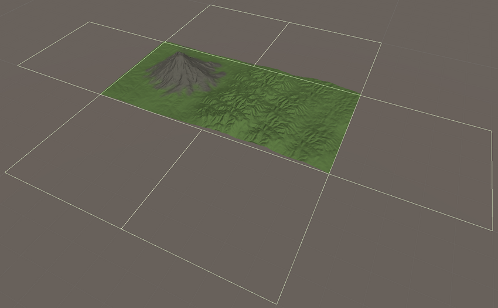
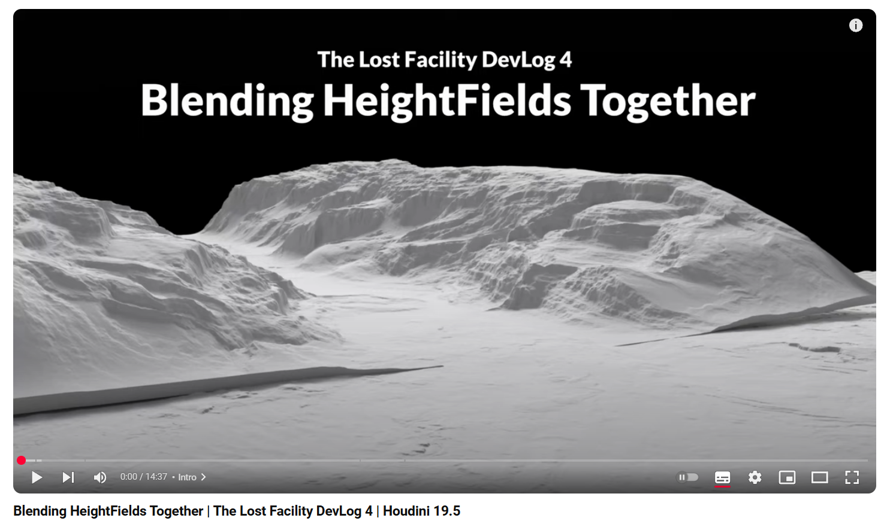

# Houdini到unity大世界流程
地图设计   
<https://inkarnate.com/>   
一些官方的工具和教程  
<https://www.sidefx.com/learn/world-building/>   
## 划分地图尺寸及拼合块  
    
如何切分的教程  
<https://www.youtube.com/watch?v=rwKKhcAfBR0>  
## Houdini中创建地形
   
<https://www.youtube.com/watch?v=Oe0_C14lYgU>   
## 导出高度图  

## Unity中整合调试  
