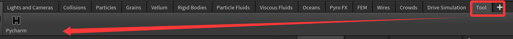
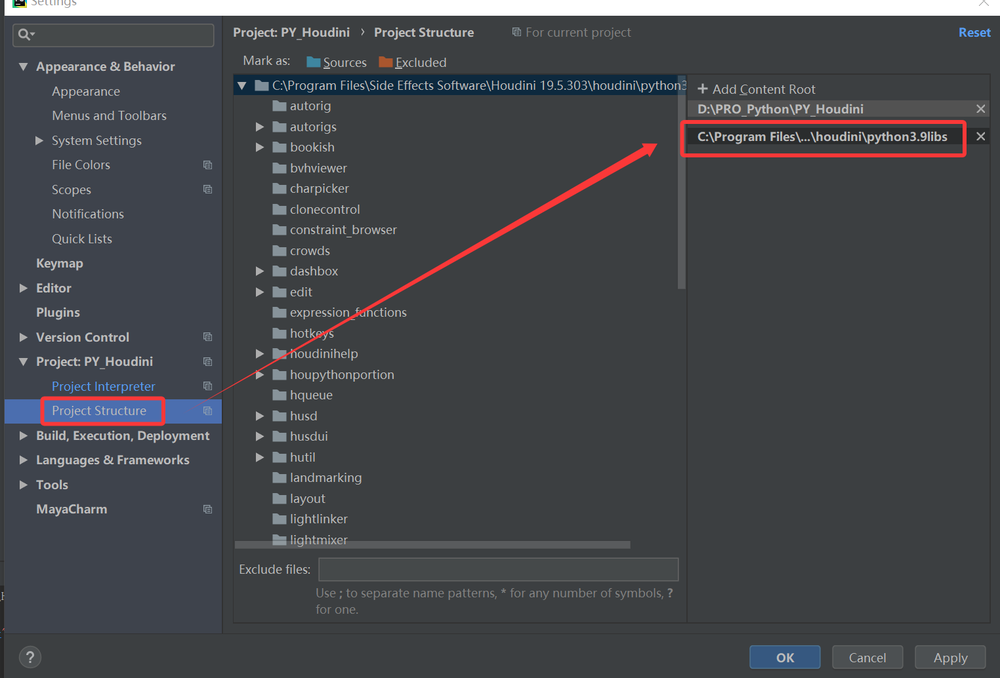
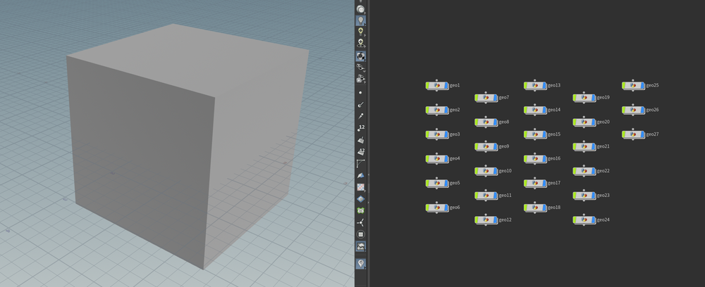

# Houdini和pycharm通信

## Houdni中创建服务端口  
官方原文：<https://www.sidefx.com/docs/houdini/hom/rpc.html>    
默认是没有打开RPC端口的   
创建新shelf,再创建新的tool,并重命名   
   

```
import hrpyc
hrpyc.start_server()
```
   
点击tool后，服务启动成功  
## pycharm中设置环境 
C:\Program Files\Side Effects Software\Houdini 19.5.303\python39    
     
### 添加包解释  
路径： C:\Program Files\Side Effects Software\Houdini 19.5.303\houdini\python3.9libs    
   
## 测试  
pycharm中运行Python脚本,用于连接houdini   
```
import hrpyc
con, hou = hrpyc.import_remote_module()
if False:
    import hou
``` 
如果是新启动houdini，需要点击tool按钮  
测试代码：
```
for i in range(-1,2):
    for j in range(-1,2):
        for k in range(-1,2):
            myPlace = hou.node('/obj')
            mygeo = myPlace.createNode('geo', run_init_scripts=False)
            mybox = mygeo.createNode('box')
            mybox.parmTuple('t').set((i,j,k))
hou.node('obj').layoutChildren()
```
    
连接成功   
以后可以在pycharm中进一步累积自己的数字资产  

## Houdini中关联外部IDE   
修改houdini的环境文件    
C:\Users\xjw\Documents\houdini19.5\houdini.env
在最后添加：  
VISUAL = "C:\Users\xjw\AppData\Local\Programs\Microsoft VS Code\Code.exe"   
关闭并重启houdini