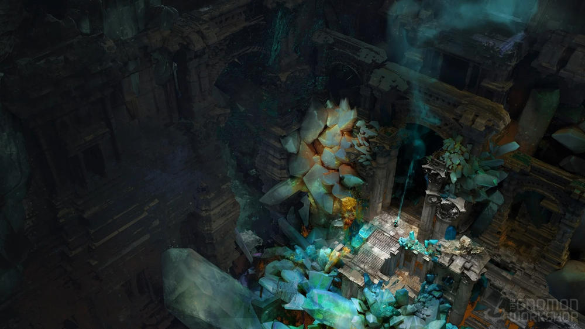
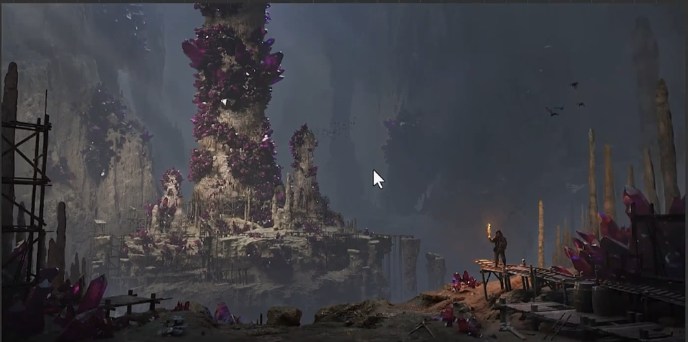
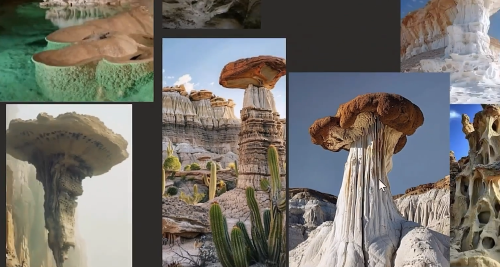
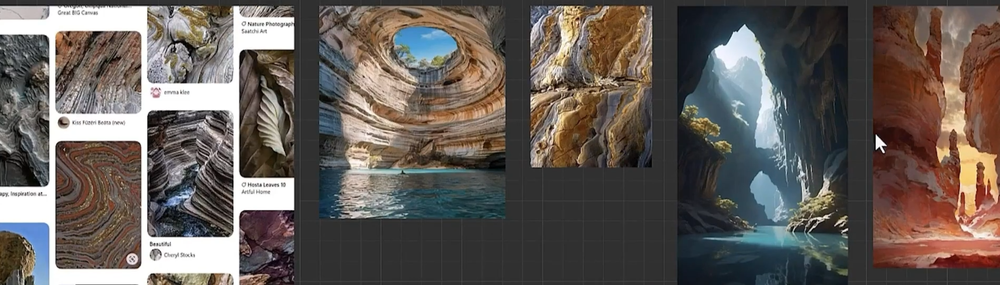
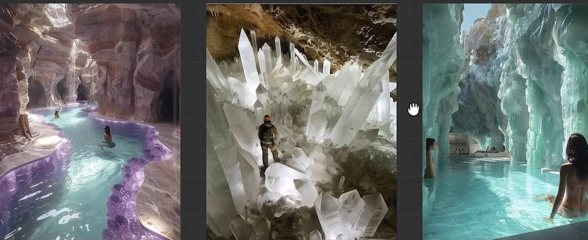
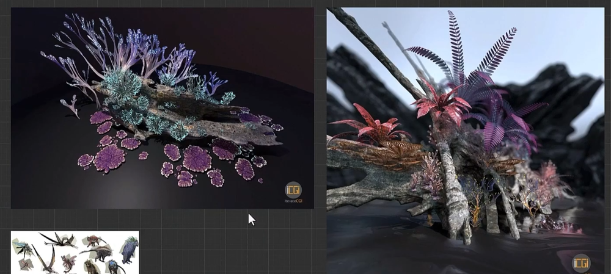

# The Gnomon Workshop - Procedural Workflows for Games using Houdini
重点介绍如何使用 Houdini 开发程序化工作流程来创建高质量的资产。    
工作坊从Houdini软件开始，Giovani首先搭建关键的建筑元素，包括墙壁、地板和柱子，并建立一个简洁的模块化模型。之后，他开始细化场景。他讲解了如何构建自己的数字资产库以加快迭代速度，并指导艺术家们如何用极少的雕刻技巧创建岩石形态，同时保持对形状的控制和变化。

Giovani 将讲解如何将素材自然地融入环境，以及如何创建复杂的母材质，从而让您能够混合多种材质，增强真实感，并为模型引入变化。艺术家们将学习如何程序化地生成复杂的晶体结构，以及如何为纹理和着色做好准备，为营造风格化的奇幻氛围奠定基础。

研讨会最后，Giovani 快速浏览了他最喜欢的一些虚幻引擎功能，包括 PCG 和 Fracture。
## 收集参考资料   
   
     
     
    
    
    
    
    
    
     
## 使用SOP进行建筑柱体遮挡处理
## 使用SOP进行建筑墙体遮挡处理
## 细节通道与程序化纹理生成
## Houdini数字资产
## 程序化岩石生成
## 资源包准备
## Unreal引擎主材质部分1
## Unreal引擎主材质部分2
## 晶体生成资产生成
## RBD刚体模拟
## Unreal引擎PCG与断裂功能
## 关卡组装与最终演示