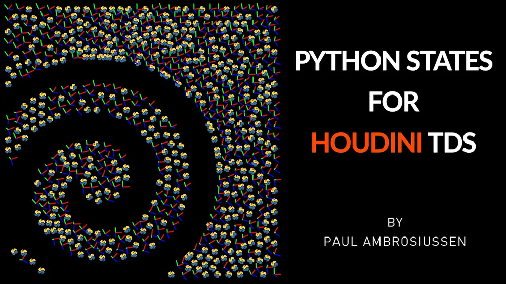

# Python States for Houdini TDs
   
## ✅ 课程摘要
本课程系统讲解**Houdini Python States** 的全部核心功能,从基础语法到高阶实战全覆盖，适配H19及以上版本。   
在Houdini中，**Python States** 是核心的交互开发模块，本质是**运行在Houdini视图窗口中的Python驱动型交互层**——它允许开发者自定义用户与视图内几何体、节点、参数的交互逻辑，是打造高定制化、高交互性程序化工具的核心技术。
## ✅ 为什么需要Python States？
Houdini默认的视图交互（如选择、移动、缩放几何体）是固定逻辑，而Python States的核心价值是**打破默认交互限制**，实现：
- 自定义视图操作（比如点击几何体触发特定逻辑、拖拽手柄生成自定义几何体）；
- 绑定输入设备（鼠标、键盘、数位板）的专属交互（比如按快捷键显示自定义信息面板）；
- 联动工具参数与视图交互（比如拖动手柄实时更新节点参数，无需手动调整）；
- 简化复杂操作（比如将多步节点操作封装为一次视图点击，降低用户使用成本）。  

Python States几乎是所有专业Houdini工具的标配，典型落地场景：
1. **自定义建模工具**：比如拖拽鼠标绘制样条线，松开后自动生成管状几何体，同时显示调整粗细的手柄；
2. **资产编辑工具**：点击HDA资产内的几何体，右键菜单显示「重置参数」「导出选中部分」等专属操作；
3. **批量处理工具**：按快捷键选中视图内所有特定类型的几何体，一键应用预设节点网络；
4. **可视化调试工具**：在视图中实时绘制几何体的法线、UV、拓扑信息，替代手动添加Visualize节点；
5. **游戏/影视管线工具**：适配生产管线的专属交互（比如按管线规范自定义选择逻辑、批量导出命名）。

## ✅ 核心特性 & 关键概念
### 1. 生命周期与事件回调（核心中的核心）
Python States的运行是「事件驱动」的，核心是监听并响应视图中的各类事件，关键生命周期/事件包括：
- `onEnter()`：进入该状态时触发（比如点击工具按钮激活状态）；
- `onExit()`：退出状态时触发（比如切换工具、关闭视图）；
- `onMouseDown/onMouseDrag/onMouseUp`：鼠标按下/拖拽/松开事件；
- `onKeyPress/onKeyRelease`：键盘按键/松开事件；
- `onDraw()`：视图重绘时触发（用于自定义绘制辅助几何体、手柄、文字提示等）；
- `onTick()`：每帧刷新时触发（用于实时更新状态逻辑）。

这些回调函数是Python States的「骨架」，所有自定义交互都基于对这些事件的重写。

### 2. 核心组成部分
| 组件         | 作用                                                                 |
|--------------|----------------------------------------------------------------------|
| 操控手柄（Handles） | 绑定到参数的可视化交互控件（如滑块、旋转环），支持静态（固定位置）/动态（随几何体移动），运行时可更新功能； |
| 状态参数（State Parameters） | 控制State本身行为的参数，允许用户自定义「交互规则」（比如手柄灵敏度、触发逻辑）； |
| 选择器（Selections） | 自定义视图内几何体/对象的选择逻辑（比如只允许选择点，或点击面自动选中所属几何体）； |
| 辅助几何体（Guide Geometry） | 在视图中绘制临时几何体（如线框、点、文字），用于提示用户操作（非最终渲染几何体）； |
| 右键菜单（Context Menus） | 自定义右键点击时的菜单选项（比如右键几何体显示「生成副本」「删除历史」等专属选项）； |
| 信息面板（Info Panels/HUD） | H19+新增的悬浮面板，可自定义显示工具状态、参数值、操作提示，替代繁琐的快捷键/参数面板查阅； |

### 3. 类型：不同场景的State分类
课程中提到的「不同类型的Python States」，核心是按使用场景划分，常见类型：
- **视图状态（View States）**：作用于Houdini主视图，是最常用的类型（比如自定义几何体编辑工具）；
- **节点状态（Node States）**：绑定到特定节点的状态（比如自定义SOP节点的专属交互逻辑）；
- **面板状态（Panel States）**：作用于自定义面板的交互状态（较少用）；
- **临时状态（Transient States）**：临时激活的短生命周期状态（比如点击一次触发的单次交互）。

### 4. 学习避坑点
- 不要过度封装：State的核心是「交互」，不要把复杂的计算逻辑（比如大量几何体处理）写在`onTick()`/`onDraw()`中，否则会导致视图卡顿；
- 重视撤销（Undo）：自定义交互必须实现Undo逻辑（课程中「Advanced Undo」），否则用户操作失误无法回退，工具可用性大幅降低；
- 兼容H版本：H19+的HUD、新回调函数在低版本不兼容，开发时需明确版本适配；
- 辅助几何体轻量化：`onDraw()`中绘制的辅助图形（Guide Geometry）要简化，避免顶点数过多导致视图帧率下降。
- 只是做一次性的数据处理或批量操作（用常规HOM脚本更合适）；
- 需要极高性能的大规模计算（用HDK或SOP节点更合适）。

## ✅ 与其他Houdini交互技术的区别
很多开发者会混淆Python States与其他交互方式，核心区别如下：
| 技术          | 对比维度       | Python States               | 常规HOM脚本                | Digital Asset（HDA）       |
|---------------|----------------|-----------------------------|----------------------------|----------------------------|
| 核心逻辑      | 交互方式       | 视图实时交互（事件驱动）    | 一次性执行（指令驱动）      | 功能封装（无自定义交互）   |
| 运行时机      | 触发方式       | 视图激活状态下持续运行      | 手动执行/节点烹饪时运行    | 节点存在即生效             |
| 用户体验      | 操作方式       | 可视化交互（点击/拖拽）     | 手动调参/执行脚本          | 固定参数面板操作           |

## ✅ 课程章节
1. 概述：认识Python States是什么，结合实际案例了解其应用场景
2. 创建与部署：学习Python States的不同类型，以及各类状态的创建方法
3. 界面事件处理器：掌握不同生命周期的事件回调函数，同时学会调用鼠标、键盘等输入设备的交互逻辑
4. 右键菜单：自定义右键菜单，添加用户常用的参数设置与操作指令
5. 选择功能：详解Houdini中的选择机制，以及如何绑定自定义的几何体/对象选择器
6. 辅助几何体：制作自定义可绘制图形，结合SOP算子（sop verbs），通过Python高效生成几何体
7. 操控手柄：给参数绑定**静态/动态手柄**，并能在运行时更新手柄的功能逻辑
8. 状态参数：理解状态参数的概念，以及如何让用户自定义「状态与工具的交互方式」
9. 信息面板：学习自定义Houdini 19新增的HUD（头部显示界面），减少用户查阅手册找快捷键的繁琐操作
10. 杂项拓展：① 资深开发者整理的Python States实用技巧（快速上手）；② 撤销功能（含高级撤销）的实现方法；③ Invoke SOP的用法讲解
11. 实战案例：完整演示「从0到1编写Python States」的全流程。⚠️ 本章为**持续更新内容**（课程发布后逐步补充），案例均基于用户高频需求制作。

### 补充备注
- **Python States**：Python状态（Houdini核心交互开发模块，无通用译法，业内均直接用英文）
- **HOM**：Houdini Object Model，Houdini的Python内置对象模型
- **HDA**：Houdini Digital Asset，Houdini数字资产
- **SOP**：Surface Operator，曲面算子（Houdini核心几何体处理节点）
- **HUD**：Heads-Up Display，悬浮信息面板（H19新增功能）
- **SideFXLabs**：SideFX官方出品的免费插件库，必装

## ✅ 总结
Python States是Houdini工具开发的「交互天花板」，其核心是**用Python重写视图交互的事件逻辑**，结合手柄、菜单、信息面板等组件，把复杂的程序化逻辑转化为直观的可视化操作。课程的设计逻辑（从基础概念→组件拆解→实战案例）完全贴合该技术的学习路径：先理解「事件回调」的核心框架，再掌握各组件的用法，最后通过实战把零散组件整合为完整工具——这也是掌握Python States的唯一高效路径。

