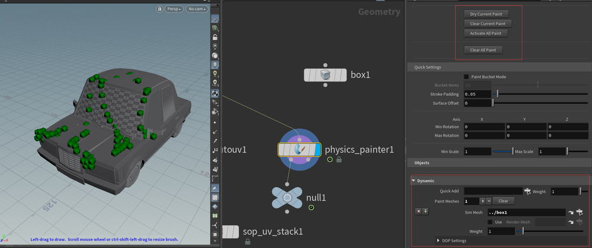
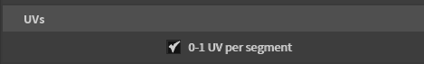
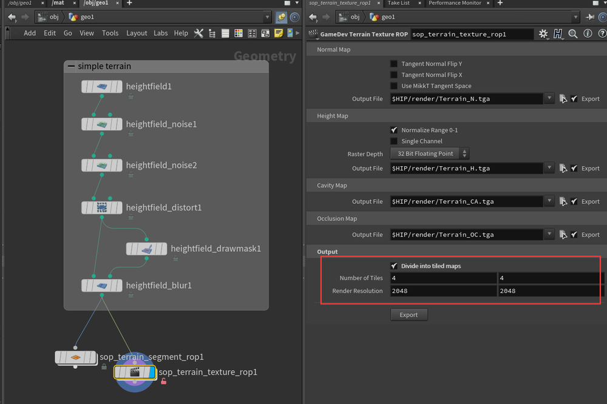

# SideFX Labs  
## SideFX Labs 与 Game Dev Toolset 的关系

### 🧱 起源：Game Development Toolset
- 最初由 SideFX 推出
- 主要用于 **游戏开发** 的 Houdini 工具集
- 提供如 LOD、贴图烘焙、布尔优化、地形工具等
- 通过 GitHub 分发和更新
- 独立于 Houdini 主程序安装

---

### 🔄 更名：SideFX Labs
- 在 Houdini 17/17.5 后更名为 **SideFX Labs**
- 原因：
  - 工具用途已超出游戏开发
  - 包含更广泛的功能，如影视、环境、预可视化等
  - 更突出“实验性”和持续更新的特性
- 集成到 Houdini 的官方支持中
- 可通过 **SideFX Labs工具面板** 或 **Houdini Launcher** 安装

---

### ✅ 对比总结

| 项目            | Game Dev Toolset       | SideFX Labs             |
|-----------------|------------------------|--------------------------|
| 状态            | 已被替代              | 当前主流工具集           |
| 适用方向        | 游戏开发              | 游戏 + VFX + 实验工具   |
| 安装方式        | GitHub, Tool Shelf     | Houdini Launcher, 内置工具 |
| 支持版本        | Houdini 16.x ~ 17.x    | Houdini 17.5 及以上       |

---

### 📌 当前建议
> 使用 **SideFX Labs**，它是 Game Dev Toolset 的升级版，功能更全，持续更新。
   
## 使用教程合集  
[Game Development Toolset概述](https://www.sidefx.com/tutorials/game-development-toolset-overview/)

### 几何工具
#### LOD Hierarchy 
LOD层级，允许用户配置细节级别 (LOD) 层级   
  
放入unity中  
  
#### Physics Painter
允许用户将物理对象绘制到任何其他对象上，并模拟重力
   
在被绘制的物体节点下添加。可以模拟并塌陷模拟结果。  
可以添加多个绘制物体，可以调整物体间相互的权重    
   
可以指定模拟mesh和渲染mesh。在引擎地编时是一个非常有用的工具  
#### Terrain Tools 
Houdini 的两个数字资产 (HDA) 可用于将高度场转换为其他数据，它们可以完美协作，生成所需的数据。   
`Terrain Mesh ROP`会根据高度场创建一个或多个网格，而`Terrain Texture ROP`会将高度场渲染成纹理。 
   
可以设置切分片数和自适应网格分布   
    
可以将每个切片的UV对应在0-1区间里   
    
输出各种贴图，并且可以切分输出    
   
### UV工具
#### 自动UV 
相比较传统自动UV工具，这个工具可以控制切割的块数和边缘破碎程度，可以获得很好的整片的UV   
   
- 参数:粒度阈值  
当“分割”基于曲率时，控制小晶粒对表面法线方向变化的敏感程度。值为零时非常敏感，会产生细小的晶粒。值在1以上时则较为不敏感，会产生较大的晶粒。  
- 合并阈值   
参数:合并值控制较小颗粒合并形成较大岛屿的频率。0表示从不合并(以初始颗粒作为输出结果)，1表示将所有相连的颗粒合并(输出结果中没有接缝)。您可以通过调整这个控制参数，使其位于0.5左右，来得到更多或更少的接缝。
#### UV Unitize
UV Unitize SOP 只是将每个面的 UV 设置为 0-1    
   
#### UV Visualize
UV Visualize SOP 是一种方便的工具，可以快速可视化网格中的 UV 壳、接缝和扭曲   

#### UV Visualizeu
它可以找出哪些 UV 壳在其几何体或 UV 空间中拥有相似的表面积，并堆叠相同或近似的 UV 壳   
   
### 纹理工具

### 实时效果工具 

### 互动操作性工具

