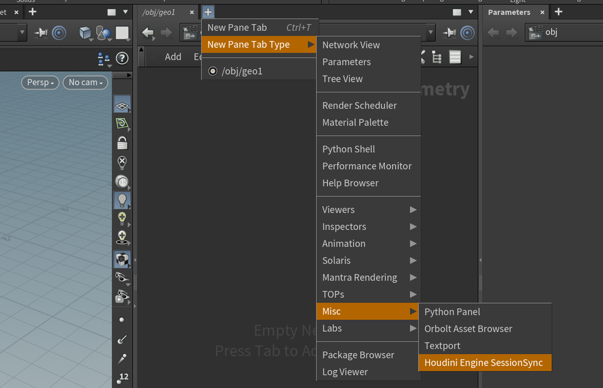
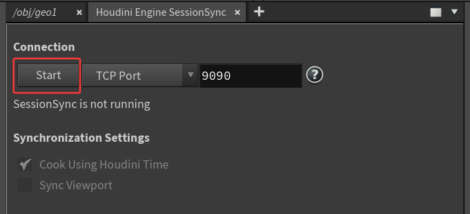
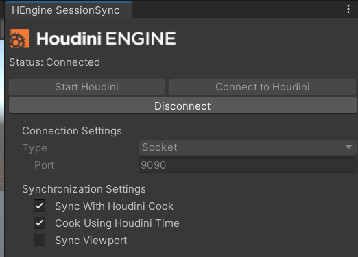
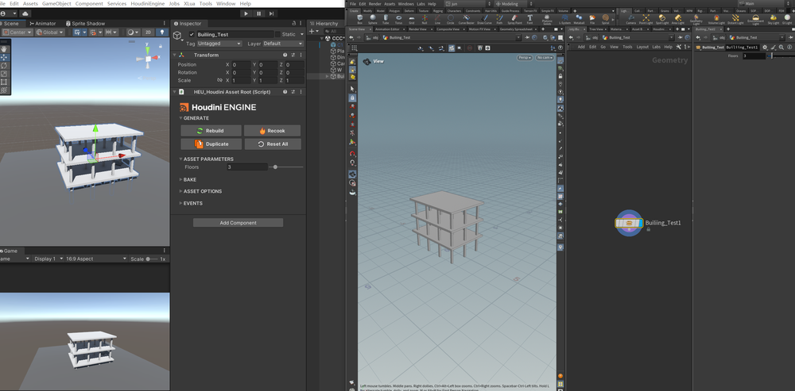
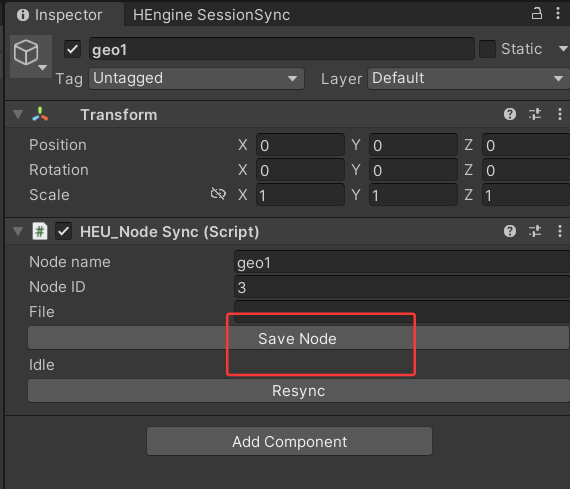
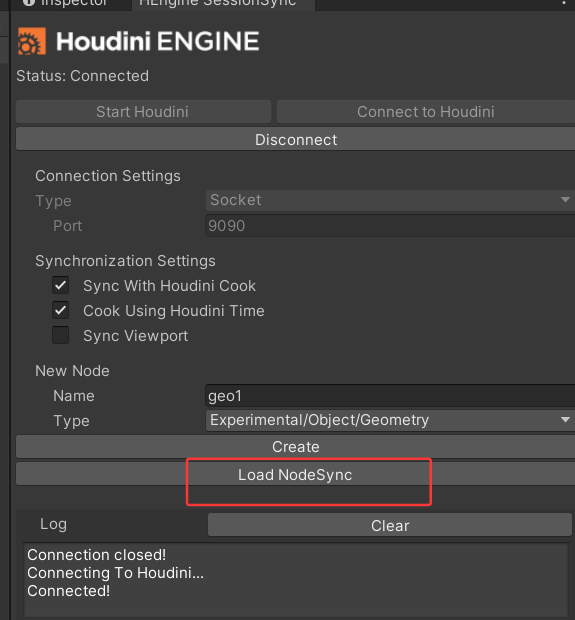

# Houdini connect Unity    
Unity安装HoudiniEngine,启动SessionSync    
    
Houdini中新建标签，创建SessionSync页签    
   
在两个软件里分别点击链接，就可以通过9090端口进行链接    
    
需要特别注意的是要注意HoudiniEngine是哪个版本的，和链接的houdini版本是对应的  
   
现在在unity中或houdini中调整HDA相关参数，就可以在另一边实时同步  
   
可以新创建HDA，在houdni中进行制作和迭代  
    
制作完成，可以在属性面板里保存这个新的HDA   
   
可以重新加载这个保存的新节点   
    
