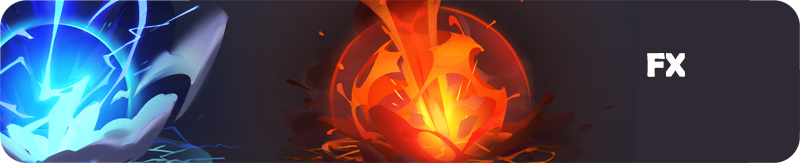

# 全流程美术  
> 涵盖美术制作的全流程。对中英文学习资料的广泛学习，并形成流程化，工具化的总结和思考。  
> 深度二次开发，形成大量工具集。
## 2D
  
### Spine
- [AE和Spine制作MOBA游戏动效](./2D动效/AE和Spine制作MOBA游戏动效/AE和Spine制作动效.md)   
## 建模
  
### 风格化
- [(Gumroad) Danny Mac - Sculpting The Head](./建模/建模1.md)   
- [Creating a AAA Character from Scratch  A Nameless Samurai](./建模/建模2.md)
- [VideoGame_Character_Creation_Katon_Callaway](./建模/VideoGame_Character_Creation_Katon_Callaway/KatonCallaway.md)
- [Udemy - Hard Surface Fantasy Female Character in Zbrush by Victory3D](./建模/HardSurfaceFantasyFemale/HardSurfaceFantasyFemale.mdY)
### 写实次时代
- [源赖光](./建模/源赖光/源赖光.md)   
- [Asuka Langley Workshop](./建模/AsukaLangleyWorkshop/AsukaLangleyWorkshop.md)   
- [南宋武士顶级影视角色制作案例教学](./建模/南宋武士/南宋武士.md)   
### 软件工具
- 小而美的强悍建模软件——Silo
- DAZ Studio的素材导入及设置
  
***
## UV  
  
- [如何制作紧凑的灯光贴图](./UV/UV1.md)
- 3DsMAX一款实用UV插件

***
## 绑定
  
### 全身绑定
- [自动化脚本绑定——Youtube博主视频案例](./绑定/PY_Rigging/PY_Rigging.md) 
- [ADV绑定Mannequins](./绑定/ADV绑定Mannequins/ADV绑定Mannequins.md)  
- [Maya四足动物绑定](./绑定/Maya四足动物绑定/Maya四足动物绑定.md)  
- [游戏角色绑定](./绑定/Maya游戏角色绑定/kd.md)
- [CGMA Rigging for Games](./绑定/CGMARiggingforGames/CGMARiggingforGames.md) 
- [古风少女绑定](./绑定/古风少女绑定/古风少女绑定.md)

### 面部绑定
- [面部口型分析](./绑定/面部动画/面部动画.md) 
- [Maya卡通嘴部绑定——脚本方式](./绑定/riggingJawPython/rigging_the_jaw_with_python_in_maya.md) 
- [《神秘海域》中的游戏面部绑定——顽皮狗技术总监方案](./绑定/游戏角色绑定/游戏角色绑定.md) 
- 北美影视动画面部绑定方案
- [MirrorSDK](./绑定/MirrorSDK/MirrorSDK.md)
### 特定技术方案 
- [软IK系统](./绑定/软IK系统/软IK系统.md) 
- 肩膀跟随和不跟随的绑定方法
- IK无翻转绑定
- IK和FK的切换问题

***
## 动画
  
### 软件配置及工具
-  [如何配置Maya,让动画制作更顺手](./动画/动画配置设置/动画配置设置.md)
-  AnimBot,动画制作不可或缺的神级插件
-  [动画控制器快捷拾取工具 Picker](./动画/Picker/Picker.md)
-  [绑定资源及插件](/插件工具/Maya脚本工具/动画插件/动画资源插件.md) 
-  [In-Between Tool ](./动画/InBetween/InBetween.md)
### 动画库
- [批量下载所有的Mixamo免费动画](./动画/批量下载所有的Mixamo免费动画.md)
- Maya动作库的使用和积累
### 动画制作案例
- [英雄联盟英雄回城动画制作案例](./动画/AnimatingaRecallforGames/AnimatingaRecallforGames.md)
  
## 特效
  
 ### Unity 3D特效
-  动作特效1
-  场景特效1

## 毛发  
  
- [依托管状模型制作毛发——仿迪斯尼方案](./毛发/Tube_hair_gen/Tube_hair_gen说明.md) 
- Peregrine Yeti 
- gs-curvetools

## 渲染

- [Aronld渲染说明](./渲染/Arnold/Arnold1.md)  
- [皮克斯渲染器RenderMan](./渲染/RenderMan/RenderMan.md)
- [Marmoset Toolbag渲染](./渲染/MarmosetToolbag/MarmosetToolbag.md)