# Animating a Recall for Games 

[动画前期准备及设置](/全流程美术/动画/动画配置设置/动画配置设置.md)    
animbot存储默认姿势     
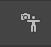    
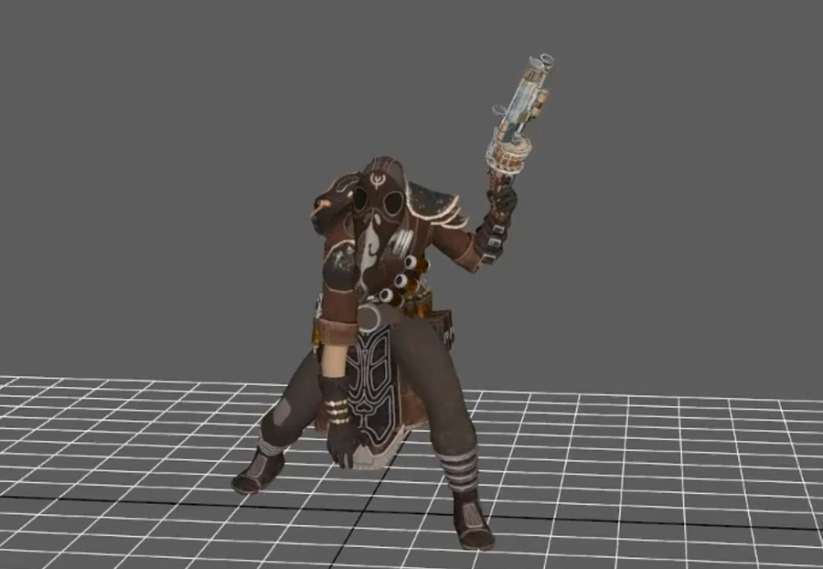   
animbot存储控制器选择集合   
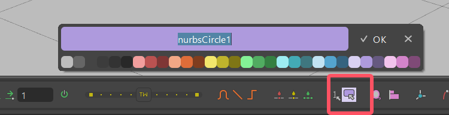   
创建一个游戏视角的摄像机，锁定摄像机。并划定一个动作区域的范围  
  
  
调整姿态，完成第一步工作   
 
## 关键帧制作   
抱头痛苦   
  
可以从剪影角度看动画姿态   
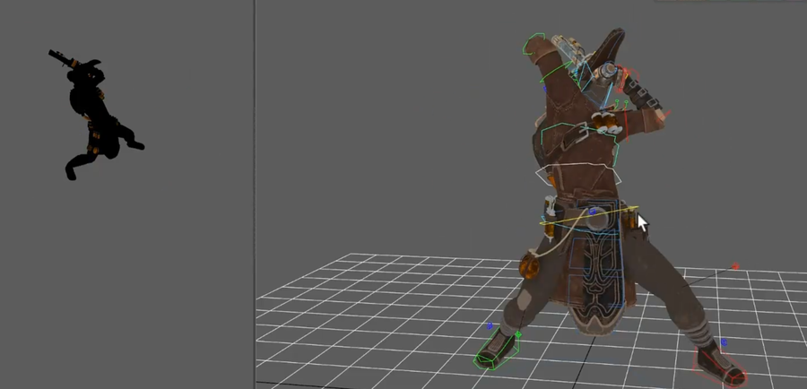  
痛苦蹲下  
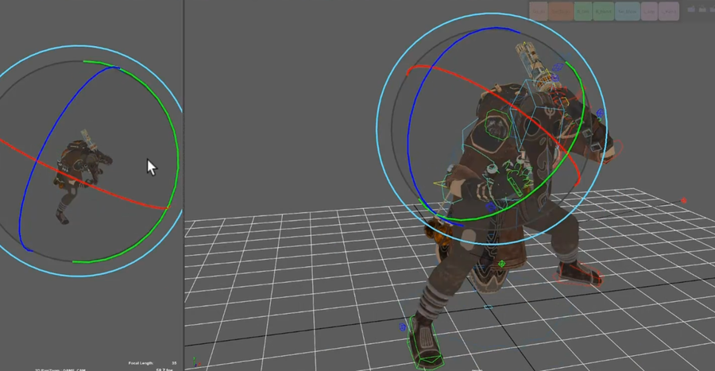   
   
转身，枪换手,animbot有工具可以镜像选择集的姿态。握手可以用快速镜像。     
   
   
跳起，枪换手   
   
   
再一个姿势   
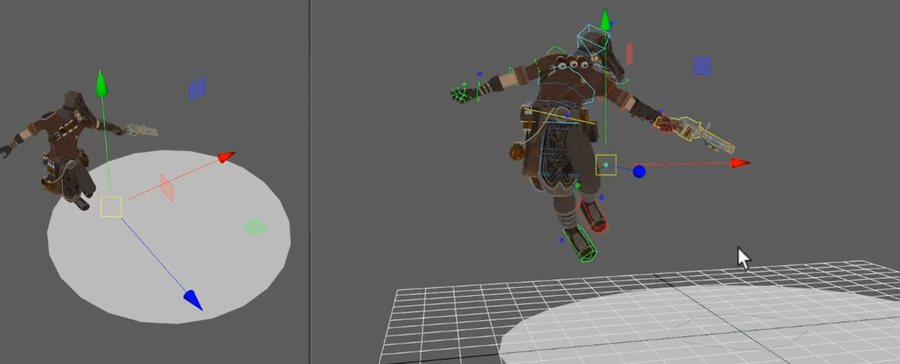   
  
继续姿势   
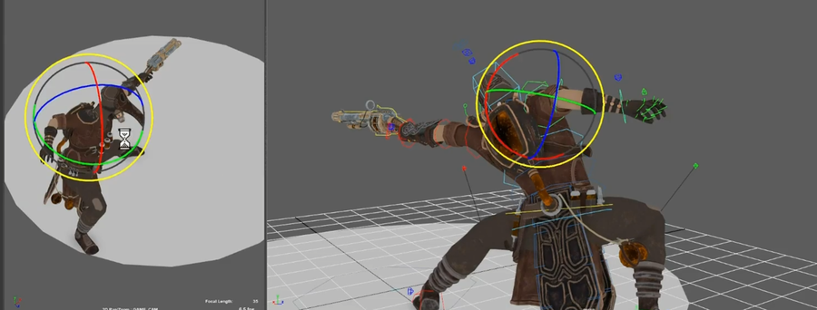   
   
蓄力姿势   
   
飞升   
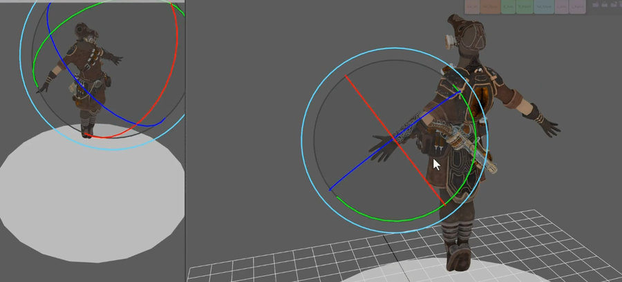   
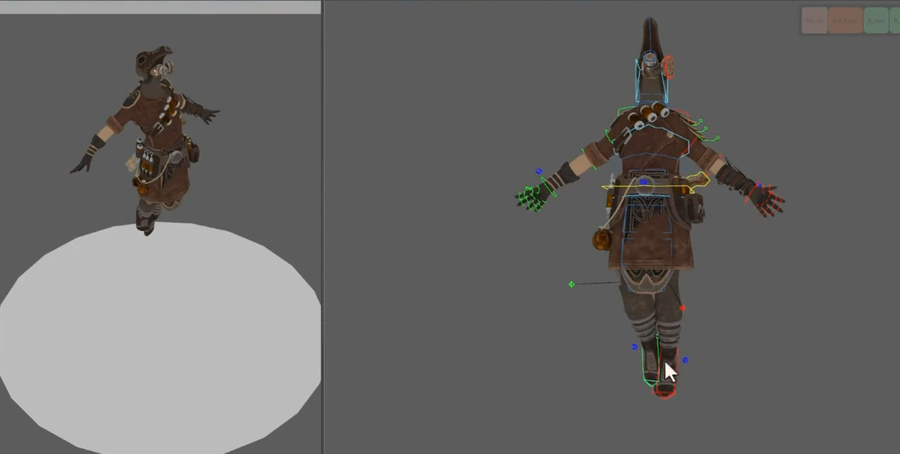   
落地  
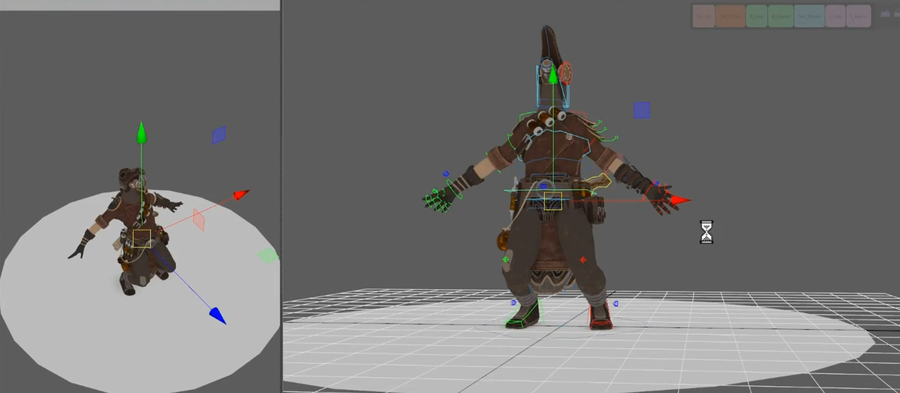   
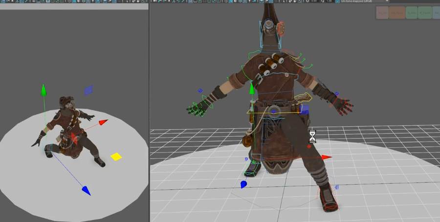   
缓冲   
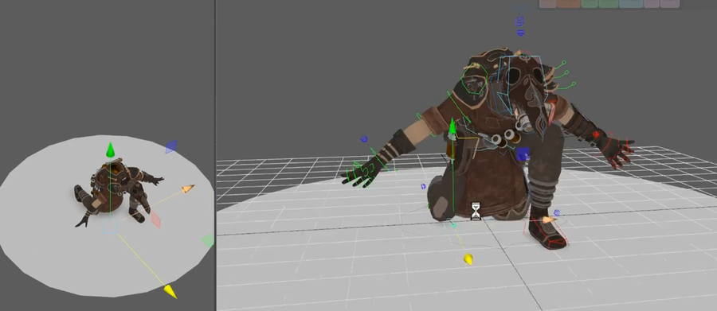   
   
站起拔枪   
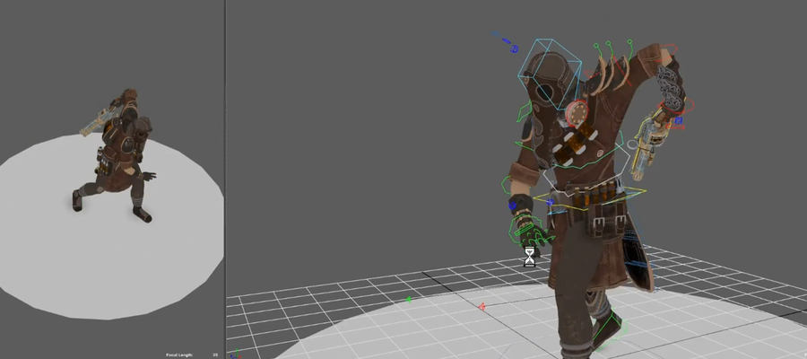   
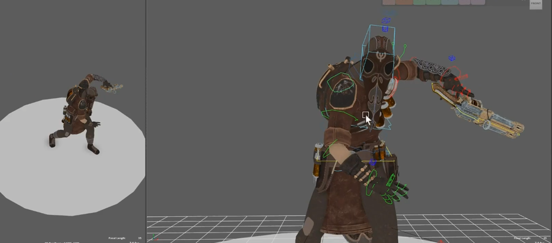   
完成关键帧后，粗略调整动画节奏   
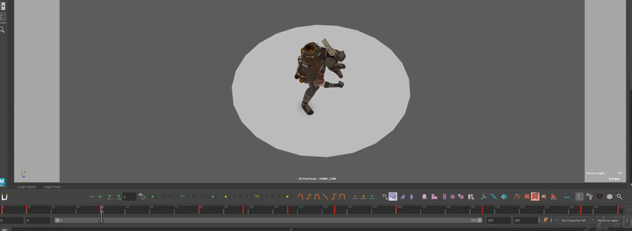