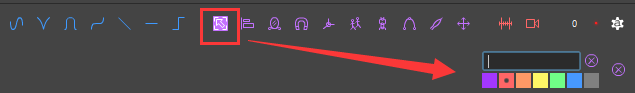
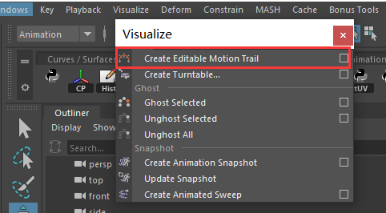

# Animbot  
[Animbot 与 ATools：Maya 动画插件比较](https://www.youtube.com/watch?v=0ha2SnbId4Y)   
[ATools官网下载](https://camiloalan.wixsite.com/atoolswebsite)   
[aTools for Python3 ](https://github.com/MKlimenko/aTools_python3)  
## aTools  
### 默认姿势
存储控制器的默认姿势，可以在任何帧一键到默认姿势  
   
### 选择集   
  
### 复制世界空间
面对的问题场景：复制控制器的世界坐标轴，将一个控制器和另一个控制器位置重叠  
先选择要移动的控制器，再选择目标控制器，执行图标命令  
  
一个扩展用法是可以创建一个临时虚拟体，控制器可以对齐临时虚拟体   
### 镜像工具  
高频使用的工具   
   
可能受制绑定特殊性，一些概率会出现局部错误   
### 临时枢轴
比如指尖垫起的动画，可以在指头创建临时轴心。   
应对一些低频但又出现的动画需求。一定程度减小了绑定的臃余   
   
### 复制/粘贴动画
  
### 补间和关键滑块
 
### 假约束
是一个很难见效的功能，或者说没有掌握具体用法  

### 运动轨迹   
   
不见效，但有Maya内置的命令   

### 微动画
   
快速创建大量微细节  
