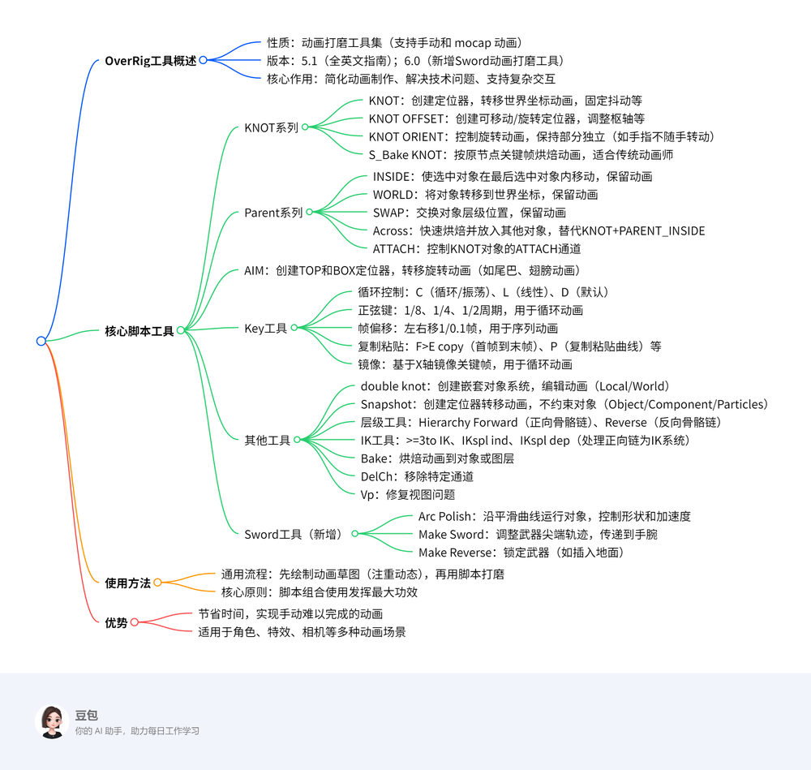

# OverRig 用户手册

OverRig 是一套用于打磨动画（包括手动制作和动作捕捉获得的动画）的工具集   

## 相关视频链接
- [完整版指南（英语）](https://youtu.be/YlxmJX4KJm8)
- [补充内容（版本6.0）](https://youtu.be/PgtqwtHpjiQ)

---

## 版本6.0新增功能
- **剑动画润色工具（Sword animation polishing tool）**
  - 通过手工或运动捕捉（mocap）数据制作
  - 简化动画制作流程
  - 解决动画中的复杂技术问题
  - 可不依赖Rigger添加特定功能
  - 消除IK-FK切换
  - 其他多种功能

---

## 动画脚本总览
- **动画设计思路：**
  - 草绘动画，重点突出良好的动态效果
  - 跳过互动或粗略标记
  - 使用脚本进行润色

---

## 基础脚本：OverRig动画方法

### 1. KNOT（结点）
- 为选中对象创建locator，将其在世界坐标中的动画转移到locator上，后将对象“悬挂”到locator。
- 支持多对象同时操作。
- 在专用时间线上应用时，locator会有“attach”通道，动画效果通过调节权重控制。
- 常用用途：
  - 固定控件抖动
  - 脚步滑动修正
  - 转换到渐进循环
  - 重置或移动控制器
  - 层级调整

---

### 2. KNOTOFFSET
- 创建locator，移动或旋转到目标位置，点击空白区域解除选择。
- 将相对动画转移到locator，改变pivot点。
- 支持多对象操作。
- 在时间线上应用时，locator含“attach”通道，调节权重控制动画。
- 常用用途：
  - 武器绕轴旋转
  - 避免gimbal锁
  - 脚部旋转与脚尖点保持一致
  - 环境互动

---

### 3. KNOTORIENT
- 创建locator，控制对象的旋转动画，locator追随对象。
- 支持多对象操作。
- 时间线上应用后，locator含“attach”通道。
- 常用用途：
  - 手指旋转独立
  - 头部旋转不影响躯干
  - 独立尾巴动画

---

### 4. Smart Object（智能对象）
- 一组基础节点，能根据原始对象逐帧烘焙动画。
- 适合动画初期草绘阶段。
- 作用：
  - 改变控件空间
  - 在不烘焙的情况下进行草图制作
  - 保持原动画关键帧

---

### 5. Parent（父子关系）
- 强大脚本集，用于对象及角色互动。

#### 5.1 INSIDE（内部）
- 让选中对象嵌套在最后选择的对象内（位置、旋转动画同时保存）
- 控制：
  - 将物体挂在手上（如苹果）
  - 让角色抓取敌人（如喉咙）

#### 5.2 WORLD（世界）
- 将对象变换到世界坐标系，保持动画
- 控制：
  - 放下苹果
  - 转换动画

#### 5.3 SWAP（交换）
- 交换两个对象在层级中的位置
- 支持嵌套交换
- 使用：
  - 交换手势与物体位置

#### 5.4 Across（跨越）
- 将对象烘焙到KNOT并放入最后选择的对象中
- 快速替代KNOT+PARENT_INSIDE
- 支持时间范围操作

---

### 6. ATTACH（附着）
- 在KNOT上添加“attach”通道控制
- 支持多KNOT控制单个对象
- 作用：
  - 复杂动画调控

---

### 7. AIM（瞄准）
- 为选中对象创建两个定位器（TOP和BOX）
- 移动定位器后，转动对象的动画会被传输到定位器
- 支持多对象
- 使用场景：
  - 尾巴、翅膀、衣服动画
  - 操作管理
  - 攻角动画

---

## 关键工具和快捷键
| 快捷键 | 功能描述 |
|---------|-----------|
| **C**   | 制作预设/后续无限循环动画 |
| **O**   | 制作预设/后续无限震荡动画 |
| **L**   | 制作预设/后续无限线性动画 |
| **D**   | 恢复默认无限动画 |

- **循环动画：**
  - 复制第一帧到最后一帧，制作循环
  - 支持动画层操作
  - 通过sinusoid（正弦）波实现自然循环

- **帧偏移：**
  - 向左或右偏移动画（1帧或0.1帧）
  - 支持逐步偏移，适合多控制器同步动画

- **镜像：**
  - 镜像关键帧（对X轴反射）
  - 支持已选择的关键帧或整个曲线
  - 适合 gait（步态）动画润色

---

## 结语
该工具集和脚本极大提升动画制作效率，帮助动画师解决复杂技术难题，实现高效、自然的动画效果。

   
