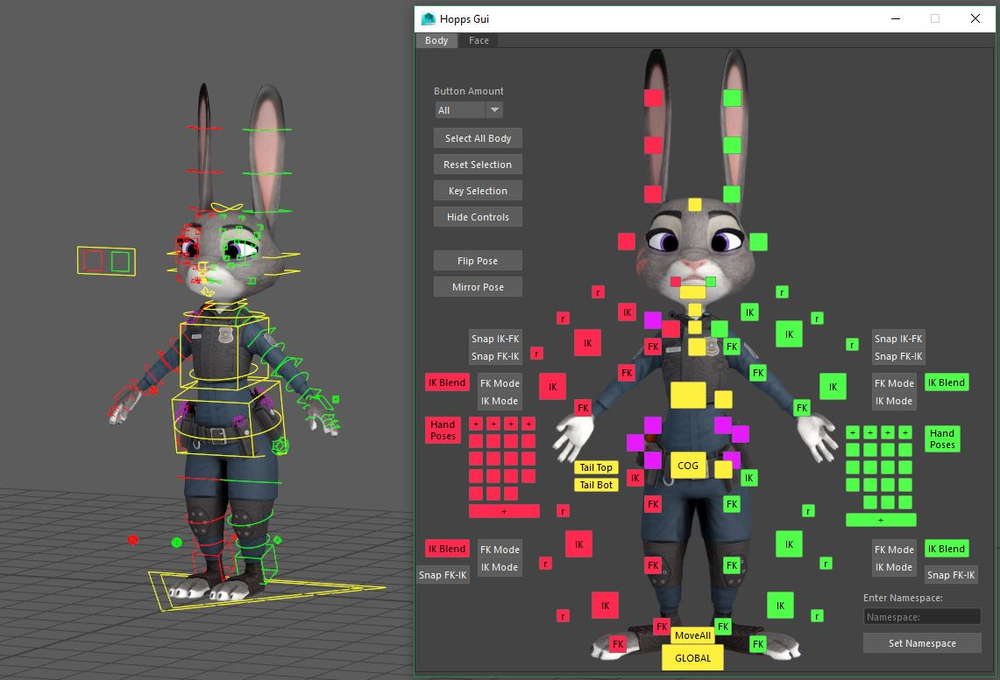

# picker
## [AnimSchool Picker](https://store.animschool.edu/product/animschool-picker-indie/)   
   
账号登录密码：H@ppyD0gs123!   
激活码：0558-6534-5760-4746  

## [Dreamwall Picker](https://github.com/DreamWall-Animation/dwpicker)

## 使用 PySide 和 QtDesigner 为 Maya 制作 Picker GUI  
<https://benmorgananimation.wordpress.com/2017/09/13/making-a-picker-gui-for-maya-with-pyside-and-qtdesigner/>
   
### QT设计
- QMainWindow widget 包含2个 QTabWidget objects
- 背景 png 放入 QtDesigner 中的 ui 文件中，并将其作为像素图添加到 QLabel 小部件
- 确保已启用“scaledContents”