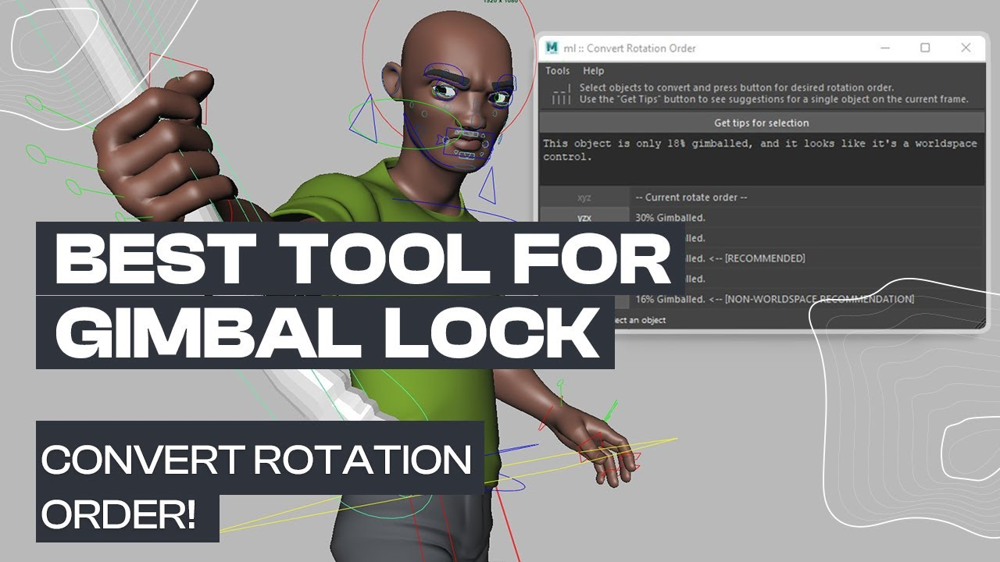

# 万向锁问题 Gimbal Lock
   
## 原理
每个对象的旋转基于 **Euler 旋转**，它按指定的旋转顺序（如 XYZ、YZX 等）进行计算。万向锁（Gimbal Lock）发生在使用欧拉角（Euler Angles）进行旋转时，当其中两个旋转轴重合或接近重合，导致失去一个自由度。在动画插值中，如果旋转顺序不合适，就可能出现非预期的旋转路径。  
  

- **为什么发生？**  
  当中间轴的旋转值接近 ±90° 时，其他两个轴可能完全重叠，数学上丢失一个自由度。虽然视觉上操作可能看不出来，但插值曲线和动画路径会反映问题。

- **实际操作中的疑惑**  
  Maya 默认的旋转操作柄是 **Local 模式**。用户一般不会严格按三个轴逐一旋转，而是直接拖动旋转球体，修改多个轴的值。手动操作很难精准重叠两个轴，但 **万向锁现象** 实际上发生在两个轴接近重叠时（即接近 ±90° 的区域）。

## 观察现象
- **轴重叠阈值**：  
  当中间轴旋转角度接近 ±80°～90° 时，插值开始受到干扰，即使操作柄显示正常，动画路径或曲线可能出现意外跳跃或旋转翻转。
  
- **影响表现**：  
  - 动画插值时旋转出现“抖动”或“跳跃”。
  - 曲线编辑器中，旋转曲线可能产生尖峰或剧烈波动。
  - 对旋转球体的拖动操作可能看似平滑，但内部计算已超出数学上的自由度限制。

## 解决办法
针对实际操作中用户的需求，以下是按有效性和优先性排列的解决方法：

### 1. 优化旋转顺序
#### 原理
通过选择合适的旋转顺序，减少主要旋转轴之间的相互干扰。例如，观察物体的运动趋势，确保某些频繁旋转的轴不容易接近 ±90°。 

#### 操作
1. **分析运动趋势**：  
   - 如果某个轴的旋转最为频繁，将其放在最内层（如 ZYX 顺序的 Z 轴）。
   - 根据物体的旋转模式选择合适的顺序：
     - **XYZ**：适合以 X 轴为主旋转。
     - **ZXY**：适合以 Z 轴为主旋转。
     - **YXZ**：适合角色倾斜或复杂身体动作。
   
2. **修改控制器旋转顺序**：  
   在 Maya 的 Attribute Editor 中，修改控制器的 Rotate Order 属性。

3. **预防性调整**：  
   在动画制作开始前设置正确的旋转顺序，以减少后期调整的麻烦。

---

### 2. 使用 Locator（定位器）辅助
#### 原理
通过中间定位器的轴向调整，重新计算旋转数据，从而在一个无万向锁的参考系中过渡。

#### 操作步骤
1. 创建一个 **Locator（定位器）**。
2. 使用目标控制器约束定位器（通常是旋转约束），勾掉“保持偏移（Maintain Offset）”。
3. 烘焙定位器动画（Bake Animation），勾选“智能烘焙（Smart Bake）”以优化关键帧。
4. 解除约束后，用定位器反向约束目标控制器。
5. 修改目标控制器的旋转顺序，再次烘焙目标控制器。
6. 最后解除所有约束。

#### 优势
- 避免直接修改已有动画曲线，操作灵活。
- 保留原始旋转数据，可随时还原。

---

### 3. 临时切换 Local/Global 模式   
#### 原理
全局旋转模式（Global）不依赖于局部的旋转顺序，可以避免万向锁问题，将调整后的结果重新计算回局部空间。

#### 操作步骤
1. 在 Maya 中，切换到 Global 模式进行调整。
2. 调整完姿态后，切回 Local 模式以精确操作。
3. 结合辅助控制器节点，尽量减少因模式切换引发的额外计算。

#### 提示
- Local 模式更适合物体与方向一致的操作。
- Global 模式用于修正姿态，避免插值失控。
- Gimbal 模式显示实际轴向关系，适合分析和诊断万向锁问题。

---

### 4. 插件辅助（ml_convertRotationOrder）  
  
#### 适用场景
批量处理多对象旋转顺序的动画，节省手动调整的时间。
#### 操作
1. 下载并安装插件：[Morgan Loomis Tools](http://morganloomis.com/tools/)。
2. 使用 **ml_convertRotationOrder** 工具：
   - 自动分析当前旋转曲线。
   - 调整旋转顺序，保持原始动画数据。
   - 输出修正后的动画曲线。

#### 提示
插件操作简单，但需确保所有控制器已正确设置旋转顺序。

---

## 总结
- 万向锁问题并非只有在轴完全重叠时才会发生，接近重叠（±80°～90°）即可引发问题。
- 优化旋转顺序是最优先的解决方法，能从根本上减少问题。
- 对于已有动画，使用 Locator 辅助或插件调整可以高效修正问题。
- 动画制作时，善用 Gimbal 模式分析旋转轴间关系，尽量避免大幅多轴旋转。

通过这些方法，可以显著降低万向锁问题对动画制作的干扰，提高效率和动画质量。
