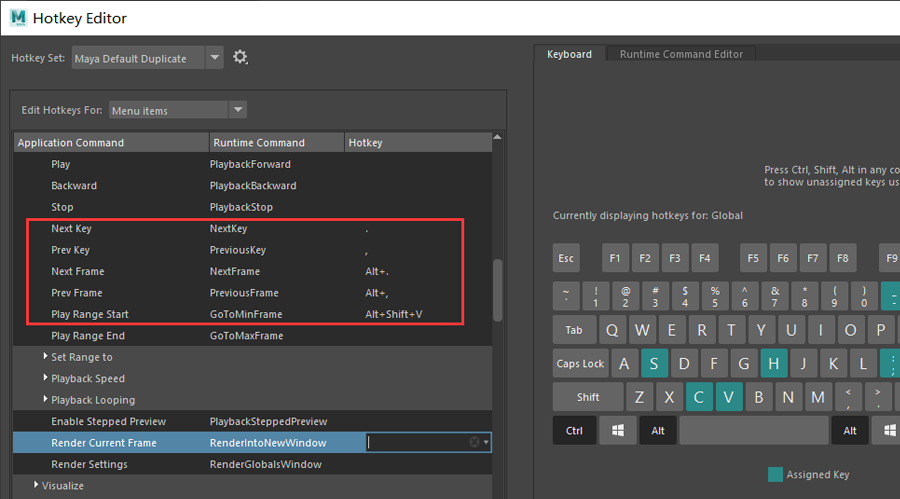
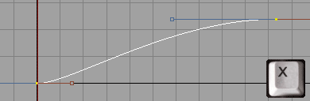
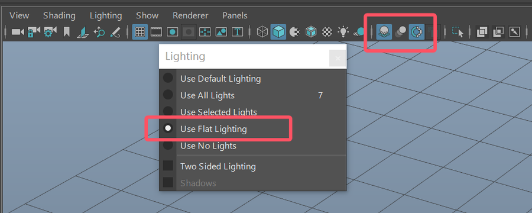

# 动画的前期准备——Maya设置配置
### 快捷键设置
前后帧快捷键.不建议修改    
   
曲线编辑器和大纲(非必要)   
   
  
拍屏快捷键   
  
***
## 自定义工具快捷键   
### `ackSliceCurves` 添加帧脚本说明

作者: [Aaron Koressel](https://www.aaronkoressel.com/index.php?nav=tools)   

#### 功能概述

`ackSliceCurves` 是一个用于在 Maya 的图形编辑器（Graph Editor）中插入关键帧的脚本。其主要作用是在当前时间点插入关键帧，同时保留曲线的切线（tangents）。该脚本可以对选中的曲线或图形编辑器中的所有曲线操作。它与 Maya 自带的插入关键帧工具类似，但更具针对性和效率，特别适合在当前时间点快速调整动画曲线。  
   
#### 主要功能
1. **插入关键帧至选中曲线**：如果在图形编辑器中有选中的曲线，它会在这些曲线的当前时间点插入关键帧。
2. **插入关键帧至所有曲线**：如果没有选中的曲线，它会对图形编辑器中所有可见曲线插入关键帧。
3. **性能优化**：相比 Maya 的内置插入关键帧工具，该脚本专注于当前时间点的操作，性能更高。   
```
global proc ackSliceCurves() {    
	// get graph outliner 
	string $connection = `editor -q -mainListConnection graphEditor1GraphEd`;
	
	// get selection from outliner
	string $graphObject[] = `expandSelectionConnectionAsArray $connection`;
	
	int $keyCount = 0;
	$keyCount = `keyframe -an keys -q -kc`;

	if ($keyCount == 0) {  							//no curves selected: slice all
		setKeyframe -insert -time `currentTime -q` $graphObject;
	} else {								//curves are selected:  slice selected
		string $selectedCurves[] = `keyframe -selected -q -name`;  		//return curves of selected keys
		setKeyframe -insert -time `currentTime -q` $selectedCurves;
	};
};
```
### ` ackDeleteKey`删除帧脚本   
- 如果在图形编辑器中选择了曲线，则删除选定的关键点。 
- 如果未选择任何曲线，则删除所选对象的当前关键点。与键盘上的删除键功能相同，但可映射到任何其他键。
```
global proc ackDeleteKey() {    
	// get graph outliner 
	string $connection = `editor -q -mainListConnection graphEditor1GraphEd`;
	
	// get selection from outliner
	string $curveSel[] = `expandSelectionConnectionAsArray $connection`;
	
	int $keyCount = 0;
	$keyCount = `keyframe -an keys -q -kc`;					//check for selected curves

	if ($keyCount == 0) {  							//no curves selected: delete current key of objects
		timeSliderClearKey;
	} else {								//curves are selected:  delete selected keys in graph
		cutKey -animation keys -clear;
	};
};
``` 
显示&隐藏控制器  
```
string $activePanel = `getPanel -wf`; if (`modelEditor -q -nurbsCurves $activePanel` == 1) { modelEditor -e -nurbsCurves 0 $activePanel; } else { modelEditor -e -nurbsCurves 1 $activePanel; }
```
快捷键设置的建议方案   
   
X显示快捷键
```
```
视窗渲染显示设置   
 