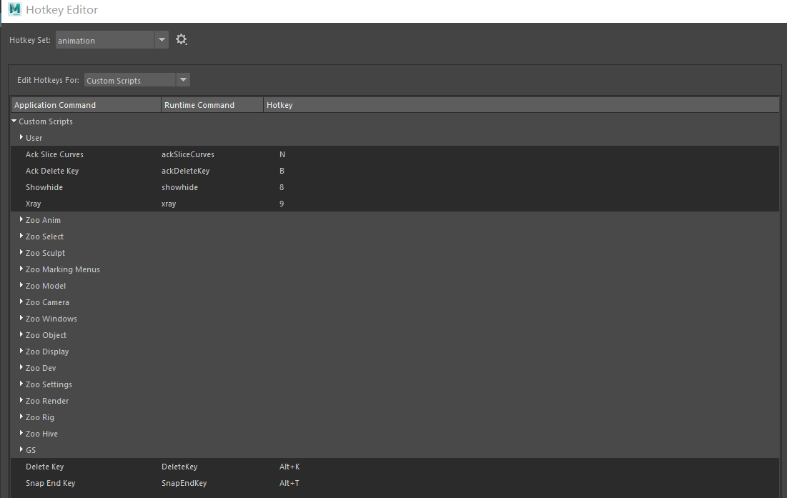
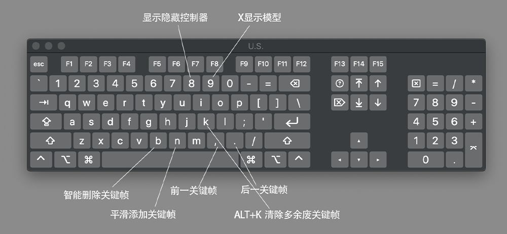

# 动画的前期准备——Maya设置配置
### 快捷键设置   
可以单独创建一个animation的key set集合，不和Maya默认的快捷键相冲突，做动画的时候临时切换过来   
前后关键帧帧快捷键:`<`,`>`   
前后帧快捷键:`Alt+<`,`Alt+>`   
Maya默认如此，不建议修改    
   
曲线编辑器和大纲(非必要，比较低频)   
   
  
拍屏快捷键   
  
***
## 自定义工具快捷键   
### `ackSliceCurves` 添加帧脚本说明

作者: [Aaron Koressel](https://www.aaronkoressel.com/index.php?nav=tools)   

#### 功能概述

`ackSliceCurves` 是一个用于在 Maya 的图形编辑器（Graph Editor）中插入关键帧的脚本。其主要作用是在当前时间点插入关键帧，同时保留曲线的切线（tangents）。该脚本可以对选中的曲线或图形编辑器中的所有曲线操作。它与 Maya 自带的插入关键帧工具类似，但更具针对性和效率，特别适合在当前时间点快速调整动画曲线。  
   
#### 主要功能
1. **插入关键帧至选中曲线**：如果在图形编辑器中有选中的曲线，它会在这些曲线的当前时间点插入关键帧。
2. **插入关键帧至所有曲线**：如果没有选中的曲线，它会对图形编辑器中所有可见曲线插入关键帧。
3. **性能优化**：相比 Maya 的内置插入关键帧工具，该脚本专注于当前时间点的操作，性能更高。   
```
global proc ackSliceCurves() {    
	// get graph outliner 
	string $connection = `editor -q -mainListConnection graphEditor1GraphEd`;
	
	// get selection from outliner
	string $graphObject[] = `expandSelectionConnectionAsArray $connection`;
	
	int $keyCount = 0;
	$keyCount = `keyframe -an keys -q -kc`;

	if ($keyCount == 0) {  							//no curves selected: slice all
		setKeyframe -insert -time `currentTime -q` $graphObject;
	} else {								//curves are selected:  slice selected
		string $selectedCurves[] = `keyframe -selected -q -name`;  		//return curves of selected keys
		setKeyframe -insert -time `currentTime -q` $selectedCurves;
	};
};
```
### ` ackDeleteKey`删除帧脚本   
- 如果在图形编辑器中选择了曲线，则删除选定的关键点。 
- 如果未选择任何曲线，则删除所选对象的当前关键点。与键盘上的删除键功能相同，但可映射到任何其他键。
```
global proc ackDeleteKey() {    
	// get graph outliner 
	string $connection = `editor -q -mainListConnection graphEditor1GraphEd`;
	
	// get selection from outliner
	string $curveSel[] = `expandSelectionConnectionAsArray $connection`;
	
	int $keyCount = 0;
	$keyCount = `keyframe -an keys -q -kc`;					//check for selected curves

	if ($keyCount == 0) {  							//no curves selected: delete current key of objects
		timeSliderClearKey;
	} else {								//curves are selected:  delete selected keys in graph
		cutKey -animation keys -clear;
	};
};
``` 
显示&隐藏控制器  
```
string $activePanel = `getPanel -wf`; if (`modelEditor -q -nurbsCurves $activePanel` == 1) { modelEditor -e -nurbsCurves 0 $activePanel; } else { modelEditor -e -nurbsCurves 1 $activePanel; }
```
快捷键设置的建议方案   
   
X显示快捷键
```
import maya.cmds as cmds
panel = cmds.getPanel(withFocus=True)

if cmds.getPanel(typeOf=panel) == "modelPanel":
    xray_state = cmds.modelEditor(panel, query=True, xray=True)
    cmds.modelEditor(panel, edit=True, xray=not xray_state)
```
视窗渲染显示设置   
    
Animation快捷键组，最后调试好，并同步好了一个版本，图示如下   
 
   

## 作者[Aaron Koressel](https://www.aaronkoressel.com/index.php?nav=tools)的其他动画工具脚本   
| 分类                  | 工具名称                  | 版本   | 核心功能                                                                 | 语法/参数                                                                 | 应用场景                          |
|-----------------------|---------------------------|--------|--------------------------------------------------------------------------|---------------------------------------------------------------------------|-----------------------------------|
| **动画曲线优化**      | ackDeleteRedundant        | 1.1    | 删除与相邻两键值相同的关键帧，减少冗余数据                                | `ackDeleteRedundant;`                                                      | 动画粗调后清理曲线                |
|                       | ackSliceCurves            | -      | 在当前时间点为选中曲线插入关键帧，保留原有切线形态                        | 直接运行                                                                   | 添加中间控制点                    |
| **关键帧位置调整**    | ackConvergeBuffer         | 1.0    | 使选中关键帧向缓冲曲线收敛、远离或捕捉                                    | `"toward" / "away" / "snap"`                                               | 匹配参考曲线                      |
|                       | ackSnapToTime             | 1.1    | 将选中关键帧移动到当前时间帧，支持左右模式                                | 默认左模式，通过`ackSetup`切换                                             | 同步多角色动作                    |
|                       | ackMoveKeys               | 1.1    | 通过键盘方向键移动关键帧时间或值，支持向相邻键收敛                        | `"left"/"right"/"up"/"down"/"convergeLeft"/"convergeRight"`                | 精细调整关键帧位置                |
| **键值与姿势操作**    | ackSnapEndKeyValues       | 1.0    | 将曲线首尾关键帧值对齐，确保动画循环衔接                                  | `"left"`（默认）/`"right"`                                                 | 制作循环动画                      |
|                       | ackNegateKeys             | 1.3    | 沿X轴翻转选中关键帧姿势，以相邻键或最后选中键为中心                      | 直接运行，方向通过`ackSetup`设置                                           | 生成对称或反向动作                |
|                       | ackSnapKeyValues          | -      | 将所有选中关键帧值对齐到最后一个选中键的值                                | 直接运行                                                                   | 批量统一关键帧值                  |
|                       | ackZeroOutKeys            | -      | 将选中关键帧值归零，清除动画数据                                          | 直接运行                                                                   | 重置动画或清除错误键值            |
| **动画时间与节奏**    | ackSpreadSqueezeTiming    | 1.0    | 插入或删除中间帧，实现时间轴均匀缩放，保证关键帧在整帧位置                | `"spread" / "squeeze"`                                                     | 调整动画节奏                      |
|                       | ackTimingFramework        | 1.0    | 按选中曲线关键帧时间，在其他曲线插入相同时间点关键帧，保留切线            | `ackTimingFramework;`                                                      | 新控制器匹配现有动画时间          |
|                       | ackSwapKeys               | 1.0    | 交换两组垂直关键帧的时间点，需选中两个时间点且每通道两个键                | 直接运行                                                                   | 调整姿势先后顺序                  |
| **动画偏移与缩放**    | ackSnapAnimation          | 1.1    | 偏移选中关键帧值，与相邻关键帧对齐，各曲线独立计算偏移量                  | 直接运行，邻键方向通过`ackSetup`设置                                       | 粘贴动画片段时保持衔接            |
|                       | ackPushPull               | 1.1    | 以枢轴点为中心推或拉动画曲线，使选中键靠近或远离枢轴点                    | `"pull" / "push"`                                                          | 调整动画幅度                      |
| **全局设置与控制**    | ackSetup                  | 1.0    | 为兼容脚本提供全局参数设置，包括枢轴方向、移动比例等                      | `"setup"`（打开界面）/`"left"/"right"/"last"`（切换枢轴）                  | 统一配置多脚本参数                |
|                       | ackNewGraphEditor         | -      | 智能打开或创建新的Graph Editor窗口，解决默认只能显示一个窗口的限制        | 直接运行                                                                   | 同时查看多个动画曲线              |
| **视图与摄像机控制**  | ackToggleCams             | 1.1    | 在两个摄像机之间快速切换视口显示，支持自定义摄像机名称                    | `ackToggleCams;` / `ackToggleCams_setup;`                                  | 拍摄摄像机与透视图快速切换        |
|                       | ackToggleHighlight        | -      | 切换选中对象的线框高亮显示，避免高亮干扰视图                              | 直接运行                                                                   | 复杂场景中清晰查看模型            |
| **其他辅助工具**      | ackGotoTime               | -      | 弹出窗口输入帧号，快速跳转至指定时间点                                    | 直接运行，输入帧号回车                                                      | 精确跳转至某帧调整动画            |
|                       | ackShuttleControl         | 1.2    | 替代默认穿梭控制，支持逐帧、逐键跳转，不污染撤销历史                      | `"nextFrame"/"prevFrame"/"nextKey"/"prevKey"`                              | 逐帧检查或关键帧间导航            |
|                       | ackToggleSound            | 1.1    | 切换时间轴中当前音频的静音状态，首次使用自动识别当前音频                  | 直接运行                                                                   | 临时静音音频专注视觉调整          |
| **显示与模式切换**    | ackToggleTranslateMode    | 1.1    | 切换局部平移与世界平移模式                                                | 直接运行                                                                   | 调整角色在不同坐标系下的移动      |
|                       | ackToggleRotateMode       | -      | 切换局部旋转与万向节（Gimbal）旋转模式                                    | 直接运行                                                                   | 避免旋转轴锁定，精确控制旋转      |
|                       | ackToggleTangentType      | -      | 切换关键帧切线类型（断开自由切线/统一自由切线）                            | 直接运行                                                                   | 调整曲线平滑度                    |
|                       | ackToggleModel            | 1.1    | 切换NURBS曲面、多边形、细分曲面的可见性                                    | 直接运行                                                                   | 隐藏模型方便选择控制器            |
|                       | ackToggleNURBSCurves      | -      | 切换NURBS曲线（如控制器）的可见性                                         | 直接运行                                                                   | 清理视图避免控制器干扰            |
|                       | ackToggleImagePlane       | -      | 切换场景中所有图像平面的可见性                                            | 直接运行                                                                   | 显示/隐藏参考图                  |
|                       | ackToggleKeyColor         | -      | 切换选中关键帧的特殊颜色显示                                              | 直接运行                                                                   | 突出显示特定关键帧                |

   