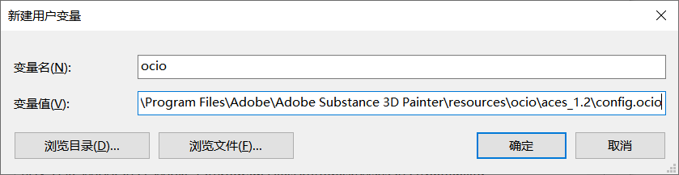
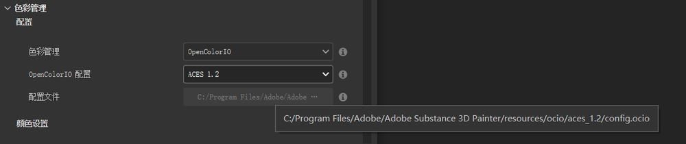
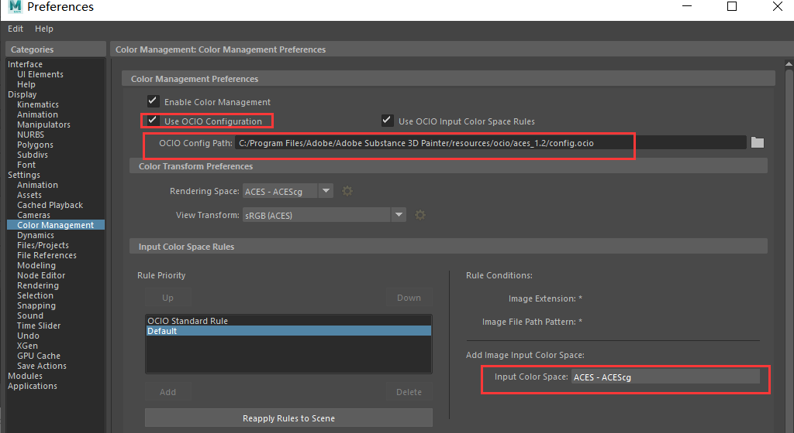

# 色彩空间  

ACES（Academy Color Encoding System）是由美国电影艺术与科学学院开发的一套电影级色彩管理系统，可以统一整个制作流程（拍摄、合成、调色、输出）中的色彩空间，从而保障最终画面质量、统一性和跨平台适应性。   
ACES 1.2 是其较成熟和广泛应用的版本，支持HDR、高位深渲染、线性工作流程等，是工业级动画和影视制作的标准之一。   

<https://opencolorio.org/>

 
这个仓库 OpenColorIO-Config-ACES 主要用于生成基于 ACES（Academy Color Encoding System）的 OpenColorIO（OCIO）配置文件
- <https://github.com/colour-science/OpenColorIO-Config-ACES>   

迪士尼在《冰雪奇缘2》等项目中使用的开源颜色管理工具为 ​​OpenColorIO（OCIO）​​，这是由索尼图形图像（Sony Pictures Imageworks）开发并由学院软件基金会（ASWF）维护的行业标准解决方案。该仓库提供了完整的代码、文档及配置案例，支持电影级色彩管线的搭建。   
- ​GitHub仓库    
<https://github.com/AcademySoftwareFoundation/OpenColorIO>    

## ACES配置流程   
   
添加环境变量，指定ocio文件路径，重启电脑  

   
SP里，新建文件选择色彩管理项。然后找到路径下的ocio文件   
> C:\Program Files\Adobe\Adobe Substance 3D Painter\resources\ocio\aces_1.2   

   
maya中选择对应项   
  
houdini中配置  