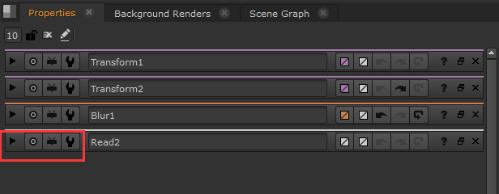
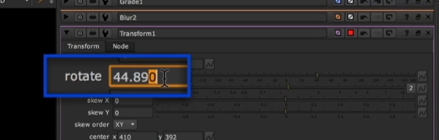
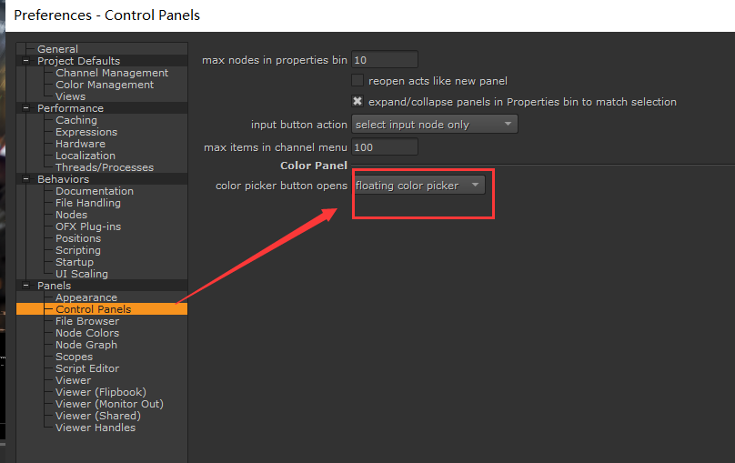

# NUKE 
安装完会多出来这么多图标应用。有点懵逼   
   
## Nuke 15.1v4 组件及其用途

| 图标名称                          | 用途描述 |
|----------------------------------|--------------------------------------------------------------|
| **Nuke 15.1v4**                  | 标准版 Nuke，主要用于节点式合成。 |
| **NukeX 15.1v4**                 | 增强版 Nuke，包含 Nuke 的全部功能，并附加高级工具（如 3D 摄像机跟踪、光流工具等）。 |
| **NukeStudio 15.1v4**            | 结合 NukeX 和时间线编辑功能，适用于完整的后期制作工作流。 |
| **NukeAssist 15.1v4**            | 精简版 Nuke，仅用于辅助任务（如 Roto、Paint），不含高级工具。 |
| **NukeIndie 15.1v4**             | 独立创作者版，功能接近 NukeX，但有商业使用限制。 |
| **Nuke 15.1v4 Non-commercial**   | 免费非商业版，带有功能限制（如水印、分辨率限制）。 |
| **NukeX 15.1v4 Non-commercial**  | 免费非商业版 NukeX，功能限制同上。 |
| **NukeStudio 15.1v4 Non-commercial** | 免费非商业版 NukeStudio，功能限制同上。 |
| **Hiero 15.1v4**                 | 时间线管理工具，适用于镜头编排与素材管理。 |
| **HieroPlayer 15.1v4**           | 播放软件，用于回放 NukeStudio/Hiero 项目。 |
| **Nuke 15.1v4 Documentation**    | 官方帮助文档，提供 Nuke 使用指南和 API 参考。 |

- 实际上，只有**NukeX 15.1v4**是核心  

## Nuke 节点操作快捷键总结

| 操作类别       | 功能描述            | 快捷键/操作方式 |
|--------------|------------------|----------------|
| **创建节点**   | 打开节点创建面板    | `Tab`，输入节点名称并回车 |
| **连接节点**   | 连接节点          | 拖动输出端口到目标节点输入端口 |
|              | 更改连接关系       | `Shift + 拖动连接线` |
| **打断连接**   | 断开节点连接      | 选中连接线后 `Delete` |
|              | 拖动断开连接      | `Alt + 拖动连接线` |
| **复制 & 粘贴** | 复制节点         | `Ctrl + C / Cmd + C` |
|              | 粘贴节点         | `Ctrl + V / Cmd + V` |
| **克隆节点**   | 创建克隆（Instance）| `Alt + K / Option + K` |
| **交换连接**   | 交换两个节点顺序  | `Shift + X` |
| **组织节点**   | 自动排列        | `L` |
|              | 启用/禁用节点    | `D` |
|              | 显示/隐藏属性    | `H` |
| **提取节点**   | 将某节点提取为独立分支 | `Shift + Ctrl + X` |
| **选择节点树** | 选择当前节点的所有上游节点 | `Ctrl + Shift + 左箭头` |
|              | 选择当前节点的所有下游节点 | `Ctrl + Shift + 右箭头` |
| **节点书签**   | 添加书签  | `Ctrl + Alt + B` |
|              | 查找书签         | `J` |
| **修改节点名称** | 进入节点重命名模式 | `N` |

## 属性面板 
  
`Shift + S` 打开属性设置面板。可以让控制手柄只显示当前选择的，而不显示全部，方便操作    
  
分别是：`展开`，`定位到节点`，`选择上游节点`，`节点预设`。
Nuke的节点预设每一个都是独立的。  
后面是`根据颜色类型选择节点`。`自定义控制器手柄颜色`,`节点操作撤销`,`节点恢复到第一次打开的值`。   
> 主要是针对一些值的试探，又想撤销会第一次的值。小技巧：先关掉节点属性面板，再打开调节。

## 常见操作  
  
滑动杆调整是整数值。   
鼠标中键滑动，可以更细致调整。   
可以在某个位数上选择后滑动中键，会对该位数进行调整。  
`Ctrl +左键`单击滑杆，可以恢复到刚创建出来的值。如果有关键帧也会被清零。     
    
可以点击`4`变为`RGBA`4通道值   
   
**颜色吸管拾取**  
`Ctrl + 左键`拾取点颜色   
`Ctrl + Shift + 左键`拾取范围颜色平均值   
`Ctrl + Alt + 左键`拾取当前节点颜色值（和之前拾取最后view节点颜色不同）  
按住`Alt`点击，拾取的是input端口的颜色    
**取消颜色吸管拾取**   
`Ctrl + 右键`  
**拾色器**    
    
可以在设置里吧拾色器面板改为浮动窗口，就会多几个拾色器模式  
