# Ncloth 

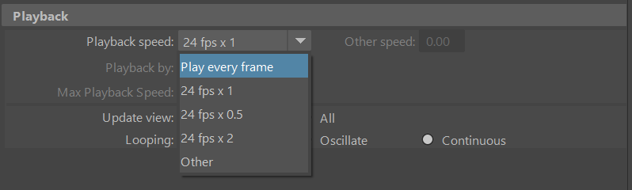   
- 做动力学相关需要把时间设置为每帧播放   
- 模型的布线要比较均匀   
- 模型缓存是已经被启用的。只能maya内部使用。现在更通用的缓存文件是Alembic  
- 场景内的物体，如果给不同的解算器，两者之间是不能做交互的。必须在同一个解算器下      

## 布料流程
1. 创建布料
2. 调整参数，模拟导出缓存。整理文件
3. 在干净的场景内使用缓存文件
> 具有相同的模型拓扑结构才能使用缓存文件   


## 解算器 
   
**重力值及方向**   
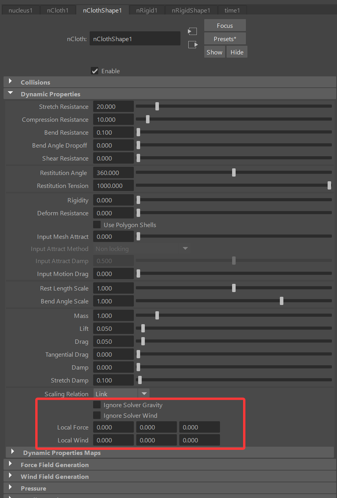   
每个布料物体也有局部设置  
可以忽略重力，或者修改局部分量的力，这个力和全局力的相抵消计算的   
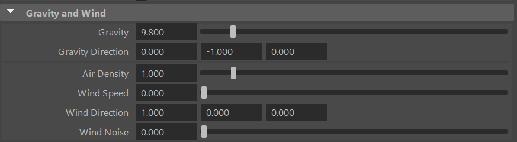   
**空气密度**会影响物体的阻力和升力。一般默认。   
**wind speed** 风力强度  
**wind noise** 风噪波扰乱，但效果不是很明显，通常用maya的场来做扰乱。  
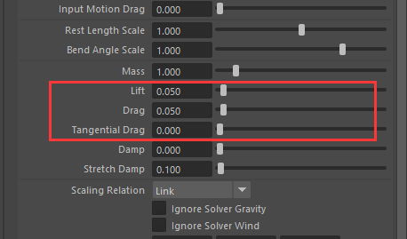   
**升力,阻力,切线阻力**。可以控制物体受风吹影响的程度  
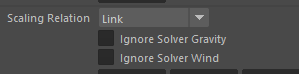   
同样可以忽略风的影响   
     
可以勾选使用平面，一个无限大的平面。但实际使用比较少。往往是做实际的碰撞物体     
**plane bounce**反弹   
**plane friction**摩擦力  
**plane stickiness** 粘性    
   
**substeps** 解算精度   
max collision lterations 最大碰撞次数   
**collosion layer range** 碰撞层范围   
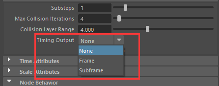    
timing output 返回值，选择返回值类型，在脚本窗口可以返回解算的各种值，一般来说，没啥卵用   
use transform  使用解算器变换复选框，如果勾选，解算器的旋转值会影响解算效果。一般保持默认勾选  
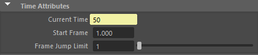  
时间相关。只有start tine有点用，可以修改模拟的开始帧    
farme jump limit 跳帧模拟。主要是查看模拟效果，没啥卵用的，一般都是观看缓存效果  
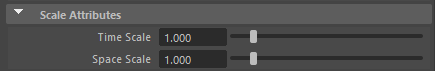   
**缩放属性**。比较常用   
time scale 数值越大模拟越快，反之越慢。如果慢镜头模拟，就把值改小   
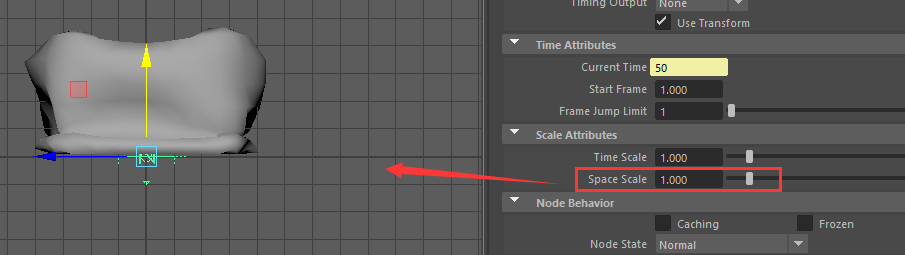   
space scale 默认1是等于maya的1cm的单位，如果是100，就是1米的模拟精度。   
空间模拟缩小10倍，等于物体倍放大了10倍，可以感性等同现实世界的大小：如果是更大的物体，那么会更重      

## 布料  
### 碰撞
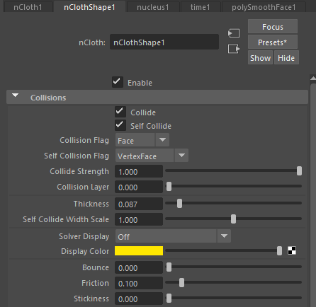   
碰撞和自碰撞   
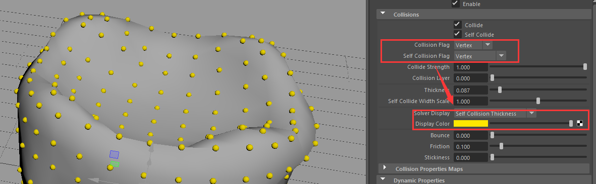   
碰撞和自碰撞的解算元素。自碰撞用点和点边比较合适比较快  
thickness 碰撞厚度，值越小，越贴合模型   
self collide with scale 自碰撞厚度   
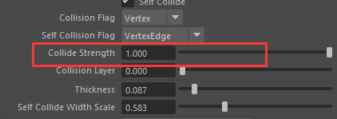   
碰撞强度。同时倍碰撞物体也有碰撞强度。这个值太小，会穿插。太高会被弹起   
   
类比解算器，同时布料节点也是有`plane bounce` 反弹，`plane friction` 摩擦力，`plane stickiness` 粘性  
   
碰撞层     
1. 确定物体之间是否产生碰撞  
物体之间碰撞层的差的绝对值，要小于或等于 **解算器内碰撞层值** 的范围，才能产生碰撞   
```
|(A-B)|≤碰撞层范围
```
2. 物体之间的碰撞级别    
- 数值越小，碰撞优先级越高   

## 动力学属性
   
**rigidity**   
刚体。数值在0——1时，物体介于布料和刚体之间。   
貌似有很多问题，不推荐使用   
**Deform Resistance**    
抗变形。数值越大，越能保持当前形态。做冰淇淋融化等比较实用    
**use polygon shells**    
可以对没有分离的开的多个物体分别使用刚体和抗变形。  
区别是可以不把物体分离成多个物体，尤其是数量特别多的时候   

   
**Input Mesh Attract**   
输入网格吸引。布料物体收到输入物体的吸引强度   
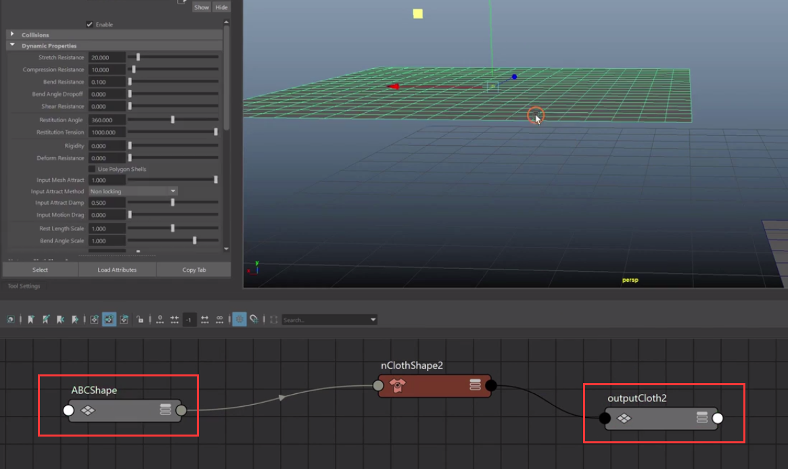   
把mesh转换成布料物体后，节点经过计算，原始的mesh物体还是存在。但是显示为布料物体。  
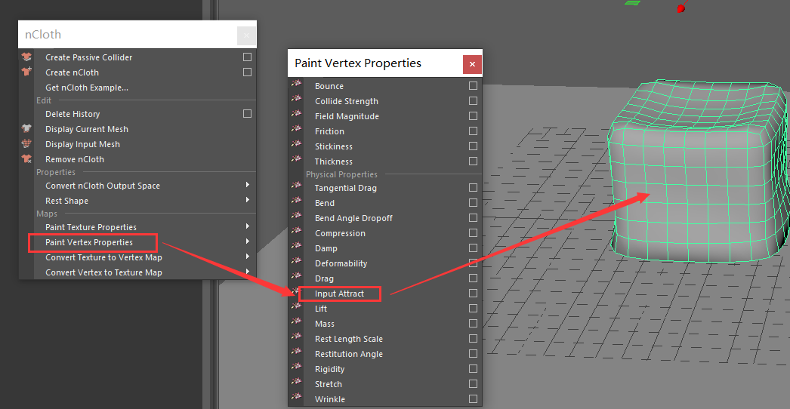  
类似权重绘制。0-1值的强度，就代表接近原始mesh的程度。做角色布料是一个非常重要的值。  
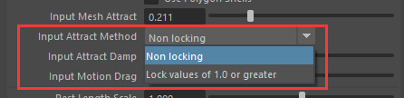   
**Input Attract Method**   
锁定及非锁定。在上面网格吸引的权重之后，可以决定接近原始mesh的部分要不要有布料模拟互动   
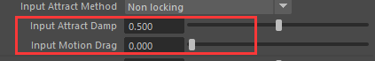   
输入吸引阻尼 。降低输入吸引的动能。一般保持默认 
输入运动阻力。输入物体对布料物体的阻尼强度。这个是整体性的，没有权重控制，实用性也不高   
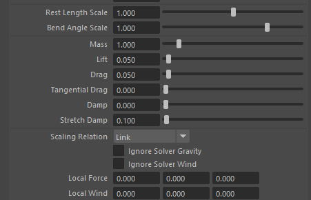  
Rest Length Scale   
静止长度比例：模拟后物体的大小比例变化（没啥用）  
**Bend Angle Scale**   
静止角度比例：模拟后物体的弯曲折叠程度   

**Mass**
质量。值越大质量越重    
**Lift**
升力：与相对风垂直的分量  
**Drag**
阻力：影响物体的曲面法线，在有风力的情况下，会产生与相对风平行的分量   
**Tangential Drag**   
切线阻力：影响物体的曲面切线  
整体说，是**Lift**，**Drag**，**Tangential Drag** 会影响布料风吹动的动态形态   

**Damp**
动能。比较常用。可以决定布料动态的势能。形象理解是布料甩动的活力   
**Stretch Damp**
拉伸阻力：降低拉伸阻力。自然现象里是有轻微抖动，一般值在1-3之间  
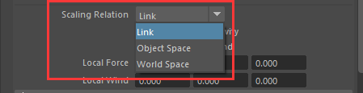   
**Scaling Relation**
缩放关系:动力学特性对布料物体的影响   
1. 链接：不同大小和面数的布料物体，产生不同的影响
2. 对象空间：动力学特性对不同形态的物体产生相同的影响 
3. 世界空间：动力学特性对不同形态的物体产生相同的影响，且刚度在世界空间中的固定的  
面数少的时候可以用link,面数多用后两者   

## 力场生成 
   
其实这个用得比较少，往往是用立场来实现。功能类似   
Force Field 立场的法线方向，单面，双面等选项  
Field Scale 立场的衰减曲线变化   
## 风吹 
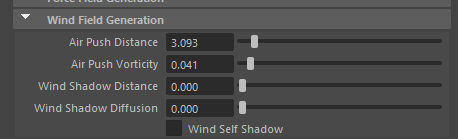  
实际中使用比较少，往往用场来替代  
模拟物体运动过程产生风，影响其他布料物体  
wind shadow distance  挡住风吹的距离值   
wind shadow diffusion 风的尾流的强度   
wind self shadow 是否尾流会影响遮挡物体
## 压力 
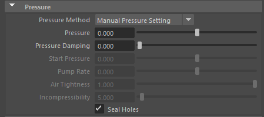   
实际中用比较少  
有两种模式。效果上是控制向内或向外的膨胀收缩程度  
