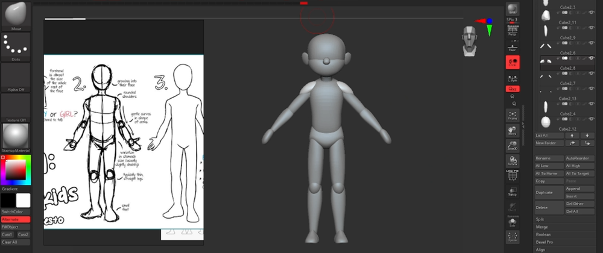
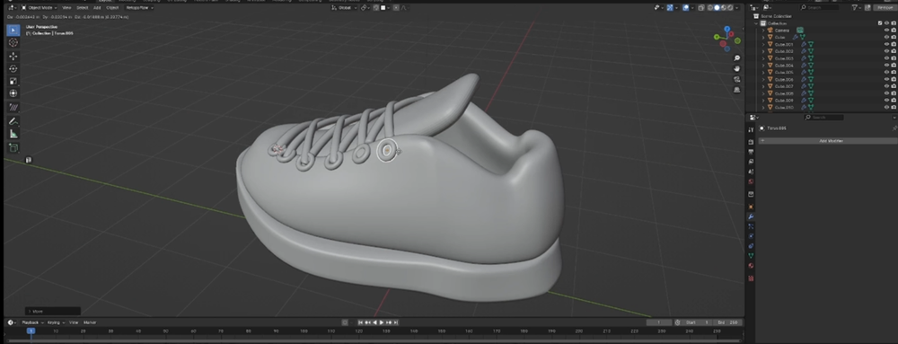
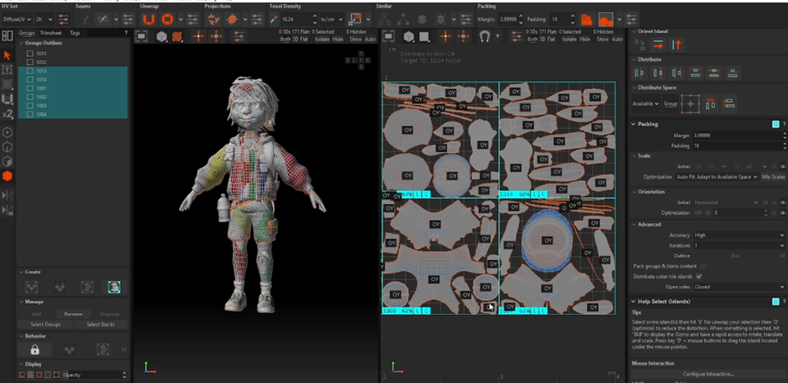
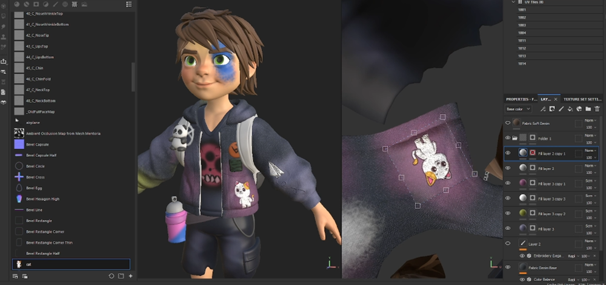
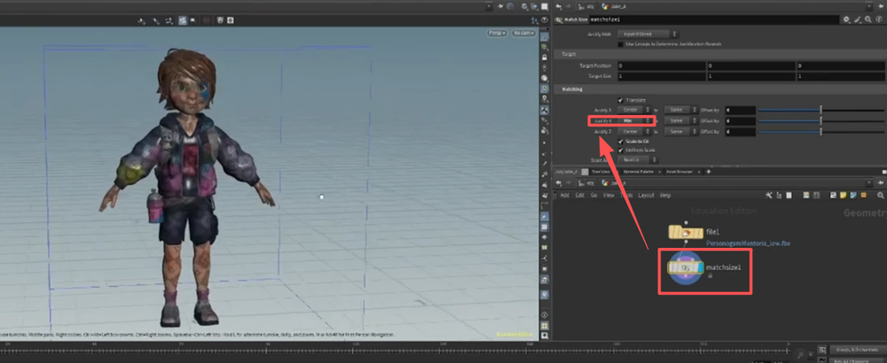
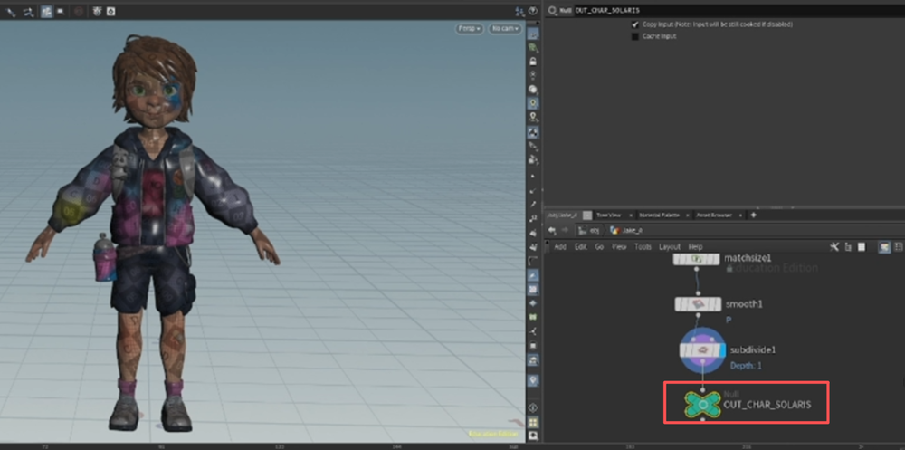
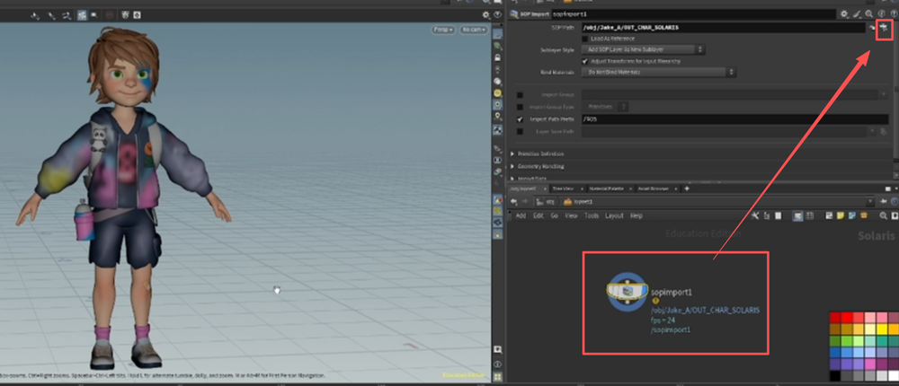
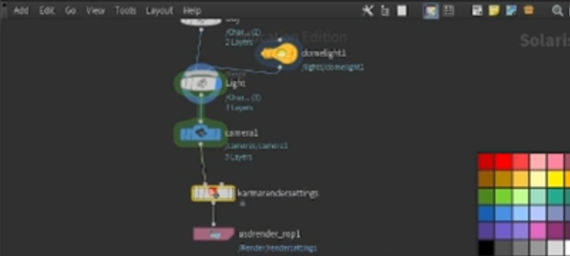

# Udemy - Designing Stylized 3D Characters  
    
Block 创建    
    
合并并重建细分，雕刻    
    
创建头发条，并变形调整    
     
    
雕刻身体    
    
衣服   
     
鞋子    
    
拓扑   
    
    
分UV   
    
SP绘制   
     
houdini加载    
matchsize 节点重设模型脚部到坐标原点    
    
最后整理完一个null节点结尾    
     
创建LOP Nerwork 节点，并在内部加载SOP Import节点，加载模型    
    
创建渲染背景网格   
     
LOP节点里加载并合并    
    
合并灯光   
    
依次连接摄像机和karma  
     
karma节点上更改摄像机节点的尺寸，视窗切换搞摄像机窗口   
    
灯光之下创建material library 节点   
   
材质节点里进行各种设置    
