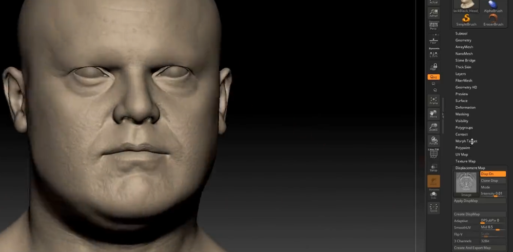
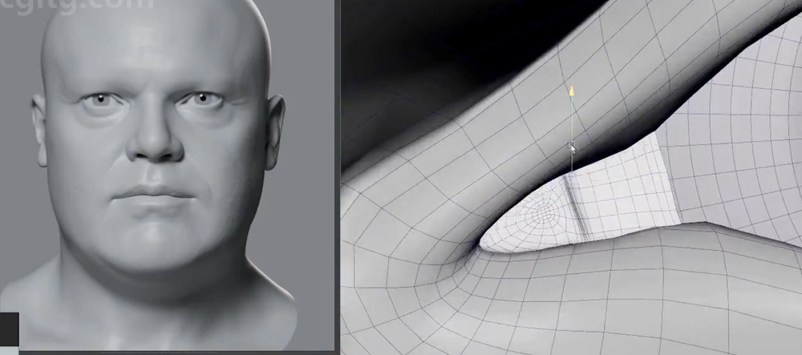
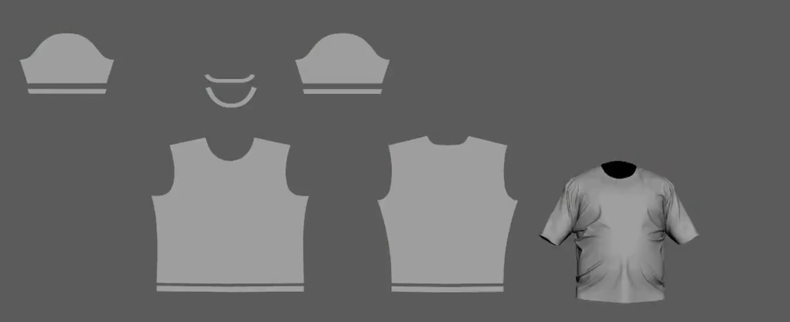
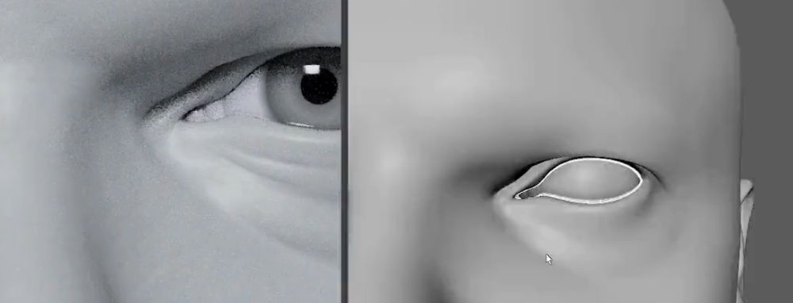

# Hyperreal 3D Character Creation by Şefki Ibrahim
    
## Hyperreal 3D Character Creation Course Reference Sheet
### TexturingXYZ   
VFace: https://texturing.xyz/collections/vface   
Iris Pack: https://texturing.xyz/collections/multi-channel-iris/products/humaneyes-brown-iris-09      
Cloth Pack: https://texturing.xyz/collections/wrinkles    
### HDRI’s   
https://polyhaven.com/    
http://www.hexquad.co.uk/product/general-hdri-collection/    
### Cloth Brushes   
https://artstn.co/m/Gbmw   
### Cave Academy   
Lightstage: https://caveacademy.com/product/maya-360-look-dev-and-lighting-rig-1003/   
Light Textures: https://caveacademy.com/product/hdri-light-set-1001/   
### Blendshape Script   
https://www.youtube.com/watch?v=0GVmTyldHf0   
(link to script in video description)   
### Reference Viewer   
https://www.pureref.com/   
### Downloadable Assets   
https://drive.google.com/drive/folders/1gH0jJfv_72SFLY_cDLxv-8NkjpP5-EUQ?usp=sharing   

## 建模
根据参考调整大型    
    
    
     
置换贴图给上后，综合再调整一些雕刻细节   
   
   
添加眼睛和泪腺等  
     
MD中制作衣服   
    
导入Maya中   
   
对衣服面板进行平展，做拓扑准备   
   
重拓扑   
   
传递   
  
焊接后在ZB进行进一步雕刻和细节纹理制作   
   
制作泪腺  
   
    
## 贴图

## 毛发