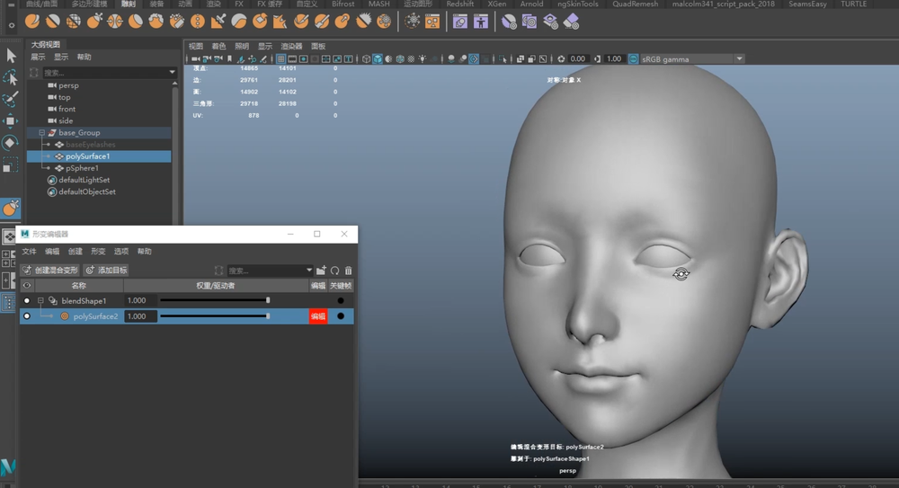
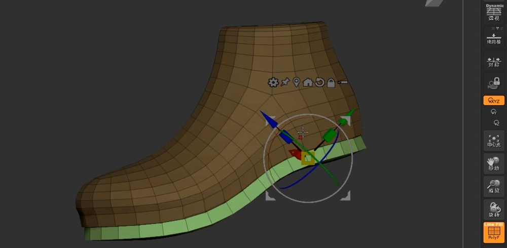
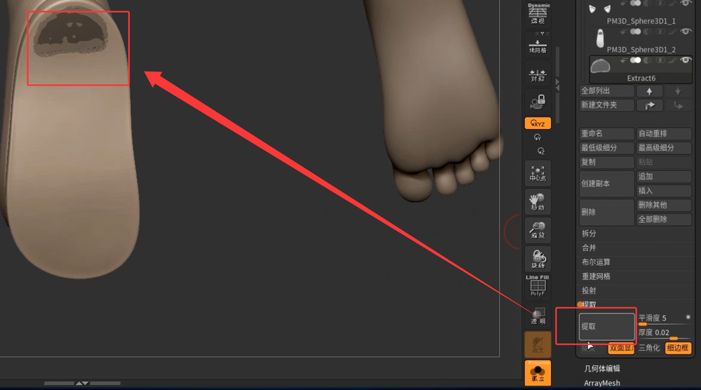
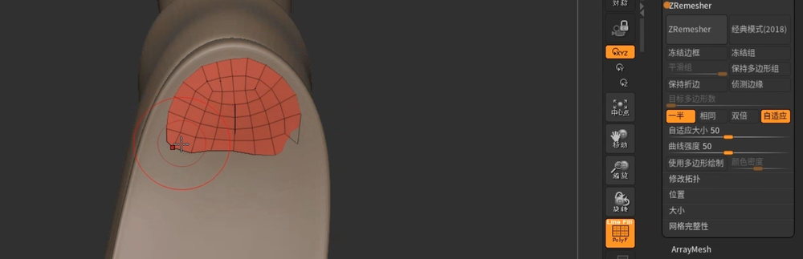
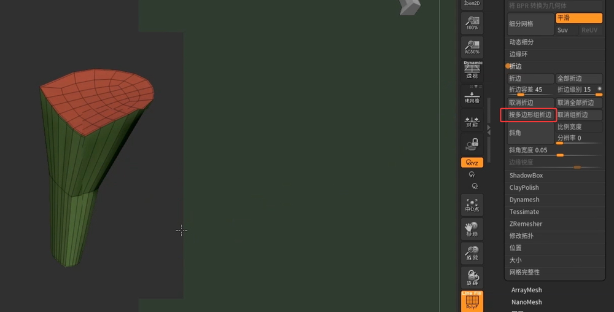

# 凯露   
    
DAZ模型导入Maya之后进行一个必要的清理和整理     
在保持绑定蒙皮的前提下，开始使用BS进行调整和修型    
    
根据参考准备下一步制作,分析出部件        
     
ZB中做鞋子大型，再重拓扑   
     
对鞋底和鞋面分组，ZModeler建模，挤出鞋底     
    
    
绘制鞋跟遮罩并提取    
    
重绘拓扑，并调整形体    
    
调整并按多边形折边，再进行细分   
     