# 源赖光
## 身体制作
### DAZ体型制作
   
制作大型后导出为FBX。可以保持skin信息 
### MAX摆动作
导出的模型是带绑定的。好像是有辅助骨骼。需要清理掉。  
第一帧是Tpose,所有骨骼key帧。再其它帧调整姿势。对比设计图调整姿势。  
  
必要的附属物品可以匹配并再此细化调整   
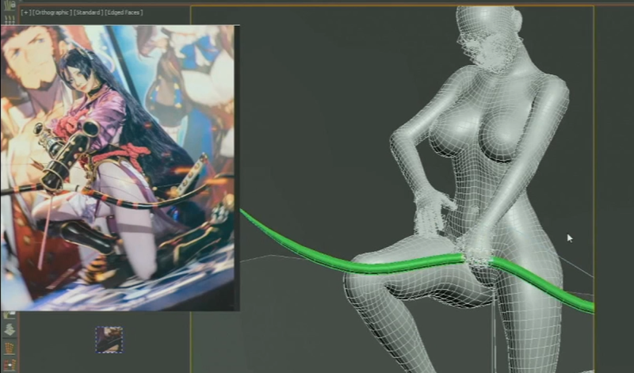
### 低模制作
在Tpose姿态下做好部件，必要的镜像后，父子链接到对应的骨骼，并看情况微调   
   
   
同样方式制作其它部件   
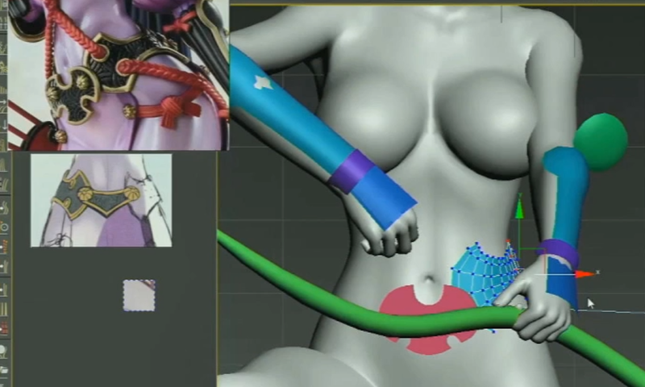   
麻花辫制作  
使用ZB插件（2021版本以上）  
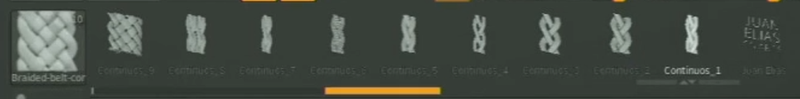    
适当修改并变形调整    
   
使用路径跟踪修改器进行制作   
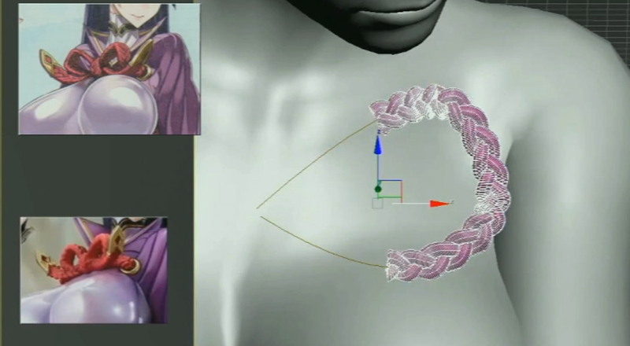  
   
看情况可以使用吸附拓扑等工具制作其它结构的物件  
   
布料可以简单创建一下，主要是适配物件和整体感觉，最后会用MD方式替换   
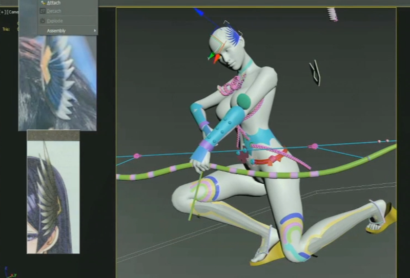   
头发面片搭建个粗略的大型   
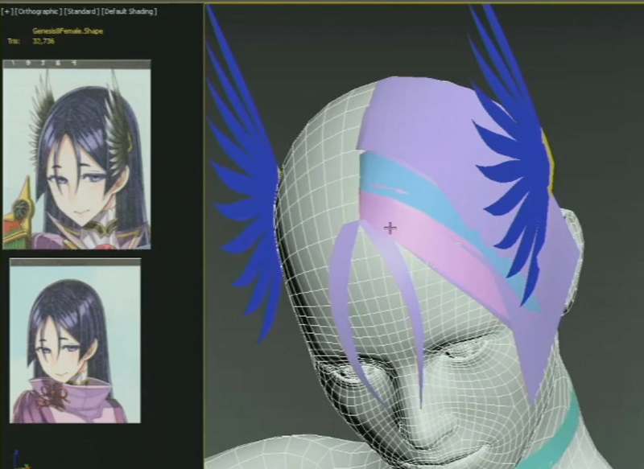   
    
  
其他道具制作  
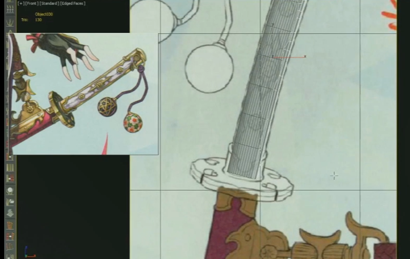
### 脸部制作
分离头和身体，主要原因是如果全身细分，细节很难保证，文件内存也开销太大。  
ctrl+c,ctrl+v复制一份模型.处理之后一个只有头，一个没有头。  
并对眼睛和牙齿进行分离处理，并作为头部骨骼的子物体，可以跟随运动。（雕刻的时候，并不希望这部分参与）  
   
导出模型到ZB进行雕刻，完成后导出**第一级模型**   
ZB模型的导入设置    
   
翻转90之后匹配Tpose的脸，可以看到完全重叠。这时候把Tpose的skin复制粘贴给新导入的头模型，这时候新的头部模型可以跟随姿势。   
在姿势状态导出obj模型，再ZB里**同名导入**，就可以看到ZB的模型更新到姿态，并保留了雕刻信息。  
最后一步看具体必要性，可以在姿态状态再导出眼睛牙齿等模型，同名导入ZB。可以同步模型。  

### 雕刻面部   
   
导入眉目睫毛模型，调整适配   
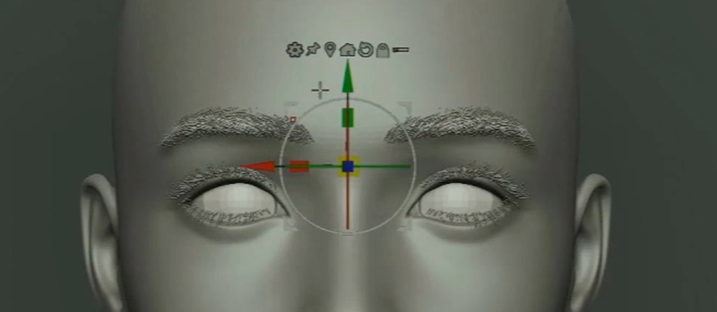   
森买入调整   
    
可以导入头发模型，整体预览调整   
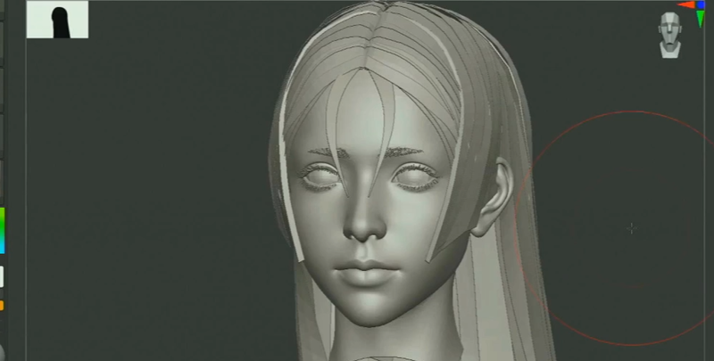   

### 面部细节映射
这个方法总体逼XYZ贴图的方式简单  
导入高模，并附加进来并调整适配   
   
注意匹配的模型的上下关系     
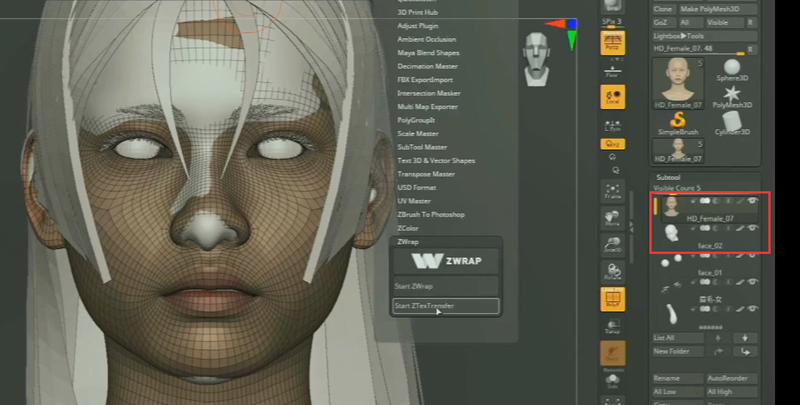  
进入插件设置匹配定位点。按住ctrl键，减去点。     
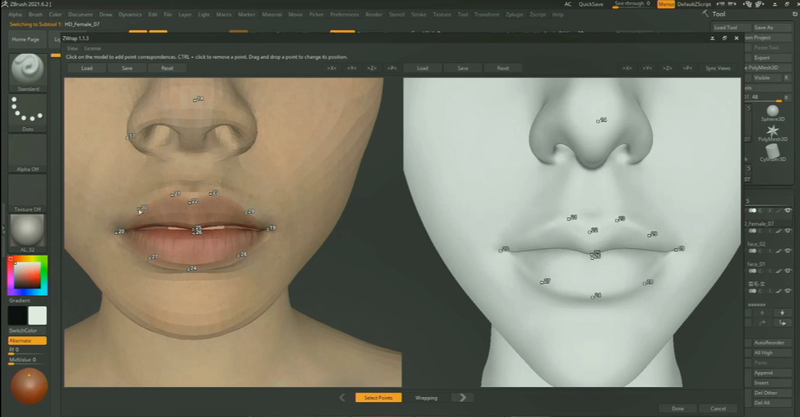   
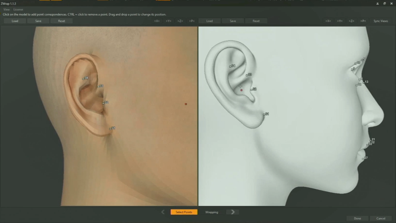   
  
project映射   
project映射是下面映射到上面，意思是上面作为不变的目标体。先让带纹理的素材模型分多层级映射匹配到我们自己做的头的形状。是为了最大化匹配好我们自己的模型。
完成匹配后，反过来，把素材模型的细节映射回自己的模型。看情况加到必要的细分层级。这个时候匹配的容差可以调很小，逼之前小。
4级别映射于以下，7级再映射一下。    
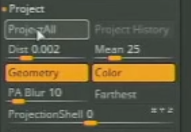   
先只映射置换信息，不用映射颜色。    
      
映射完成后检查一些错误部分，做适当修整。  
 
#### 面部细节雕刻
主要是应对素材模型的细节不够，做一些必要的添补   
   
  
把雕刻完成的Tpose头部模型整理并匹配到姿态模型   
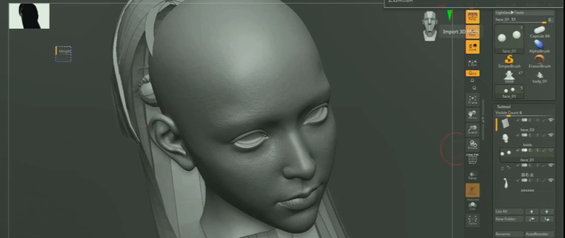   
