# 狮驼王 
软选择调整大型,并进行ZB大型雕刻        
     
制作牙齿    
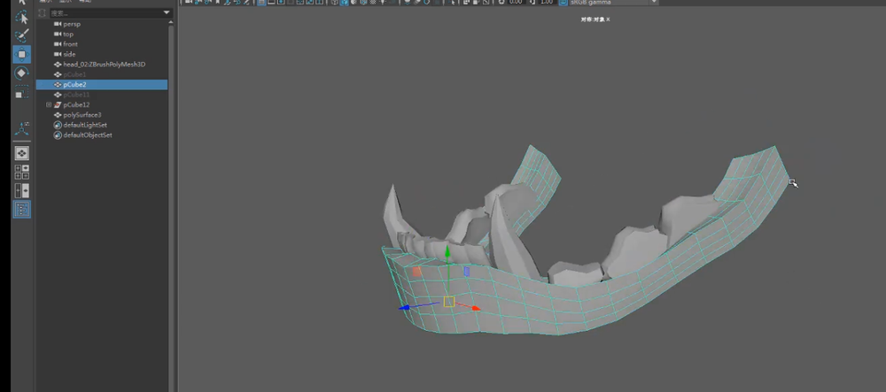    
添加到ZB的模型里   
    
添加并拼合身体等，案例显得笨笨的    
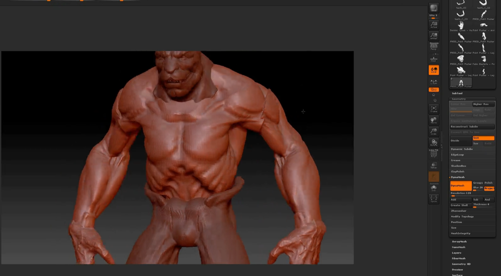     
头发大型   
    
zb简单雕刻    
    
身体等雕刻   
    
    
    
盔甲制作   
    
    
鳞片制作   
   
导入ZB之后，在一个较大的画布尺寸里，生成alpha，记得要关掉透视   
把alpha图最后导出      
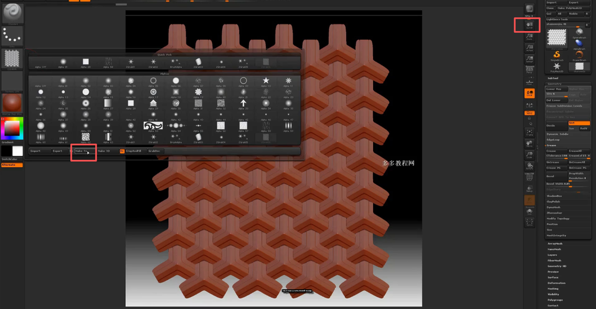     
PS 里拼合出一整张alpha图，不需要考虑无缝，因为是全部覆盖UV    
    
     
盔甲片UV   
     
ZB中导入PS出来完成的alpha图，上下翻转后转换成alpha          
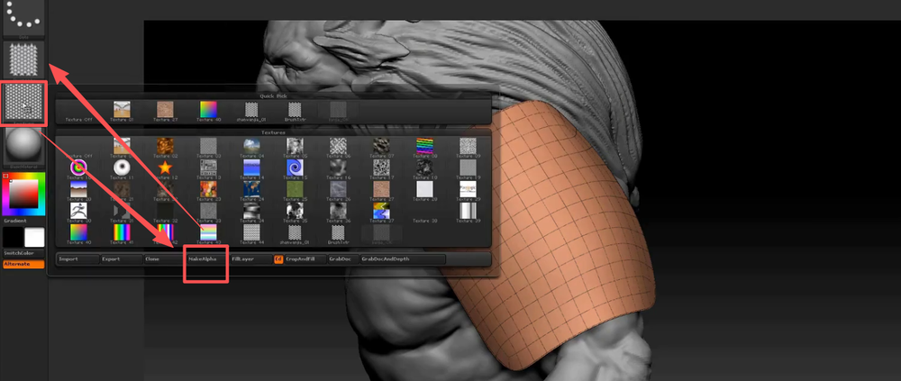    
mask by alpha   
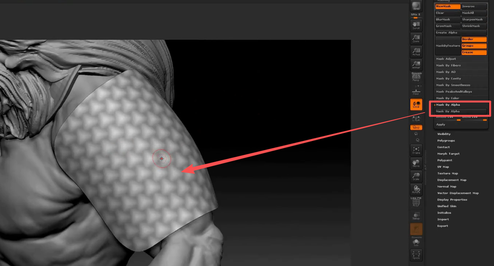     
inflate值   
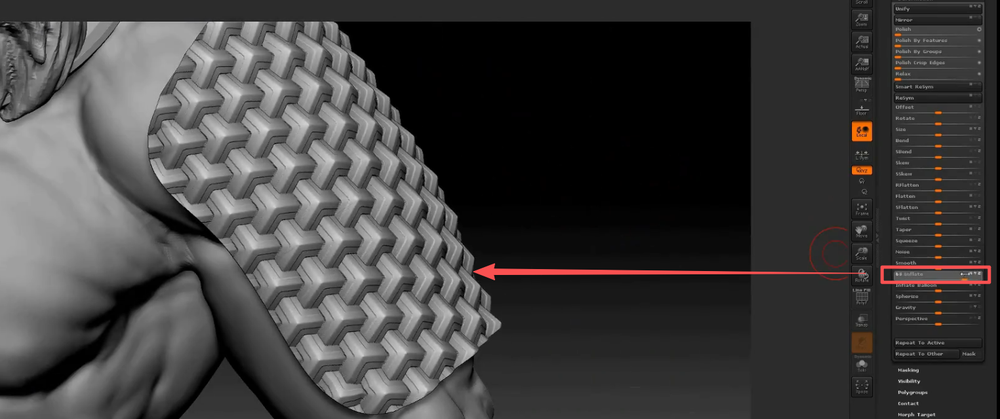    
导出低模，再maya中制作包边   
     
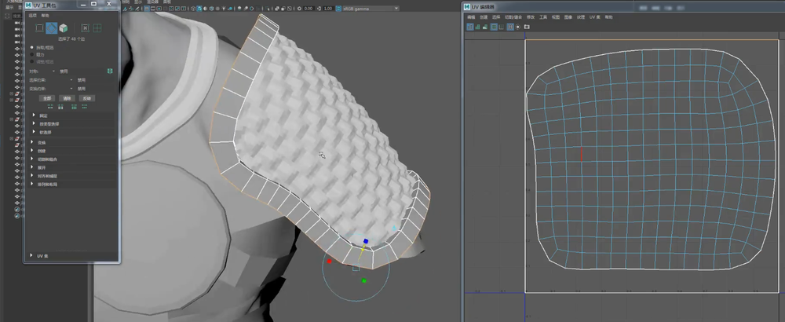   
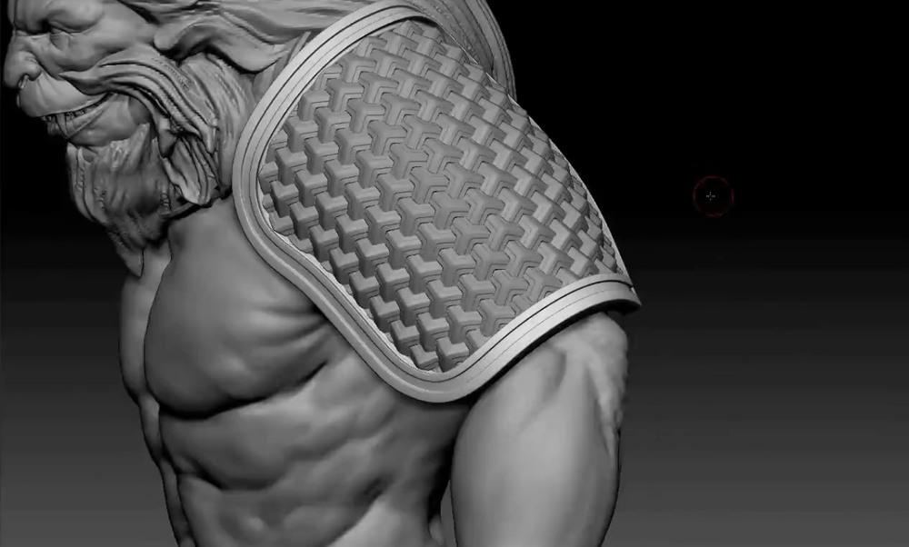    
其他部件同理，只需要注意鳞片的比例大小，适当调整alpha的密度   
    
     
锁子甲利用nano mesh功能制作  
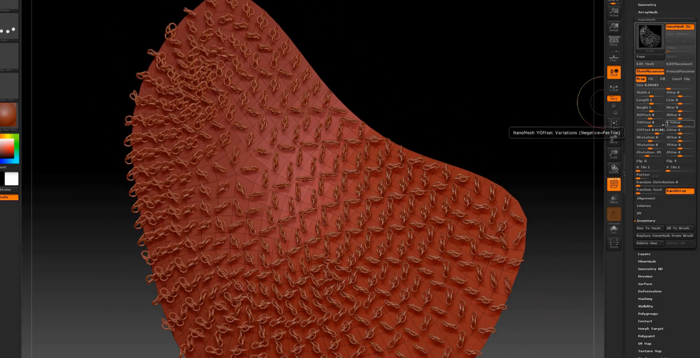   
其实效果不太理想  
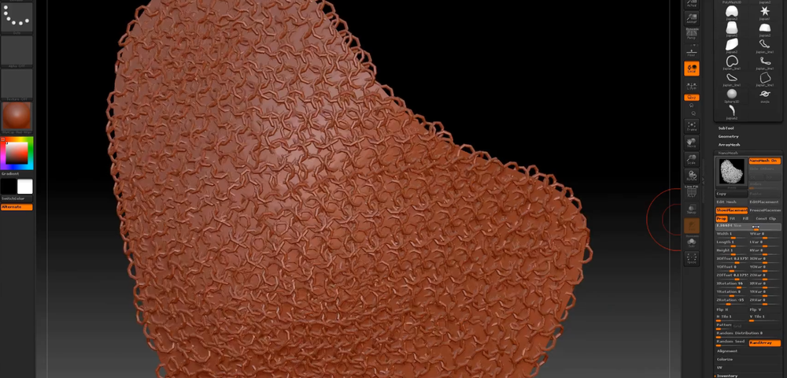    
MD 服装制作   
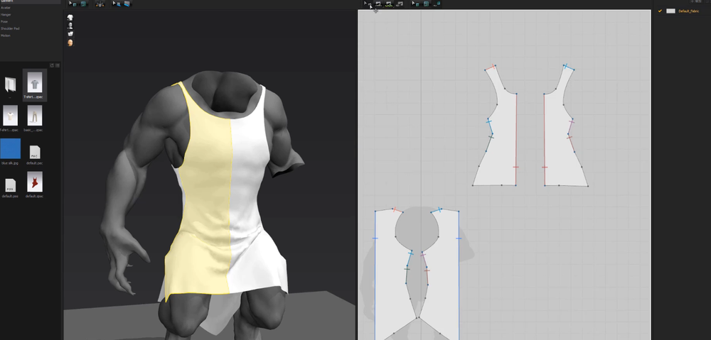    
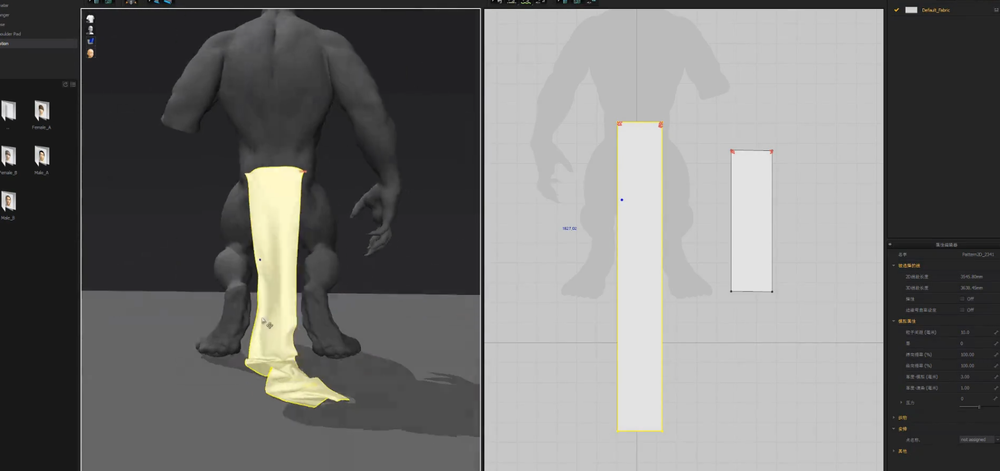    
布料导入maya后，挤压出厚度，并中间厚度加一圈线    
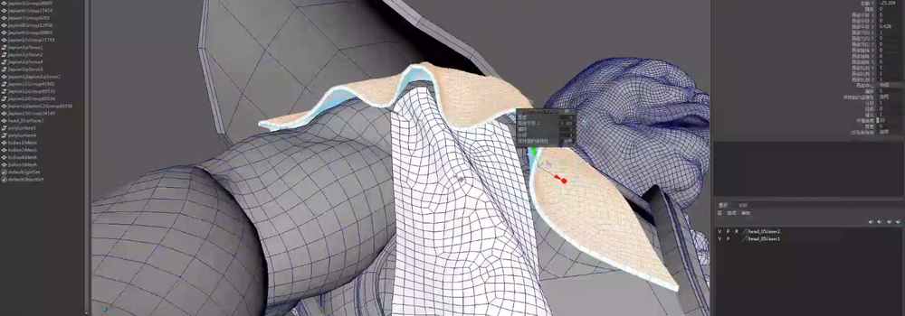     
导入ZB    
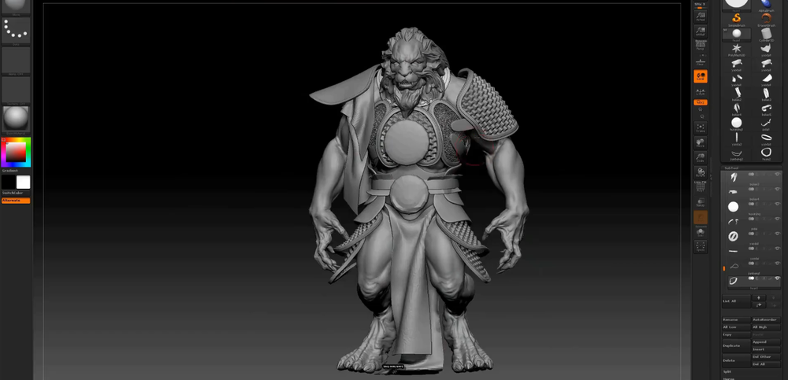    
制作辫子   
     
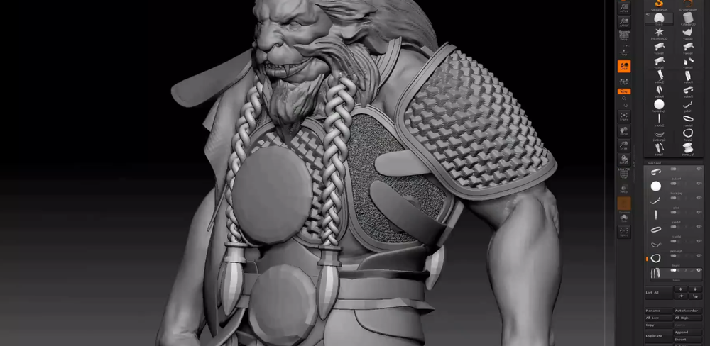    
