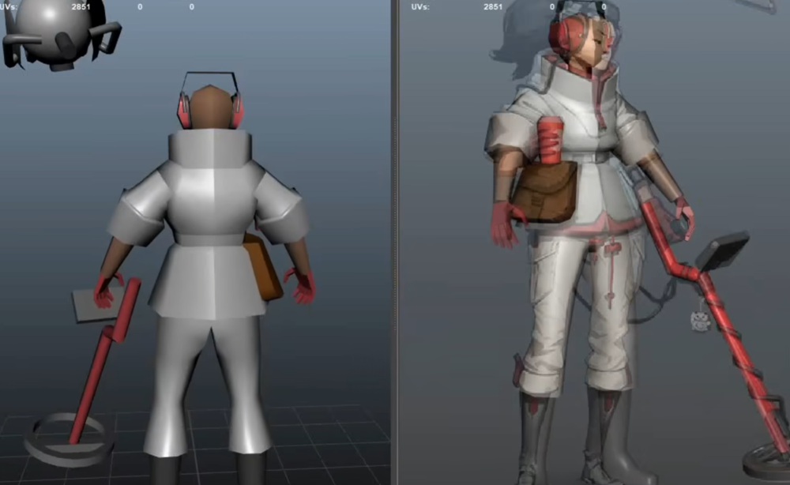
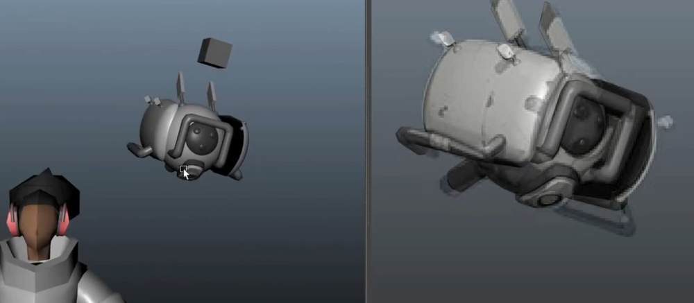
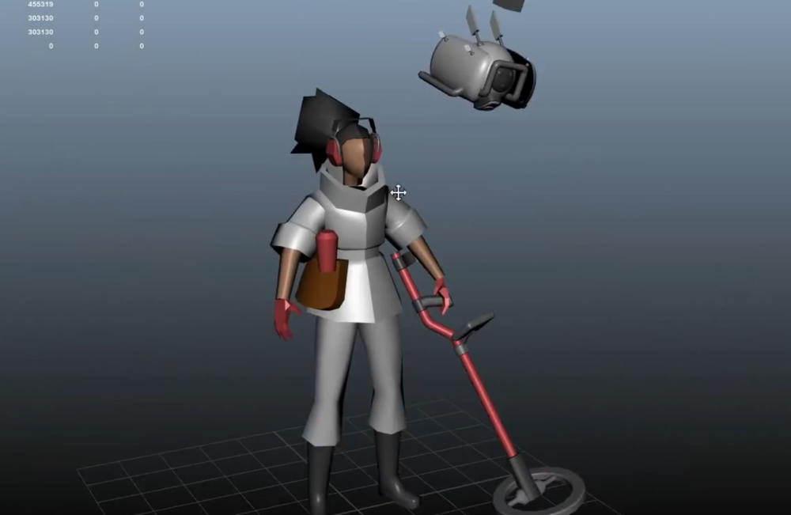
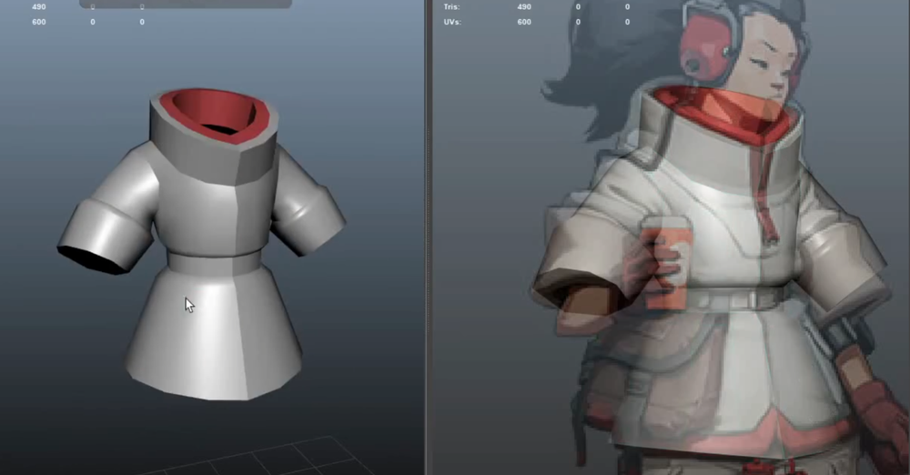
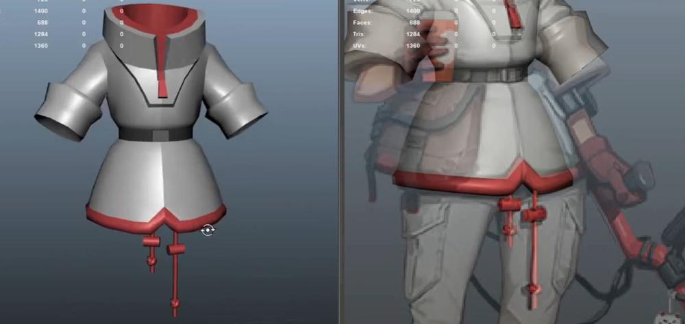
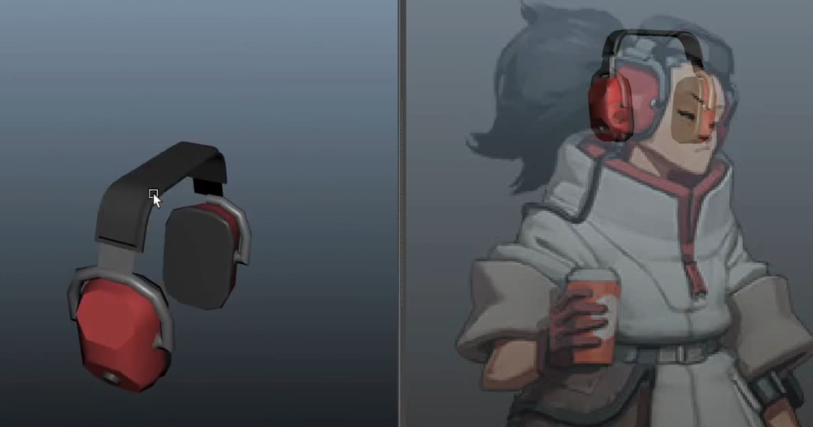
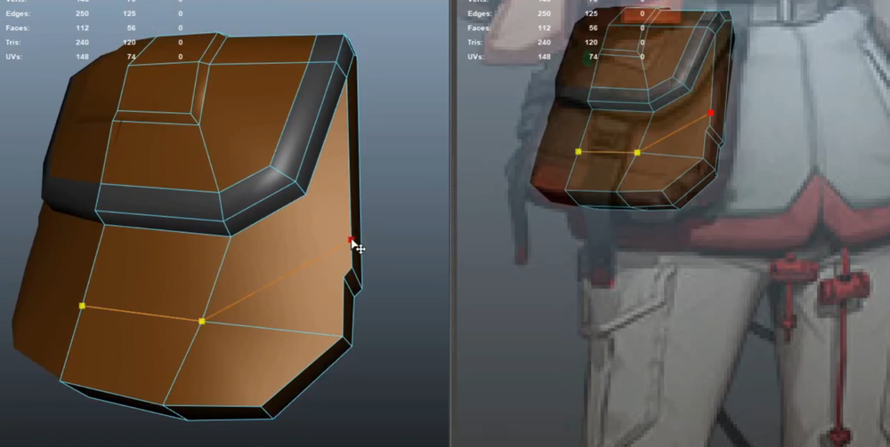
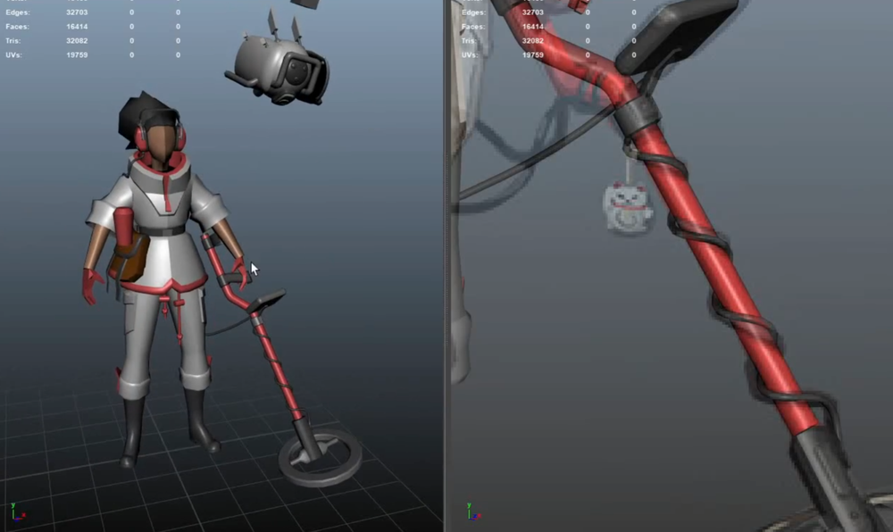
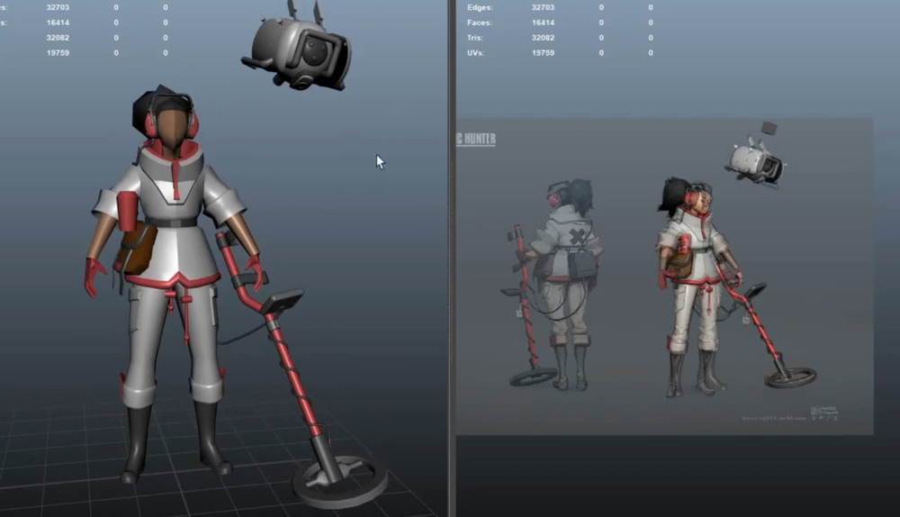
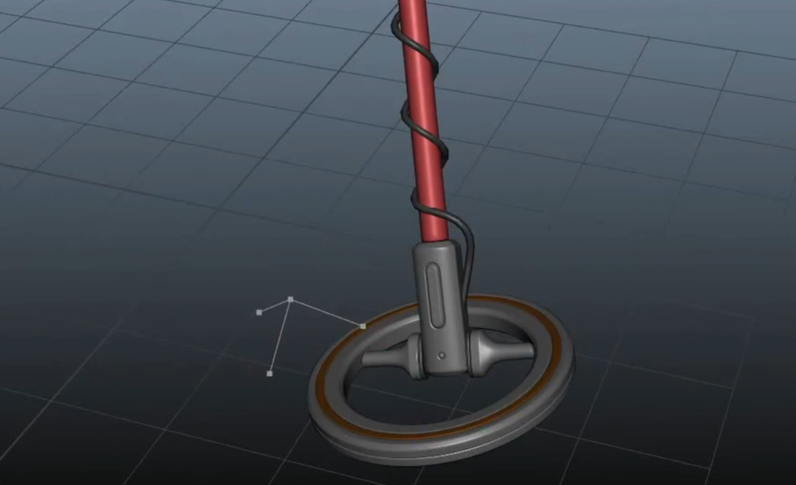

# 类守望先锋-欧美风格化游戏角色

## 插件及设置

## 大型创建  
  
身上部件大型创建   
   
细化小物件等   
    
完成主要体块的大型塑造   
   
细化体块  
   
   
道具体块细化   
    
    
腿部体块细化   
      
   
背包体块细化   
   
补充并调整完最后体块的塑造   
    
   
## 高模
硬表面等物体直接制作高模   
   
   
   
   
## ZBrush 
