# 紫罗兰永恒花园的女主角薇尔莉特·伊芙加登   
## 基于DAZ的角色制作全流程   
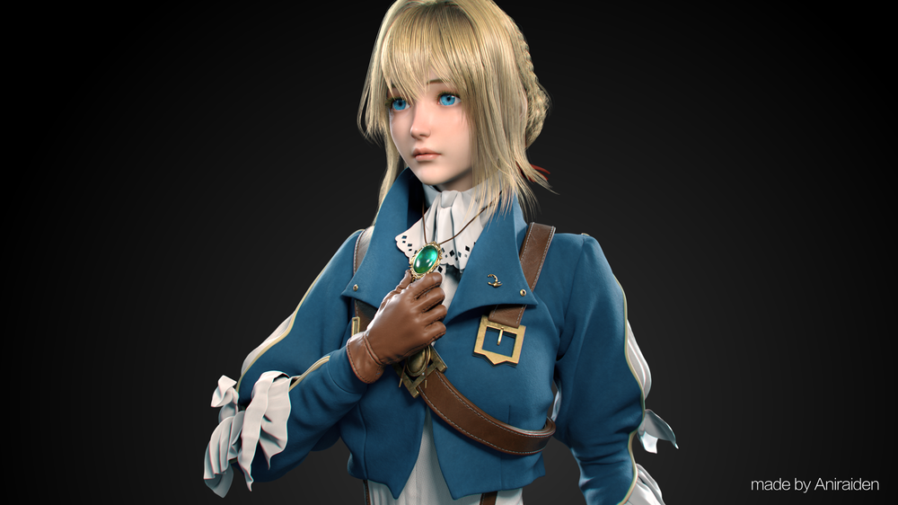   
DAZ 3D安装管理器（DAZ Install Manager, 简称DIM）   
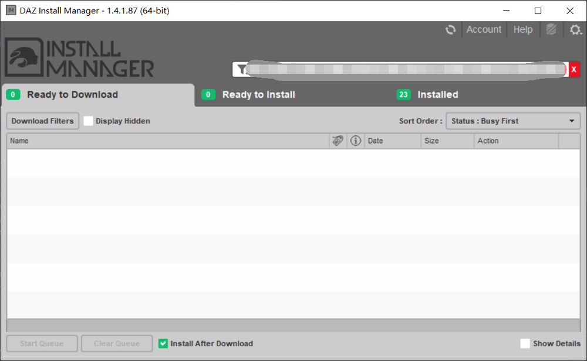 
## 安装目录解释     
- **Package Archive**   
这是​​下载缓存目录​​。DIM会将所有下载的安装包（.zip文件）存储在这里。定期清理或备份此文件夹可以释放空间。  
**修改好处大**   
- ​**​Thumbnail Archive**    
​​缩略图缓存目录​​。用于存储在DAZ Studio内容库中看到的产品预览图（缩略图）    
- **Manifest Archive**  
​​清单文件目录​​。清单文件（.dzm）是DAZ产品的“安装脚本”，告诉DIM如何解压和安装下载的包。这个路径通常由DIM自动管理。   
**强烈不建议修改​**​。此路径涉及程序的核心功能，更改可能导致DIM无法正确识别和安装产品。保持其默认位置是最安全的选择。   
- **Content Database Base**   
内容数据库目录​​。DAZ Studio使用一个数据库来索引和管理您所有的3D资产（人物、服装、道具等），这个数据库就存储在这里。这个路径包含重要的用户数据。   
**绝对不要修改​**。  
- **Content Base Path**   
所有安装的DAZ产品（模型、材质、场景等）的实际文件都存放在这个目录及其子文件夹中。  
这是​​核心内容库目录​​，是​​最重要的路径​​。
**可以移动，但非必要不折腾**   
- **​​64-bit Software Base** & **32-bit Software Base** 
DAZ自家软件（如DAZ Studio、Carrara等）的安装目录   
**不移动**  
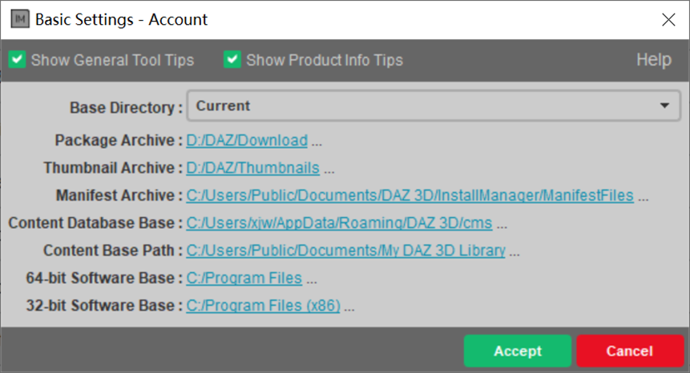    
## 资产包解释  
- IM开头的是官方素材，可以用管家自动安装。放入Package Archive目录里刷新即可。安装后对应smart content           
- 其余为非官方，需要手动安装。安装后对应content      
## 修改DAZ引用资源库路径
这里是把工程内的引用定位到新的路径    
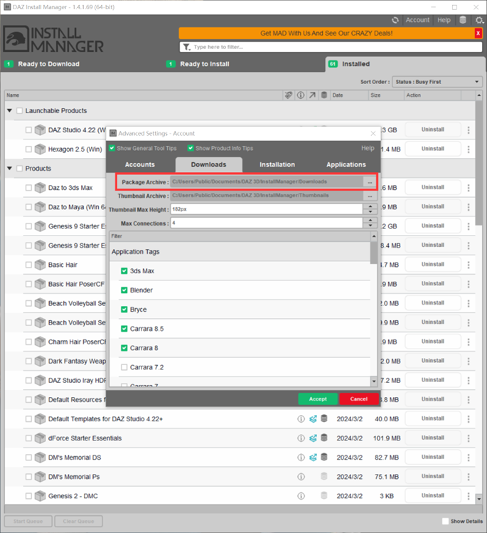  
修改完引用路径后，重新刷新资产数据。就可以看到新的资产有了      
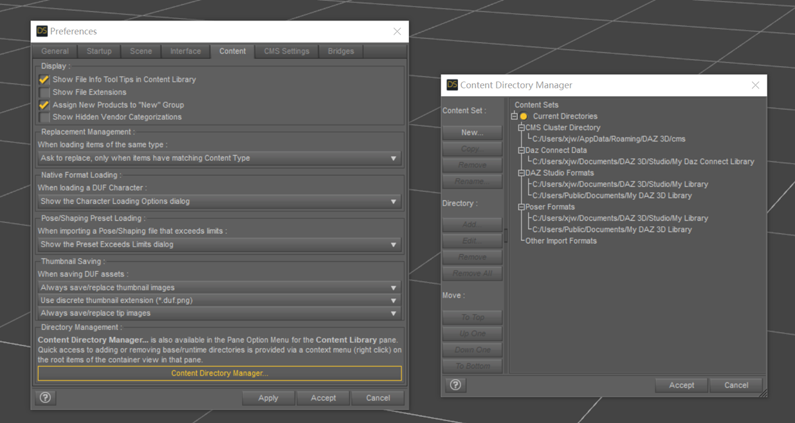   
## Maya和DAZ桥接    
先确认已经下载安装了Maya插件  
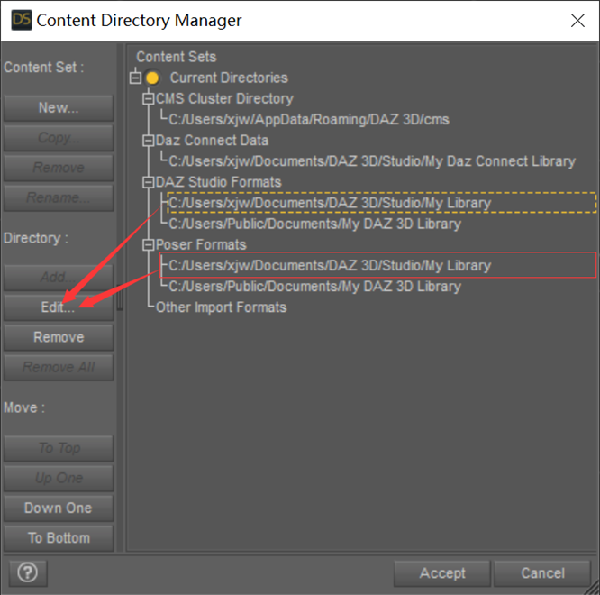  
可以在以下路径找到插件的说明文档：  
C:\Program Files\DAZ 3D\DAZStudio4\docs\Plugins\Daz to Maya    
如果Maya内没有安装好插件，可手动在 Advanced Settings 中操作。  
完成后 Maya 会出现 “DazToMaya” 工具栏      
     
在 Daz Studio 场景中，用选择工具选中已定制好的角色模型，确保角色处于被选中状态。   
依次点击顶部菜单栏的 “File”→“Send to”→“Daz to Maya”，启动桥接工具，“Daz to Maya Bridge” 窗口会再次弹出。     
“Asset Type”（资产类型）会默认选中 “Skeletal Mesh”，该类型适用于带有骨骼绑定、可进行动画操作的 3D 模型      
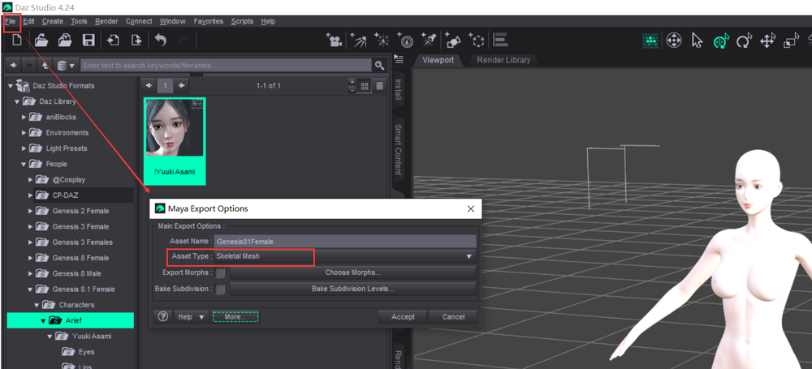     
点击 “Accept” 后，等待系统弹出 “可切换到 Maya” 的提示弹窗，收到提示后切换到 Maya 软件   
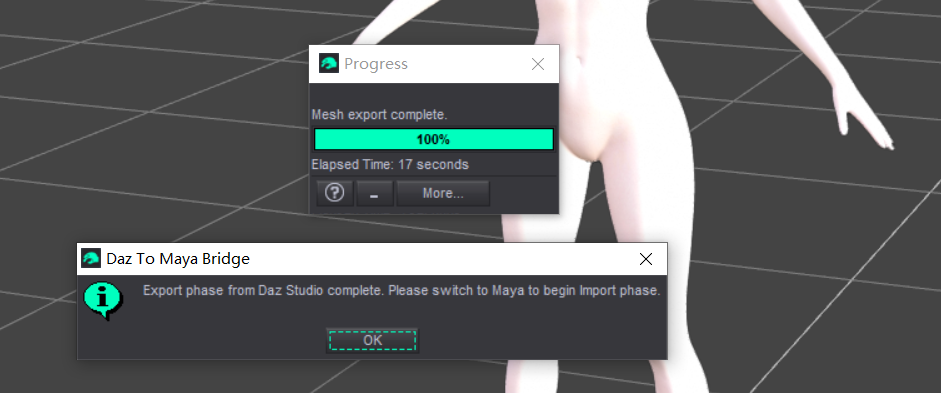   
回到Maya，此时资产还在缓存里。找到 “Daz Import” 图标，点击后会弹出 “Daz to Maya Bridge” 导入窗口。  
在导入窗口中，找到并点击 “Auto-Import” 选项，统会自动开始导入流程。   
     
等待导入过程完成，导入成功后，Daz Studio 中定制的角色模型会自动出现在 Maya 的当前场景中    
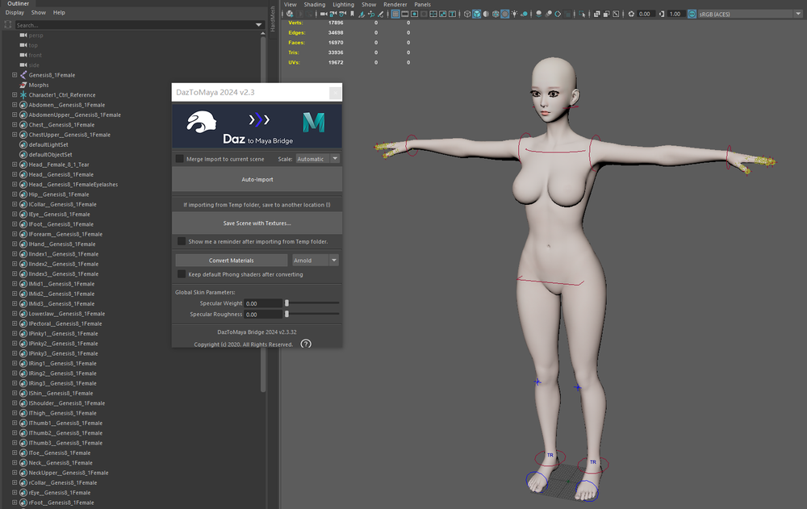    
## 修改视图操作方式
双击后可以修改。修改为**Maya**的操作方式   
自定义DAZ，快捷键F3    
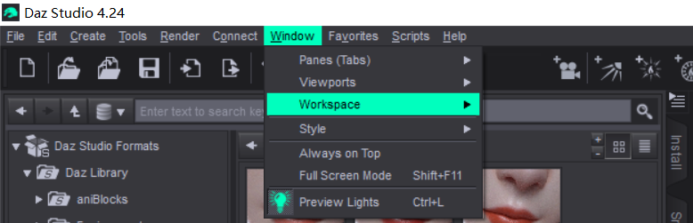   
修改旋转。双击输出框，点击ALT+鼠标左键    
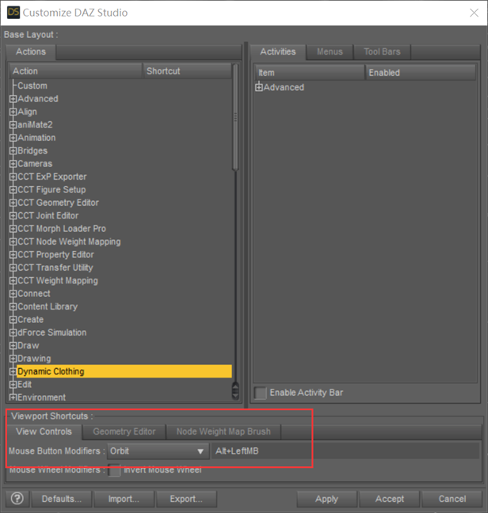   
修改平移。双击输出框，点击ALT+鼠标中键   
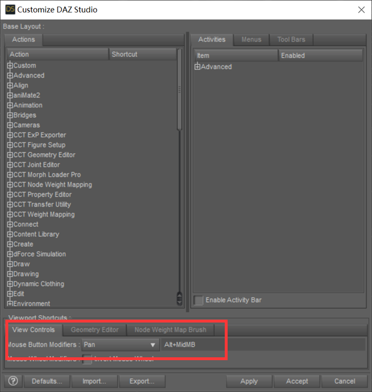    
修改鼠标滚轮   
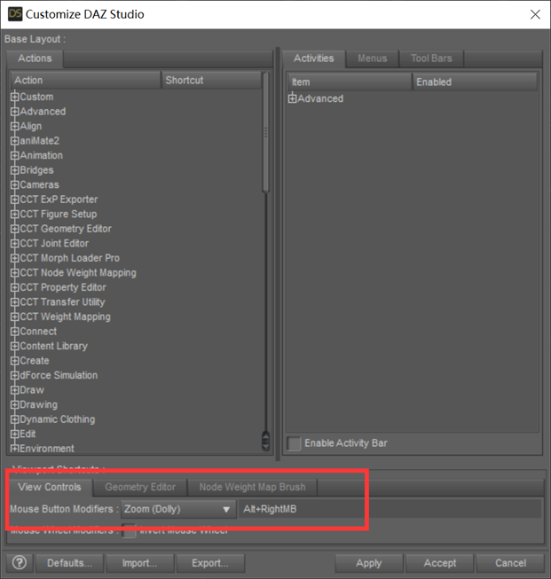    
