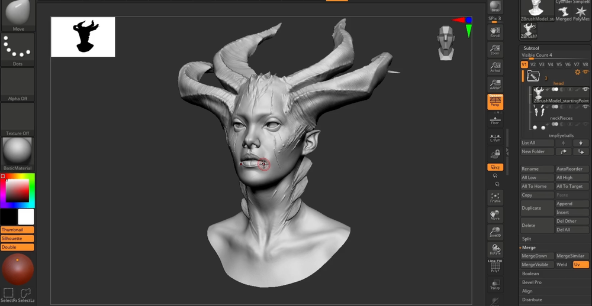

# FlippedNormals - Character Face Texturing in Substance Painter   
    
流程：ZB建模——SP里做蒙版——皮肤细节贴图——颜色贴图——渲染及设置   
## 模型预处理   
发发    
    
输出低模，在Maya中处理好UD。再把处理好UV的模型返回到ZB      
   
保持UV输出中低模型   
    
