# Photo-Realistic Texturing in Mari Buddha Mask Full Course  

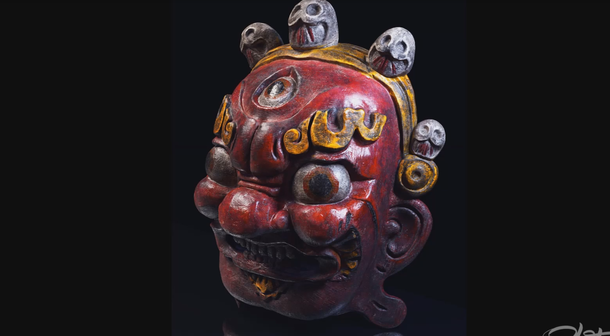   
雕刻    
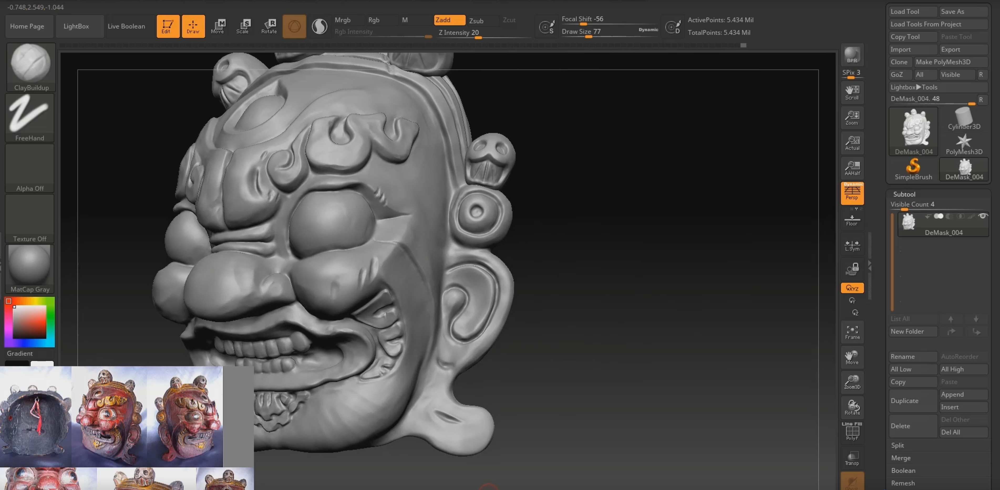   
进一步添加细节   
    
低模分UV   
    
UDIM   
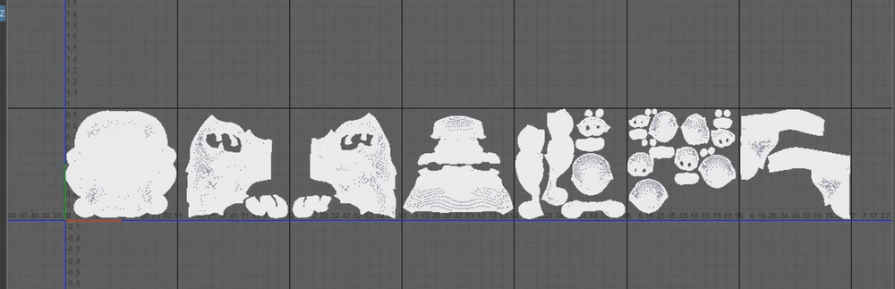    
Mari中设置一个平铺纹理   
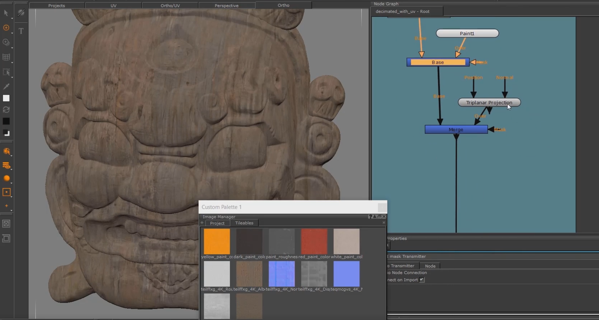    
作者的做法是预先分析出哪些平铺纹理，先一层层合并组合好      
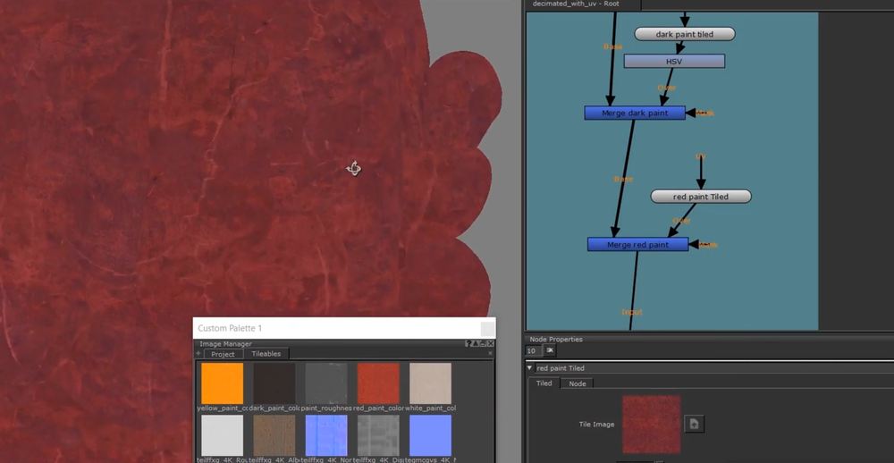     
     
再单独组织mask节点，使用插件包的radio transmitter节点   
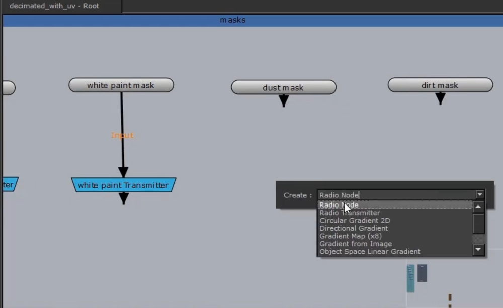    
使用SP生成mask     
    
导入mari并在节点中创建radio node进行mask的关联    
     
关联transmitter节点     
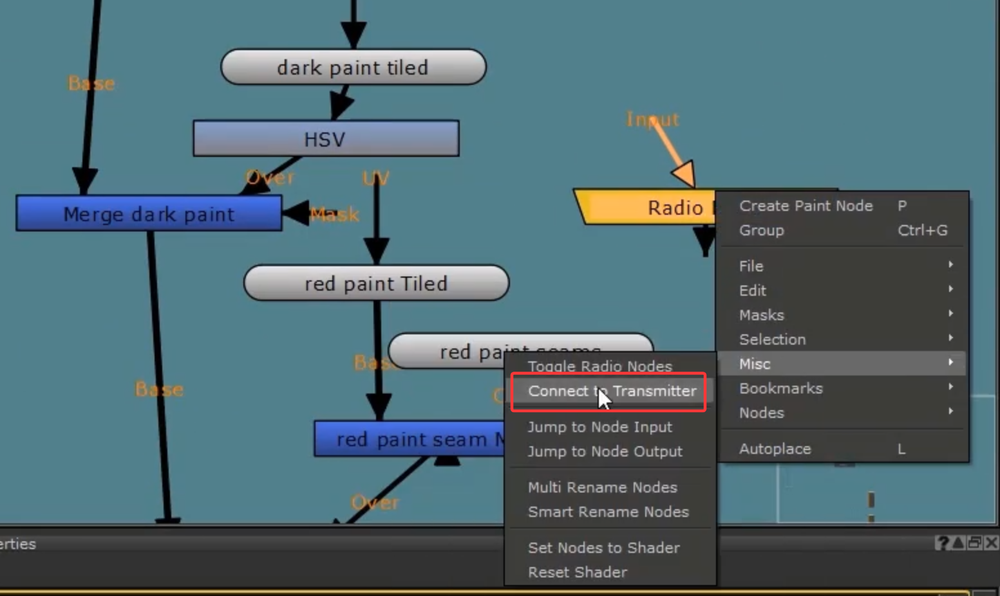    
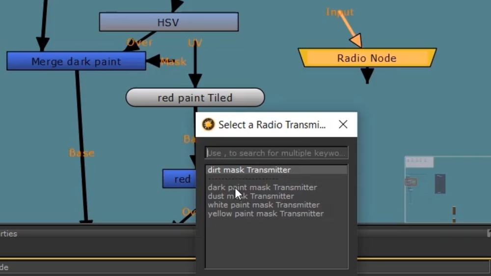     
连接后可以看到产生变化    
    
继续生成红色部分的遮罩    
     
可以视情况添加遮罩，本质是paint节点开始   
    
实际就是把mask单独组织管理，避免和主节点混合太庞大混乱    
mask组本身也可以进一步合成编辑    
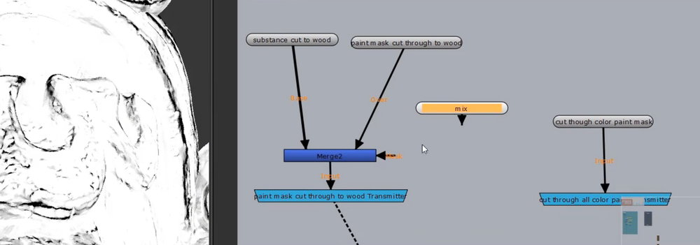     
可以在paint节点上，使用黑白纹理图用paint buffer来绘制遮罩    
     
遮罩节点本身也是可以应用其他遮罩的    
    
在混合模式上也可以根据情况进行修改，本质同理图层叠加的模式    
     
可以引入纹理化的黑白图做遮罩绘制   
    
对照细节，进行细致调整    
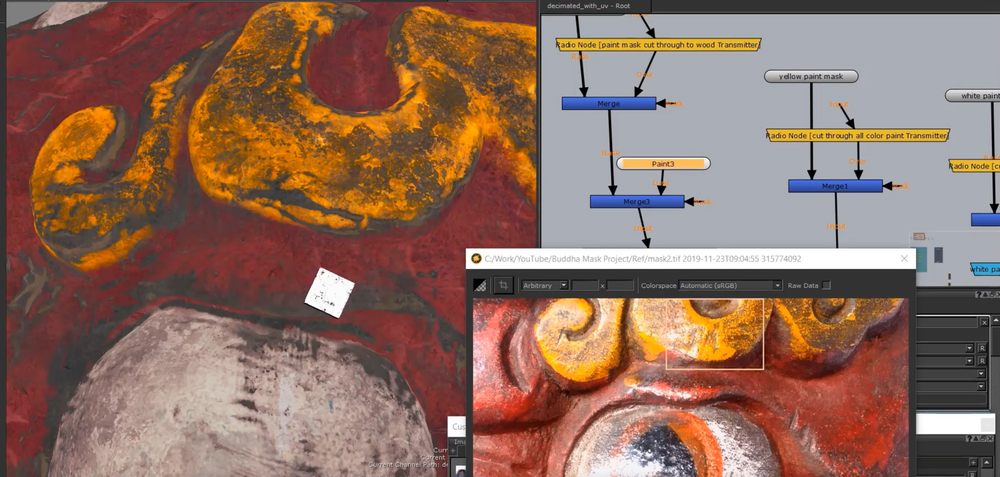    
更多的时候就是在绘制遮罩，对过渡和细节进行调整    
    
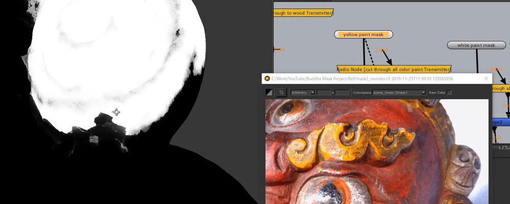     
    
      
基本完成   
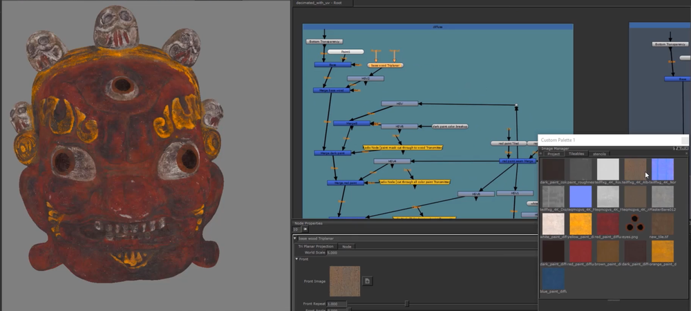    
可以复制某个节点,在其他组里继续使用      
  
在创建的bump节点组里粘贴使用这个复制节点    
    
添加值节点，可以不改变原节点的情况下继承并修改    
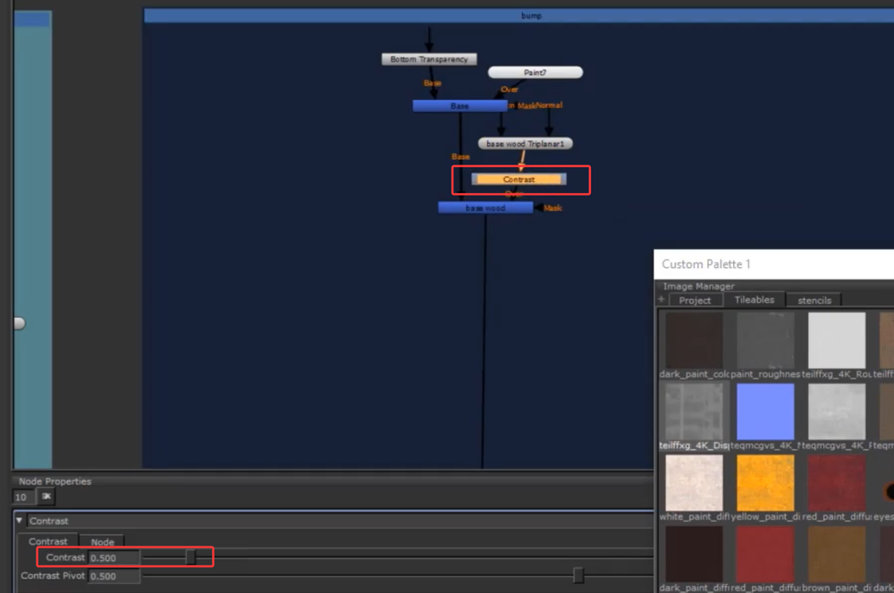    
需要思路清晰，对节点进行合理组织和调整，做出其他通道的贴图    
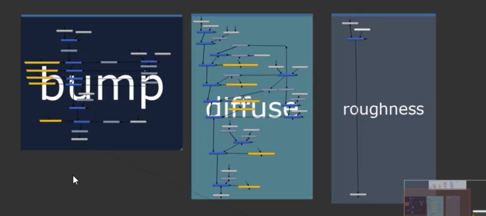    
Maya中设置材质   
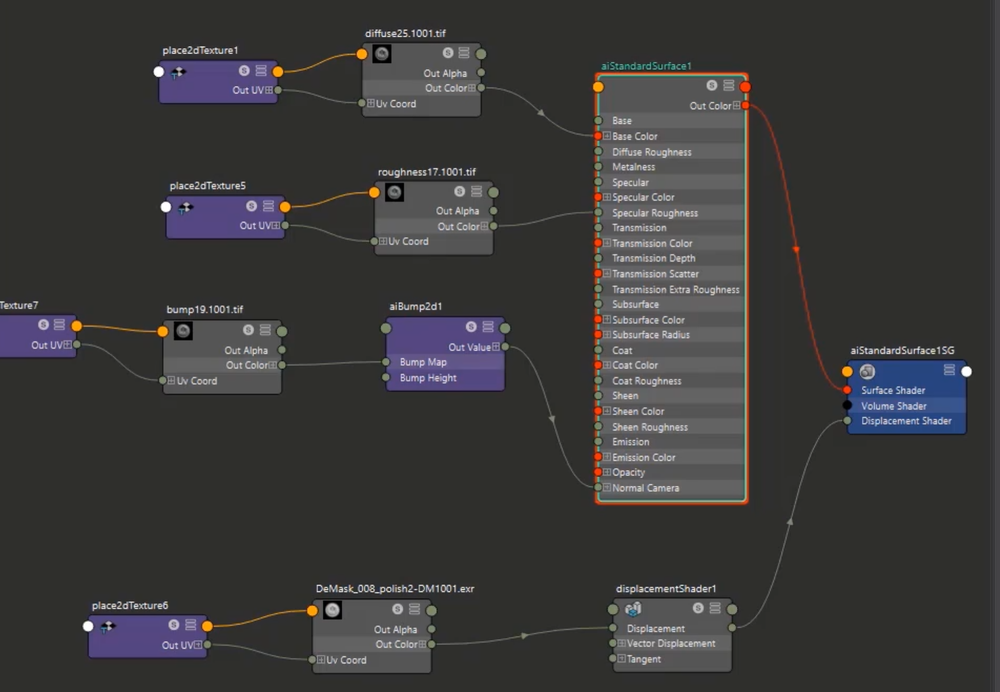     
渲染   
     
    