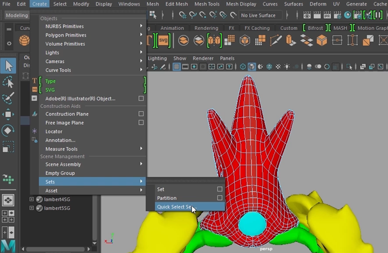
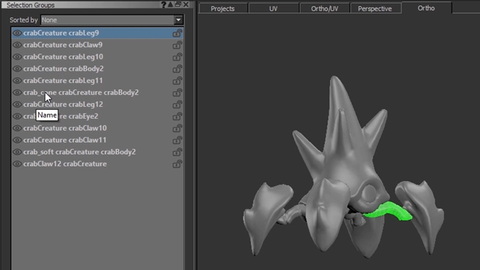
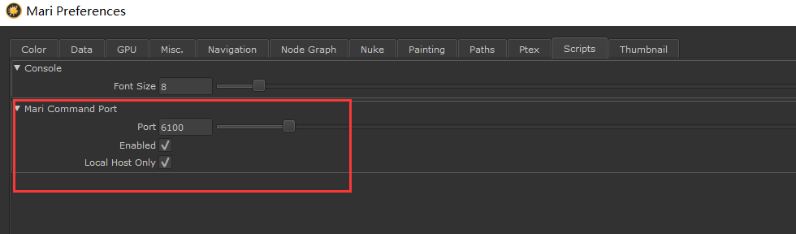
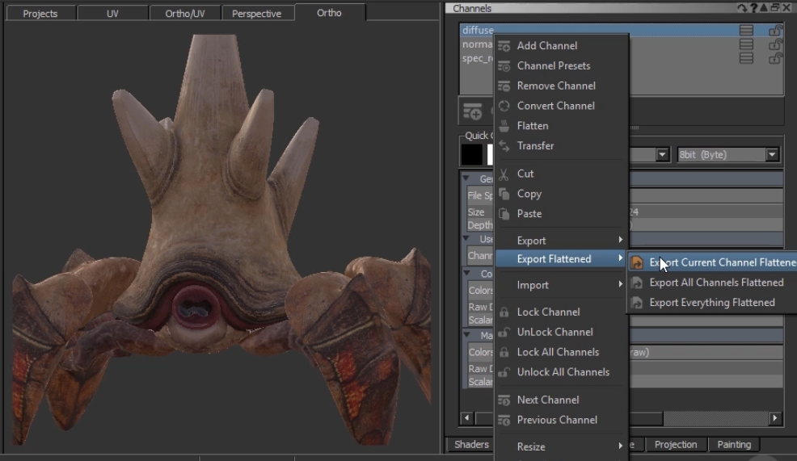

# Pluralsight - Establishing a Texturing Pipeline Between MARI and Maya   
## 在Maya中准备资产 
看具体情况，可以整理成UDIM    
    
选择集   
    
在Mari中可以使用这些选择集     
    
手动输出，记得选择导出选择集    
     
如果导出ABC文件    
    
插件安装     
Mari中的mGo    
    
maya中的插件   
    
会遇到没法链接的情况，检查Mari的端口是不是6100    
     
Mari中启动 Python 会话，例如在终端中输入 “python” 命令
```
import telnetlib
HOST = "localhost"
PORT = 6100
tn = telnetlib.Telnet(HOST,PORT)
```
注意：Mari 不会立即执行接收到的指令，而是会先将指令存入缓冲区，直至你发送传输结束（EOT）字符后才会批量执行。      
***
分离出的部件合并后，作为新物体，添加到Mari场景里    
     
## 贴图传输     
注意输出output路径要和Maya里插件的输出路径对上     
可以复选框选择输出通道和材质参数等    
       
正确的话可以在Maya中看到导入的材质和贴图   
     
手动导出贴图        
     
如果是多象限UV,材质的UV类型选择UDIM     
贴图后缀如图添加: UDIM    
     