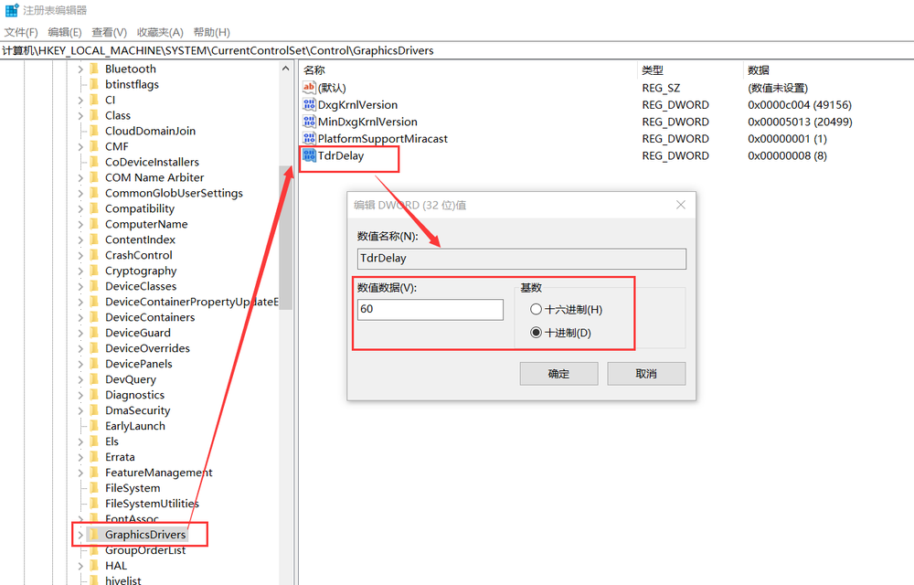

# Mari Extension 
## 基本介绍
  
详细介绍：<https://www.campi3d.com/External/MariExtensionPack/userGuide5R2v1/ExtensionPack5.html>   
## Mari Extension Pack 各版本兼容性及支持范围  

| 版本名称                    | 兼容的 Mari 版本      | 主要特点 |
|----------------------------|----------------------|--------------------------------------------------------------|
| **Mari Extension Pack 3**  | Mari 3.x             | 仅支持 Mari 3，包含基础扩展工具，不兼容 Mari 4 及以上。 |
| **Mari Extension Pack 4**  | Mari 4.1 - 4.2       | 适用于早期 Mari 4 版本，提供改进的智能蒙版和材质工具。 |
| **Mari Extension Pack 5**  | Mari 4.1 - 4.7       | 增强程序化纹理、着色器支持，优化性能，兼容更广泛的 Mari 4 版本。 |
| **Mari Extension Pack 6**  | Mari 4.8 - 7.0+      | 最新版本，支持 Mari 4.8 及以上，新增高级节点、优化 UI/UX，并提升渲染和材质管理能力。 |

- MARI extension 5   
- Mari Extension Pack 5 R2.03 for Mari4
## 安装
### 安装扩展包 
1. 找到并创建路径，并把扩展包拷贝进路径Scripts里   
> MyDocuments / Mari / Scripts /
2. 打开Mari,此时有弹窗提示。示检测到 Windows 超时检测和恢复设置（TDR）过低，这可能会导致在长时间运行烘焙操作时 Mari 崩溃。   
建议将系统的 TDR 值修改为至少 60 。弹窗中提到了两个相关问题： 
- Windows 注册表中未设置 TdrDdiDelay 值。
- Windows 注册表中的 TdrDelay 值（当前为 0）过低。   
修改教程链接：  
<https://www.campi3d.com/External/MariExtensionPack/userGuide5R2v1/TDRConfiguration.html>   
   
1. 修改注册表值  
计算机\HKEY_LOCAL_MACHINE\SYSTEM\CurrentControlSet\Control\GraphicsDrivers   
   
再创建32位新值  
   
关闭注册表编辑器并重新启动计算机。显示重置选项现在适用于 MARI  

### 安装烘焙预设 
在安装目录中找到文件夹。只需提取MariExtensionPack 5 _BakePresets.zip
进入ModoBakePresets 文件夹   
C:\Program Files\Mari4.7v4\Bundle\Media\ModoBakePresets  
### 安装检查  
重启电脑和软件后，可以看到已经安装成功  
  

## 使用