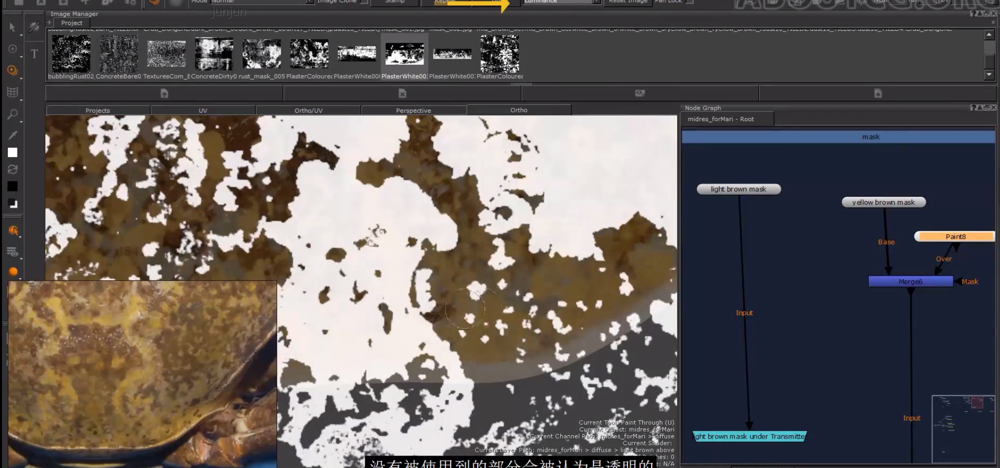
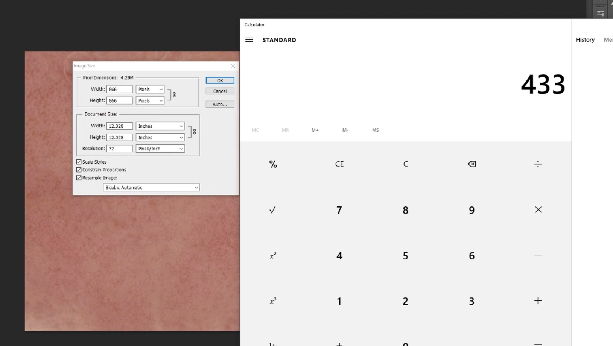
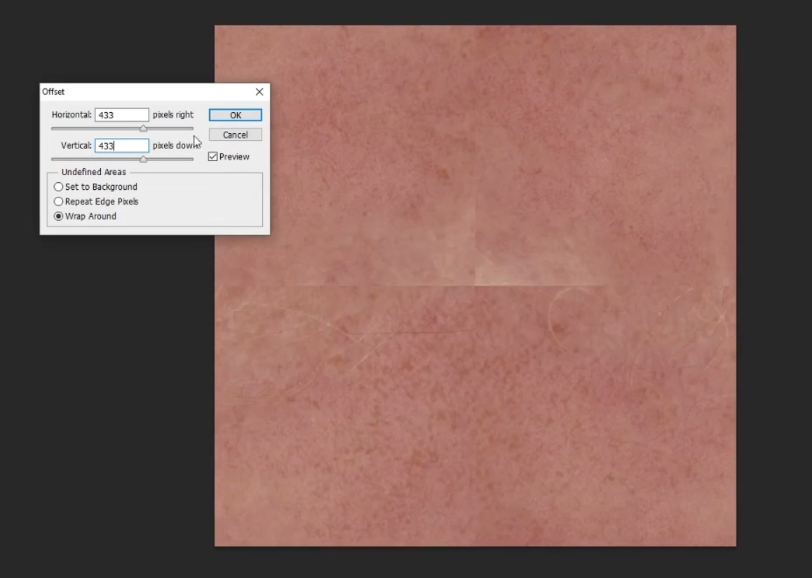
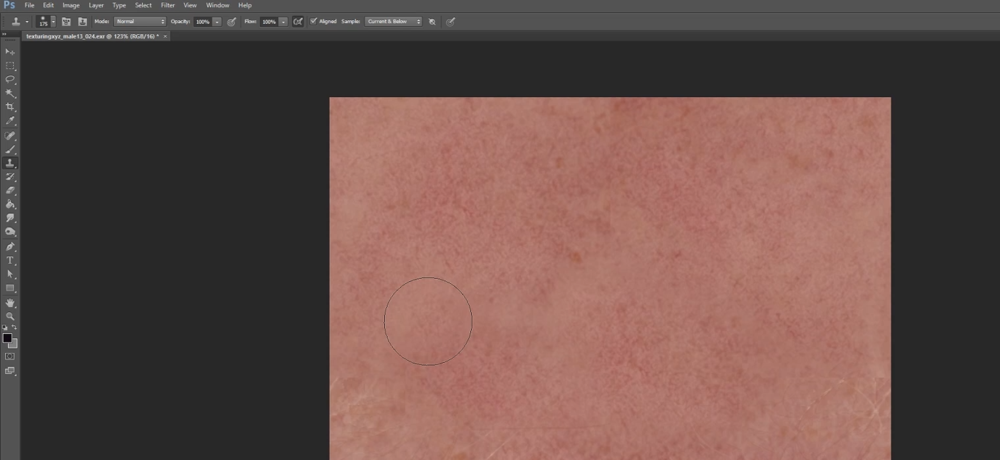
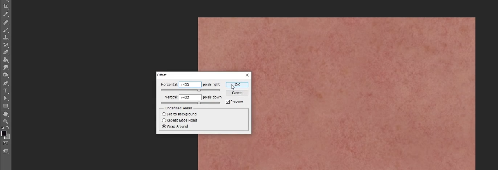

# Mari常用功能   
### Tile Node
### Merge Node
### Radio Transmitter/Radio Node
mari 扩展包内的  
可以共享mask。可以独立出mask组，和主图不直接连接       
### Super Soft Brush
### Stencil/luminance Node
利用黑白图做投射遮罩    
    
## 皮肤无缝贴图
根据截取的方形计算  
    
PS滤镜偏移   
    
仿制图章工具，修掉接缝  
    
修整好之后再运用滤镜偏移    
    
