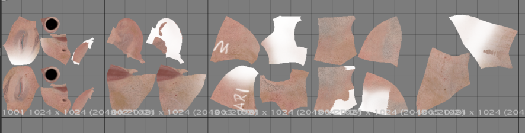
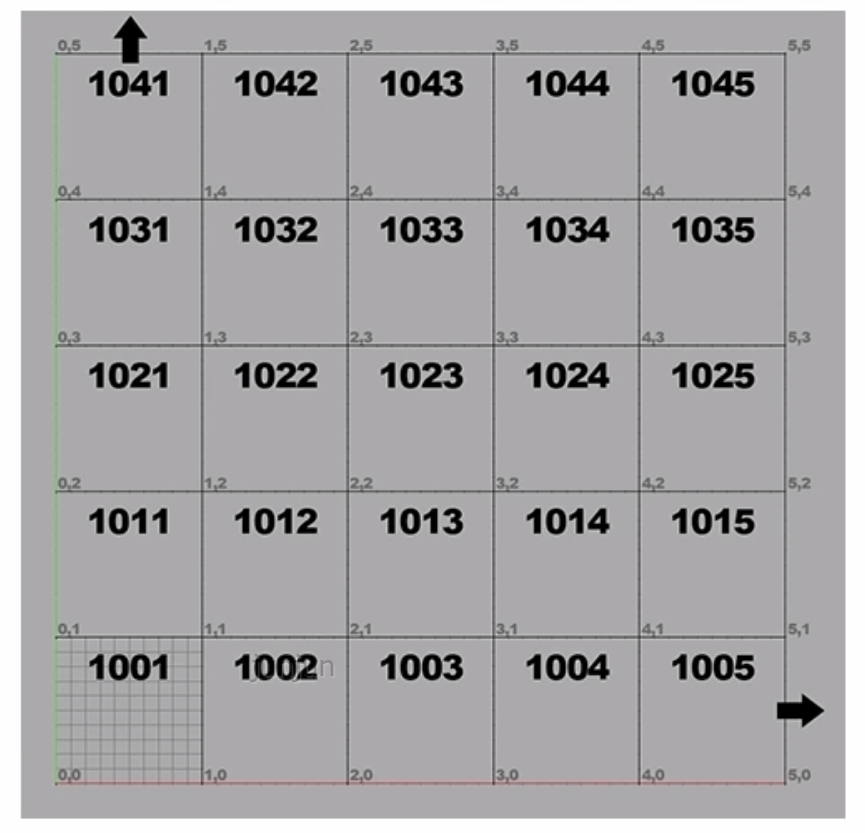
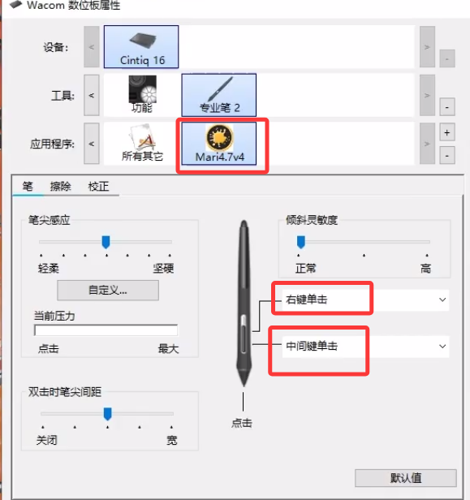
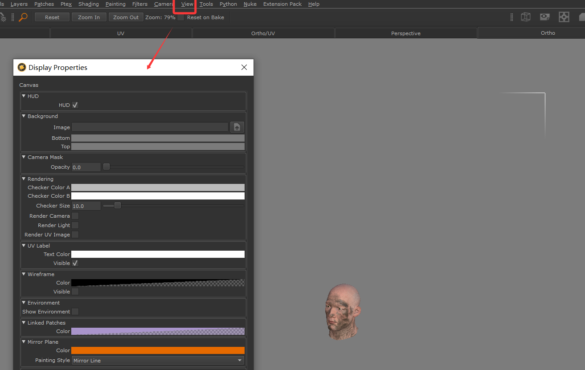
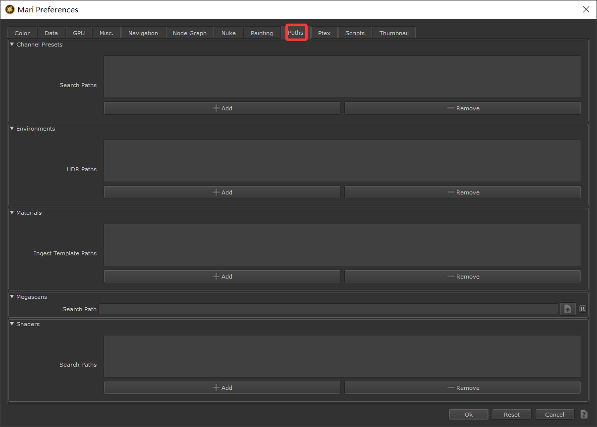

# Mari 4.7 影视级贴图绘制软件极速上手   
    
## 原理介绍   
项目文件的默认保存位置。也可以更改   
   
和Maya一样，也是项目制的。不是文件制   
Archive打包项目   
投射模式修改。可以改为手动。     
   
手动模式下，按B键才会投射。CTRL+shift+c清理掉投射屏上的内容    
    
### UDIM
    
命名规则和顺序   
  
### 名词和概念   
mari有自己概念的命名方式，明确一下： 
> shader着色器（材质） channal通道（一组贴图）——patches纹理片（贴图）
## 视图导航  
可以设置数位板笔的快捷按钮   
   
### 显示设置  
视图显示的整体设置    

## 项目创建  
### 偏好设置   
如果笔刷边缘有干扰视觉，可以把透明度调低   
    
插件预设的路径   
   
## 界面

## 选择相关 

## 灯光和shader 

## channels创建  

## 笔刷和投射类工具  

## 变形类工具   

## painbuffer类工具   

## 投射相关设置 

## 物体属性和烘焙

## 图层相关

## 节点相关 

## 程序化材质

## 机械类案例

## 金龟案例