# Mari 4.7 影视级贴图绘制软件极速上手   
    
## 原理介绍   
项目文件的默认保存位置。也可以更改   
   
和Maya一样，也是项目制的。不是文件制   
Archive打包项目   
投射模式修改。可以改为手动。     
   
手动模式下，按B键才会投射。CTRL+shift+c清理掉投射屏上的内容    
    
### UDIM
    
命名规则和顺序   
  
### 名词和概念   
mari有自己概念的命名方式，明确一下： 
> shader着色器（材质） channal通道（一组贴图）——patches纹理片（贴图）
## 视图导航  
可以设置数位板笔的快捷按钮   
   
### 显示设置  
视图显示的整体设置    

## 项目创建  
### 偏好设置   
如果笔刷边缘有干扰视觉，可以把透明度调低   
    
插件预设的路径   
   
## 界面
可以把node节点变为nuke模式。看个人习惯        
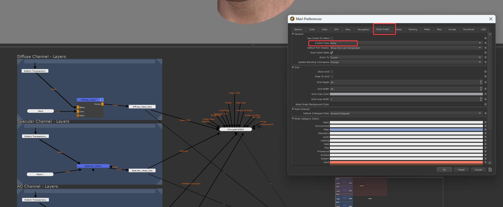   
可以对模型的不同版本进行替换   
是目前无损替换支持性最好的     
   
## 选择相关 
S 快捷键   
不同的选择层级       
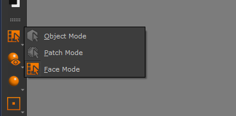     
可以对选择做选择集      
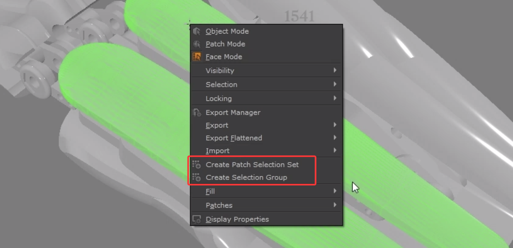   
## 灯光和shader   
可以设置HDRI相关的   
     
选择当前灯光，点击摄像机按钮，可以把灯光移动到当前摄像机   
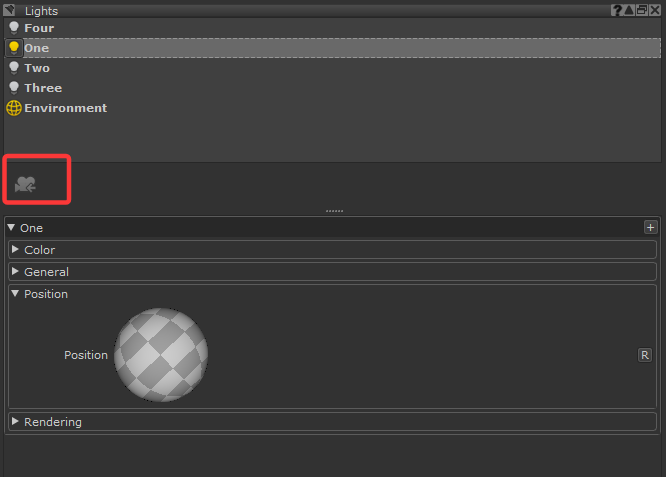     
shader相关是一个过滤显示为主的功能   
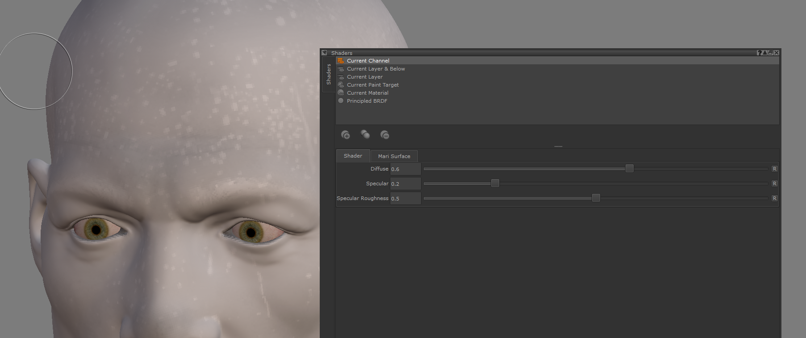   
但常用的是快捷键F1，F2，F3   
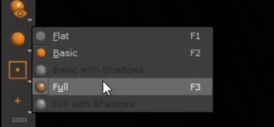    
## channels创建  
导出channel贴图   
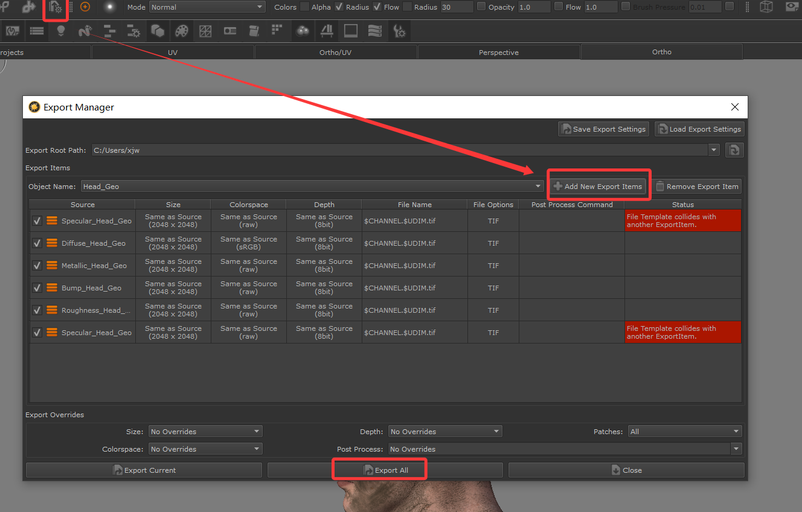   
两种添加channel的方法   
置换贴图需要把Raw Data勾选上    
Scalar Data 勾选上就是黑白贴图    
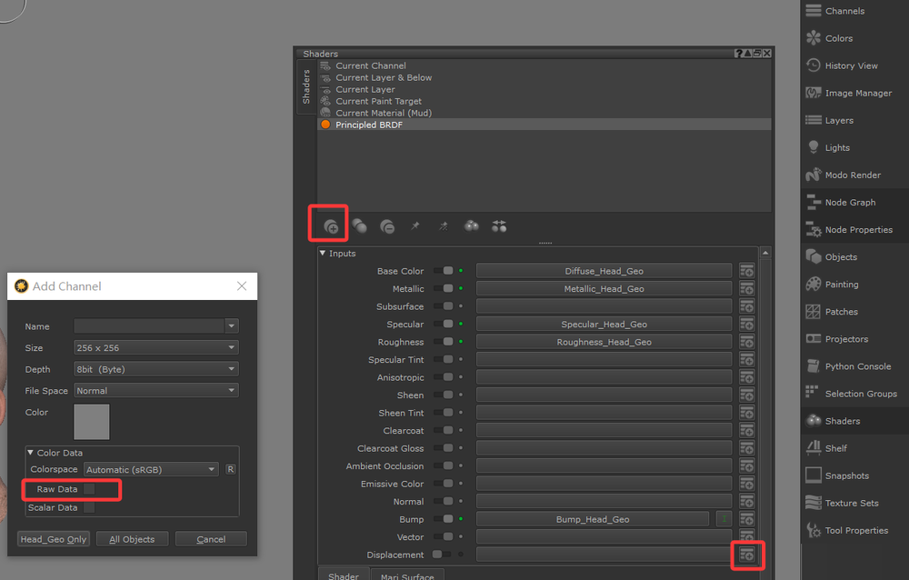    
## 笔刷和投射类工具  
### 绘画工具  
P,U,E 键 切换常用绘画工具     
有时候投射画不上，可能是在非颜色图层上    
可以把透视完后的贴图，再重新抬到paintbuffer上    
    
R键 笔刷缩放大小。O键，透明度缩放    
Q键调整笔刷压扁，然后按W键可以旋转笔刷         
   
ctrl+shift 左键。缩放paintbuffer   
Ctrl + Shift + C   
按repeat 可以重复绘制   
   
可以导入PS的笔刷   
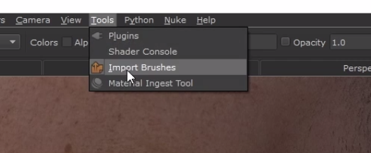    
### 其他绘画工具 
模糊   
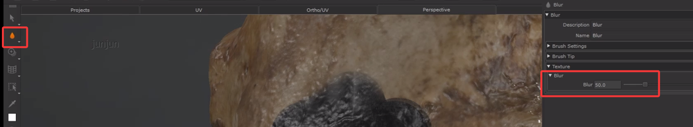    
渐变    
   
一般来说是投射整个物体   
快捷键`   
勾选穿透物体  
    
克隆笔刷    
类似PS仿制图章工具    
ctrl+绘制  
   
## 变形类工具  
变形工具，加点减点  
快捷键：上下键   
shift+r 旋转   
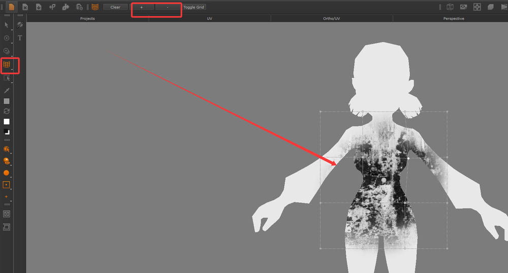   
液化工具   
   
打点变形   
上下键控制拉伸变形衰减的强度   
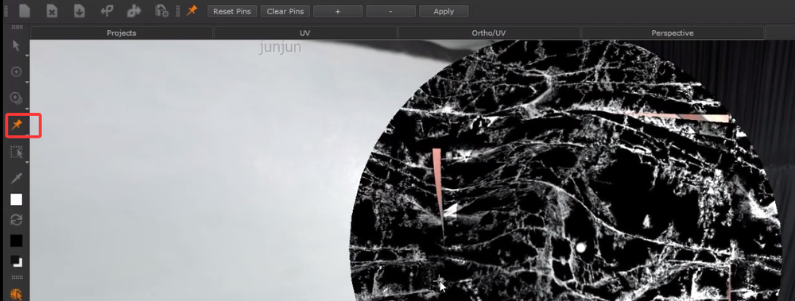    
修补工具    
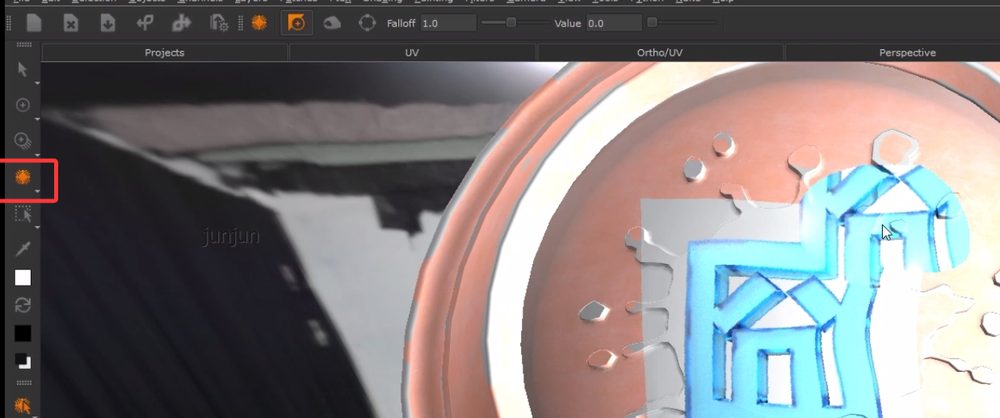    
## painbuffer 编辑类工具   
选择相关工具及其相关操作   
主要是对选择的painbuffer进行操作        
  
选区的羽化值    
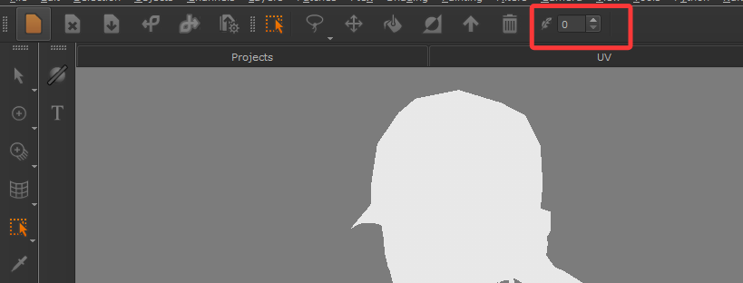    
## 投射相关设置 
对painbuffer图进行调整。但很少这样做   
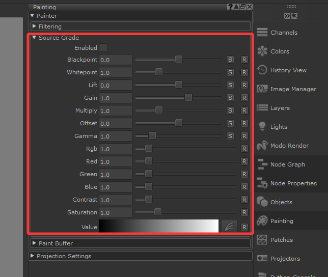   
clamp 限制值在0-1    
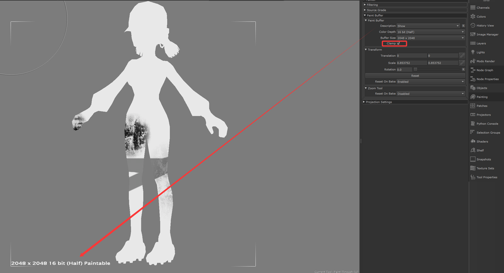    
可以修改投射的穿透和投射的物体     
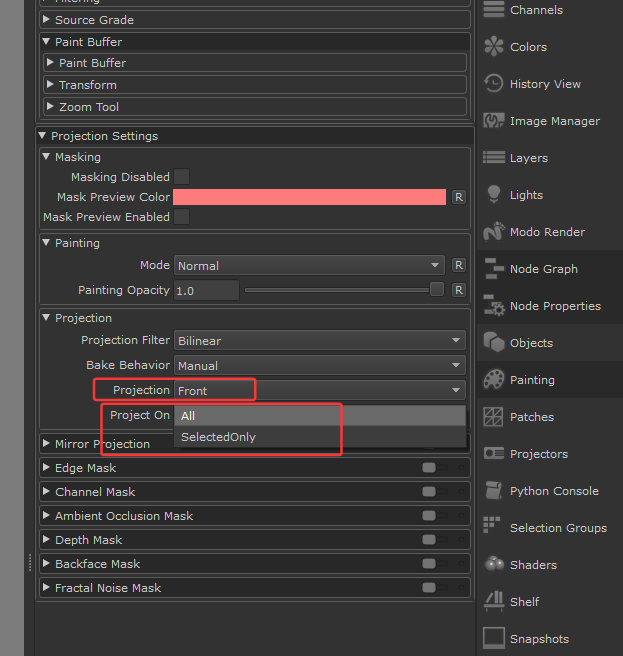   
edge mask 用比较多，可以对边缘做遮罩，不给变形的部分做绘制。防止边缘投射的变形    
  
channel mask 可以用其他通道的图做遮罩   
AO mask 现在更多倍objects下的GO节点代替  
depth mask 深度遮罩   
### projecters 外部绘画   
类似一个快照，可以导出快照到PS之类绘制，然后再导入回来   
   
## 物体属性和烘焙
贴图烘焙的通道   
也可以任意贴图放这里，可以传递图层信息   
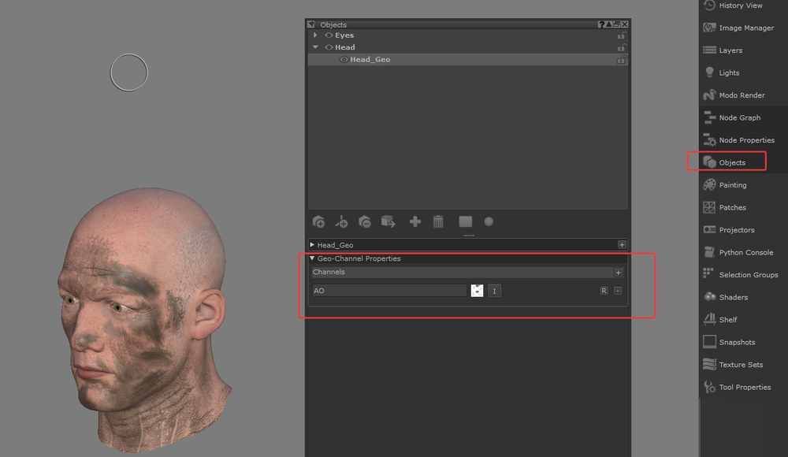    
烘焙相关   
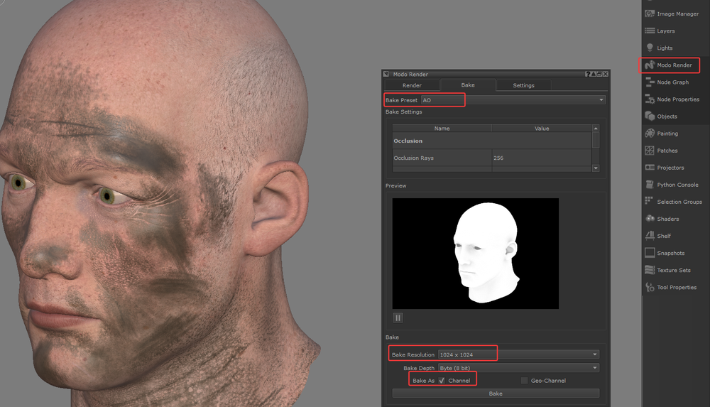   
在烘焙出来的贴图节点上按1,可以显示这个烘焙效果   
    
## 图层相关
遮罩图层嵌套   
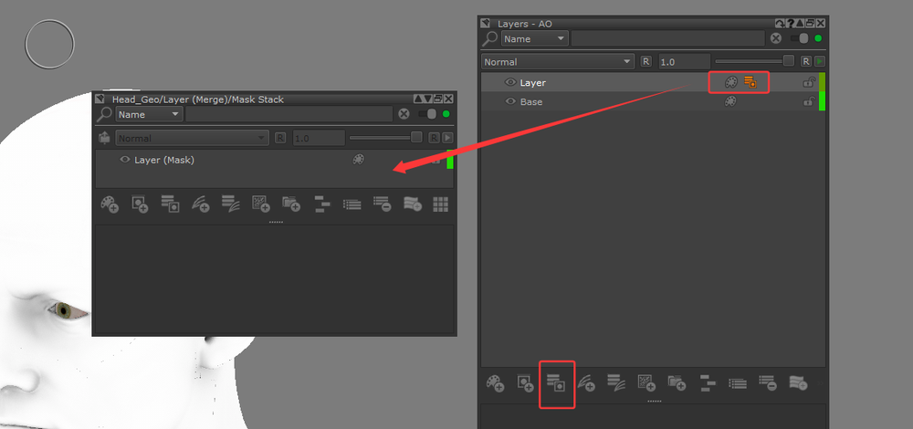   
调整图层   
    
滤镜   
需要加在普通图层上。调整图层是没有效果的    
   
程序化纹理    
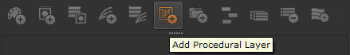    
多层通道图层。模仿SD   
    
## 节点相关 
节点和层逻辑是一样的，只是表现形式不一样   
    
在节点上按1,可以显示这个节点单独的效果   
有10个暂存的数字通道   
### 节点整理
快速整理：L键
backdrop 节点，组织管理  
可以选中节点后，tap键呼出面板，创建backdrop 节点      
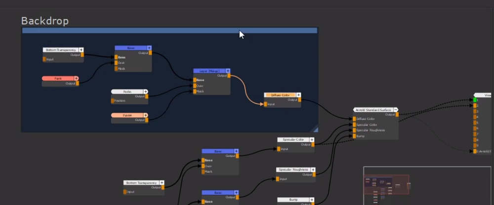   
还可以对选择的节点打组 CTRL+G   
ctrl + Enter 可以进入打组的节点内    
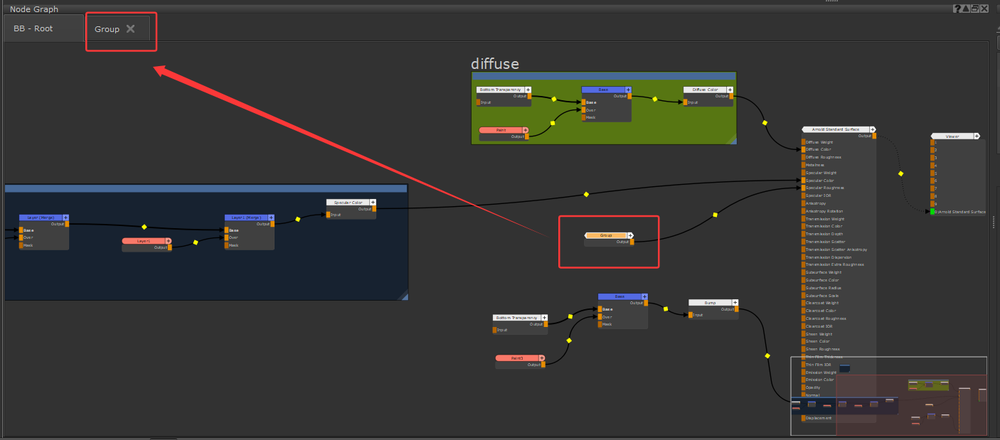    
在连线上点ctrl键，可以加点，对线进行整理   
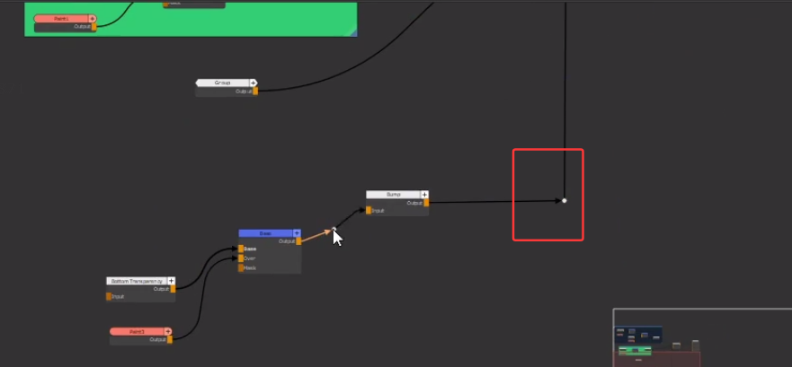    
### 常用节点   
P 键 绘画节点    
   
编辑节点相关   
    
Back point    
   
对于确定效果不再改的部分，可以烘焙塌陷数据，让运行数据更小   
    
## 程序化材质    
总体是模仿SP   
   
custom procedural 可以自定义一组节点集，打包成特定功能。但要选择三类中的一种   
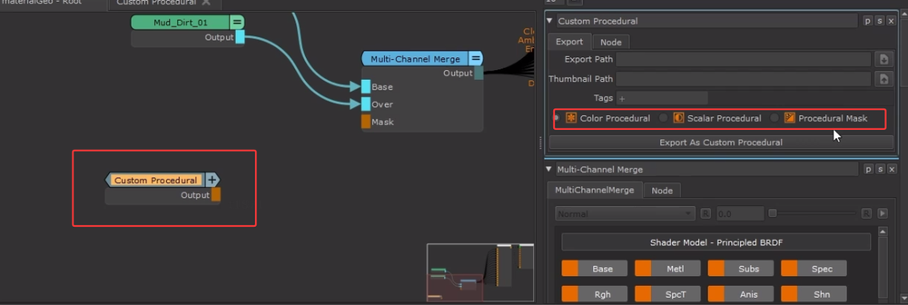    
可以把内部是某些参数暴露在最外的打包节点   
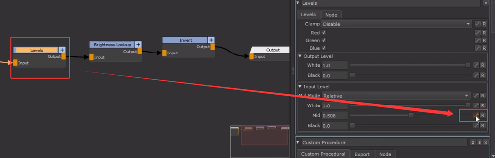    
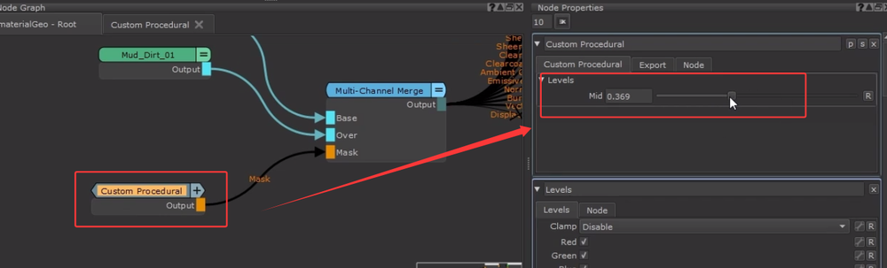    
也可以在最外部去选择暴露的参数   
    
可以链接某几个值，一起调，做成一个新的参数   
   
可以选择自定义节点的缩略图，并输出成一个自定义的节点工具   
    
如果合成多个材质，导致很卡，可以多材质烘焙   
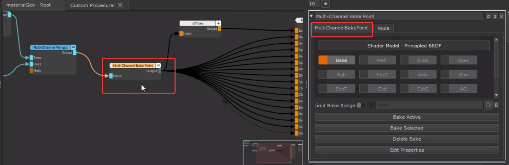     
一般自定义节点工具，用geo-channel里烘焙的贴图数据   
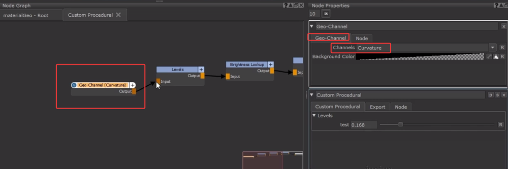    
mari也提供了一些预设的基础程序节点数据   
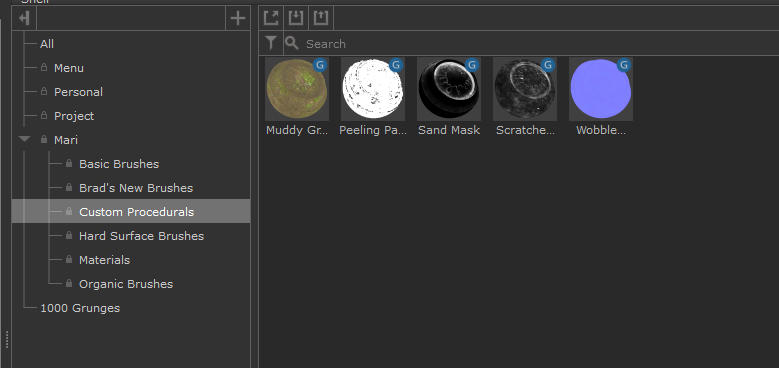   
## 机械类案例

## 金龟案例