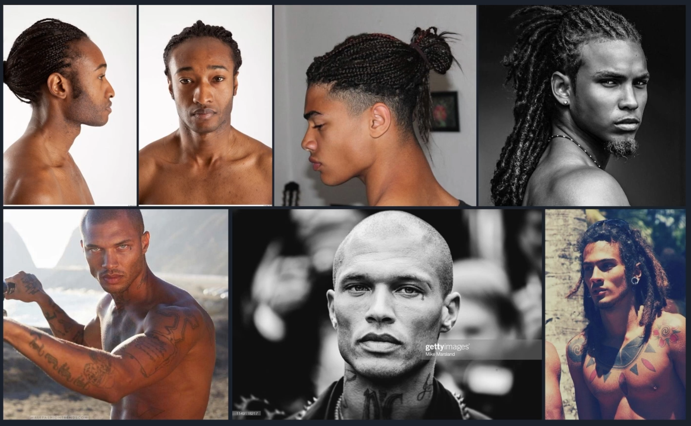
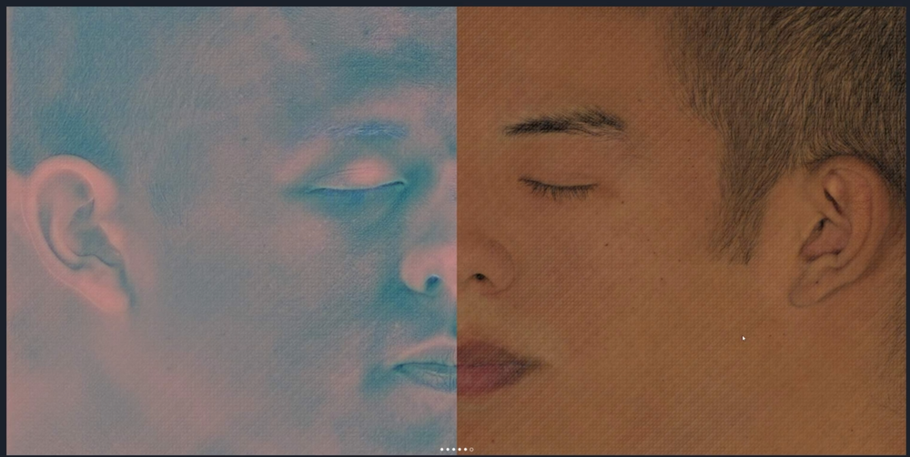
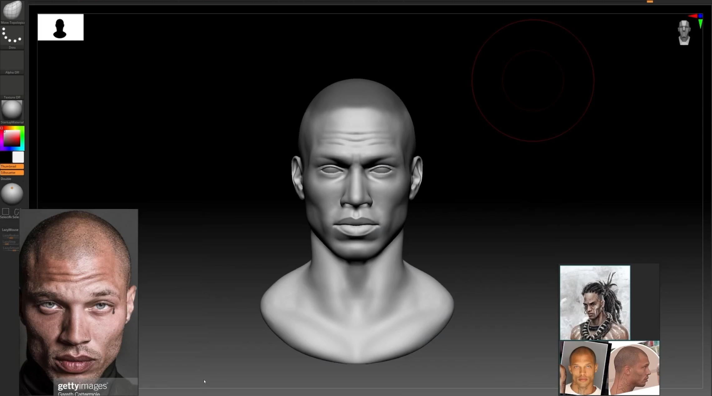
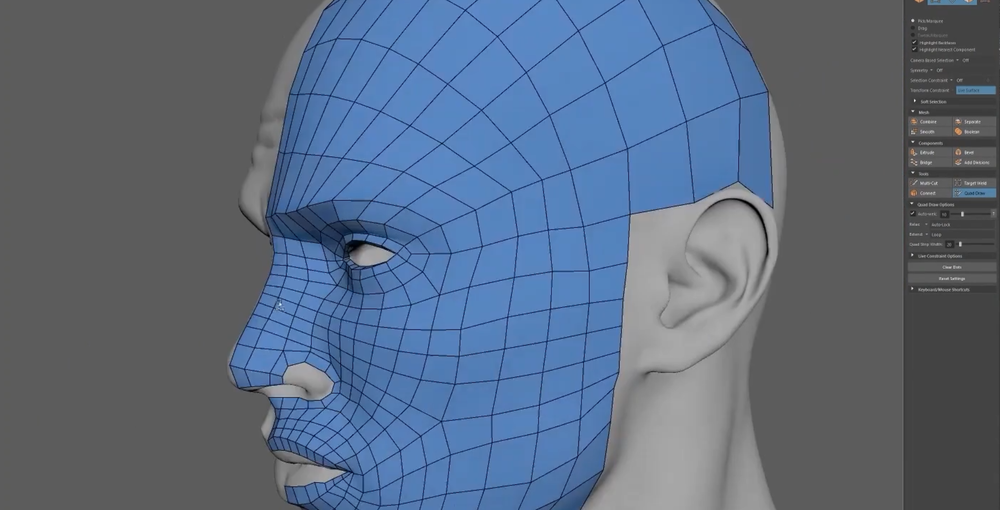
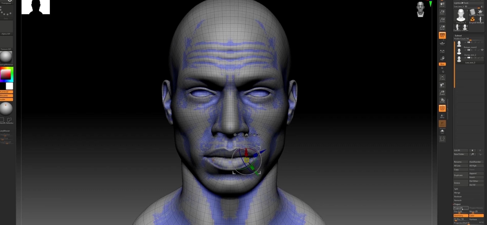
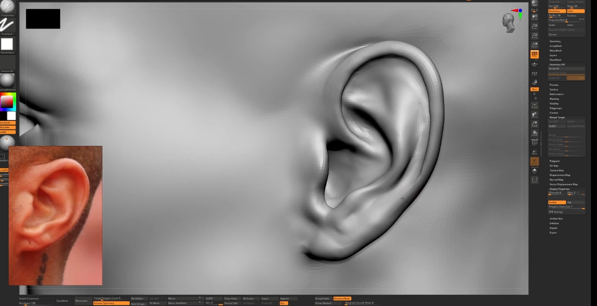
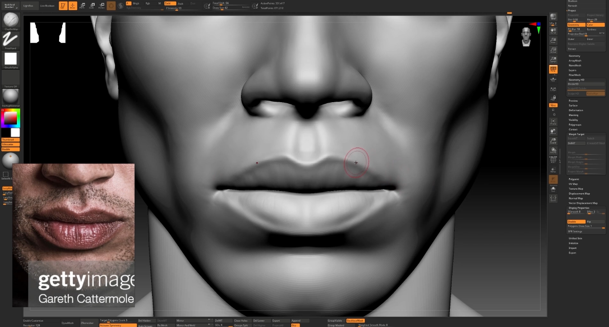
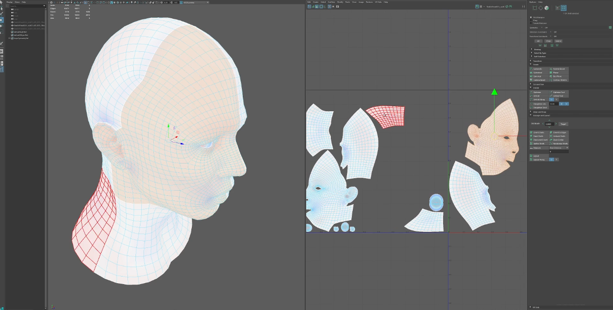

# CGCircuit - Realistic Face with Zbrush and Mari    
参考    
    
准备XYZ贴图      
https://texturing.xyz/products/male-30s-multichannel-face-28
    
ZB雕刻   
   
重拓扑   
     
     
在ZB中，把细分细节投射回重新拓扑的模型   
    
眼睛制作    
在新的拓扑结构下，在ZB中进行细节雕刻    
    
     
低模分UV   
     
XYZ贴图的使用流程   
https://texturing.xyz/pages/killer-workflow-using-xyz-and-zwrap    

