# Skin Texturing And Shading In Mari And Arnold
## 前期准备 
ZB 中雕刻好大型     
   
Maya中整理好UDIM    
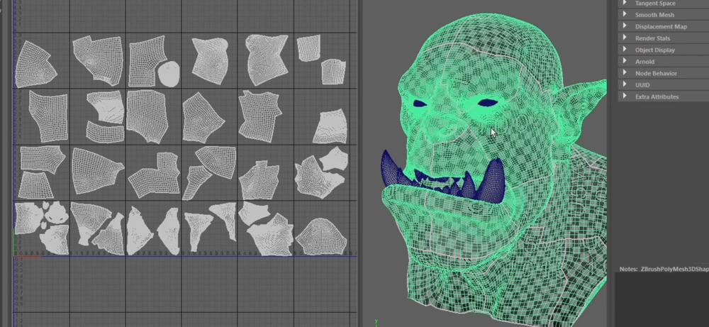   
UDIM的排序   
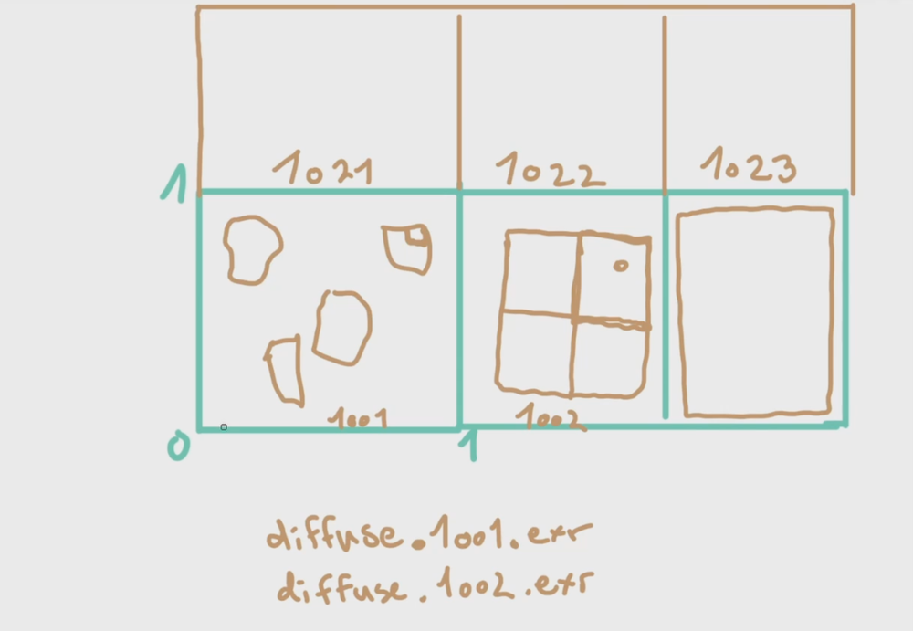   
## 绘制置换贴图   
可以新建标签管理导入的贴图素材   
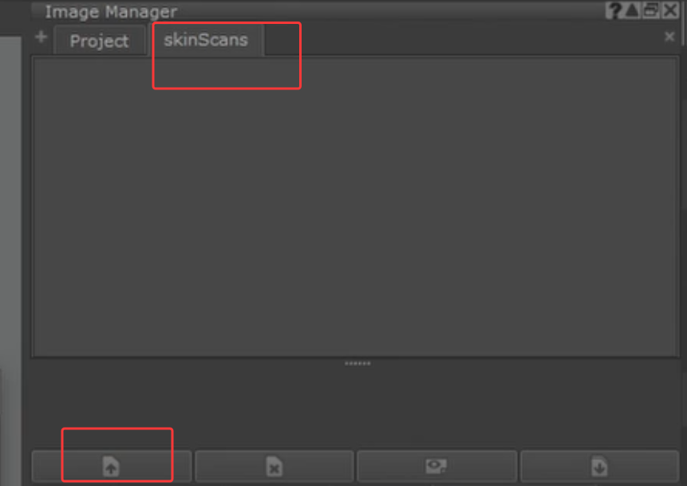    
如果不同的置换贴图精度存储在RGB通道中，可以切换   
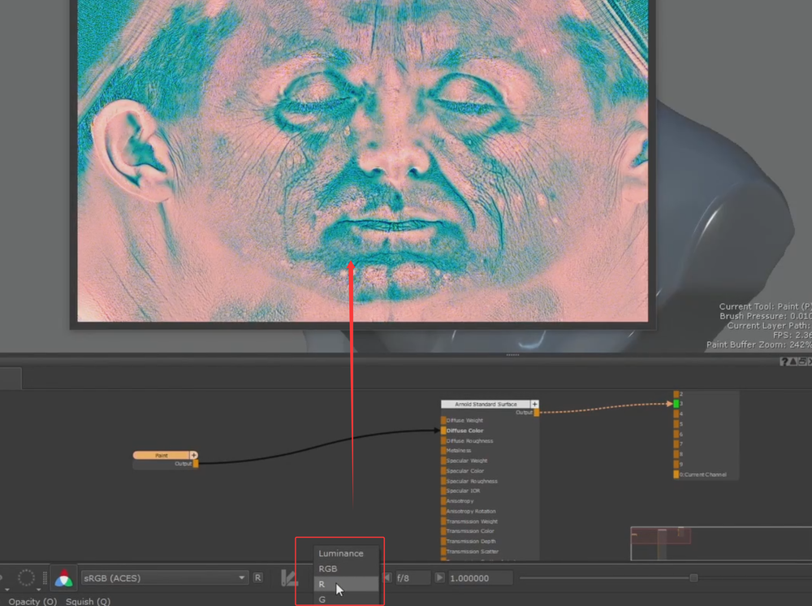    
投射绘制，可以在属性里把图的显示透明度改一下，方便观察   
    
缩放并匹配，开始绘制   
    
可以更改颜色空间，让显示更明显   
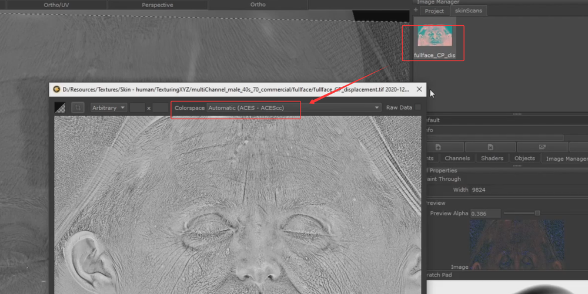    
变形调整   
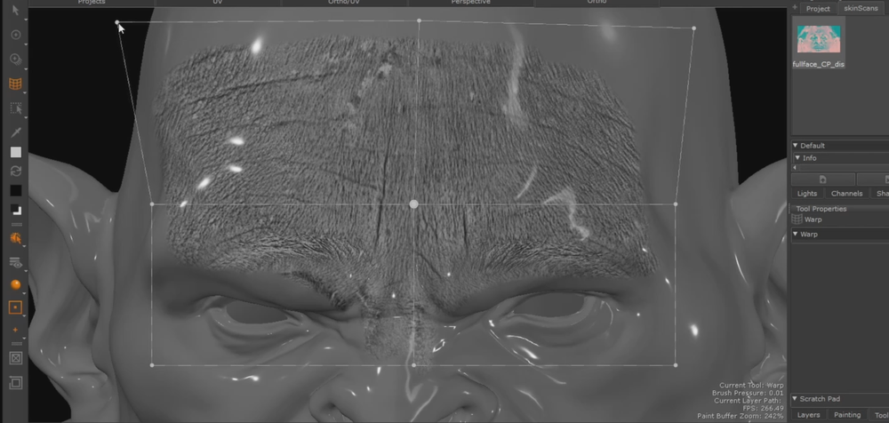    
继续绘制其他区域   
原则上每一个区域投射绘制，都新建一个图层   
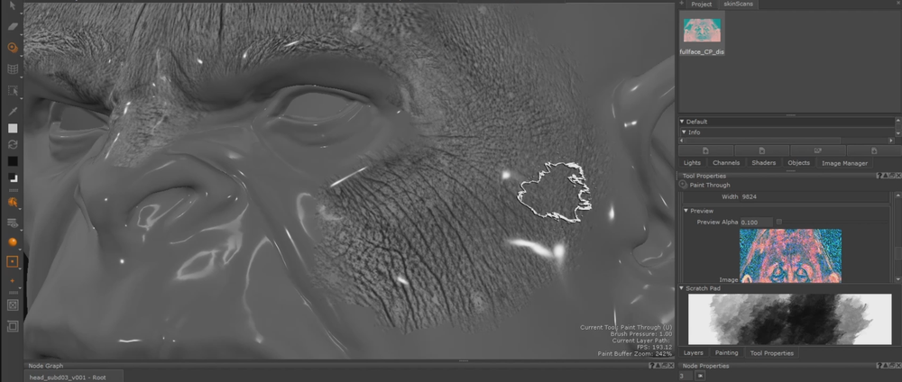    
继续变形调整    
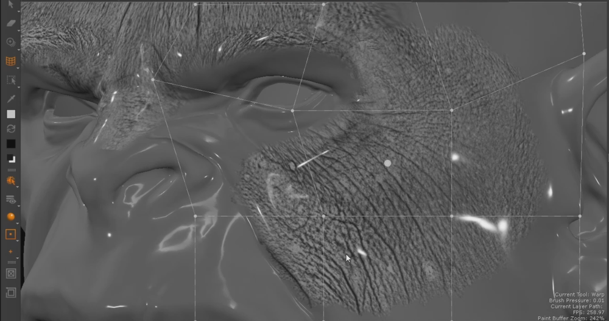     
继续绘制并调整       
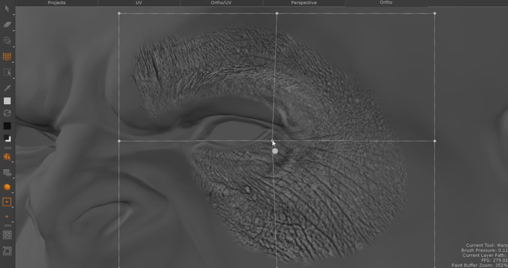    
    
继续耳朵周围   
    
   
继续    
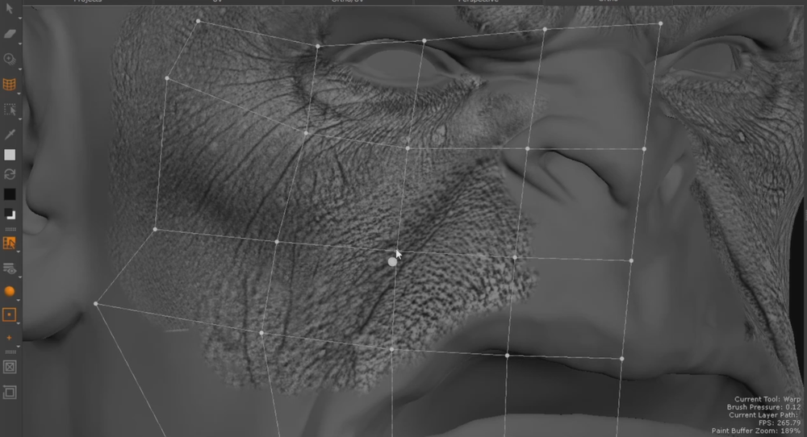   
    
鼻子绘制   
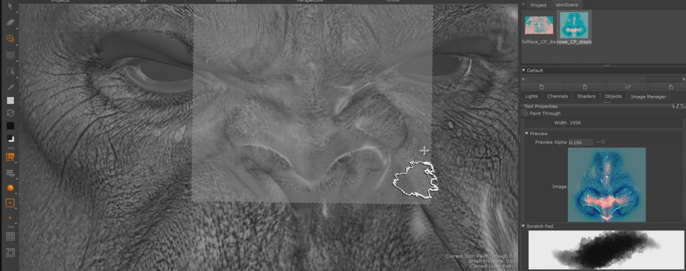   
可以在UV窗口下绘制   
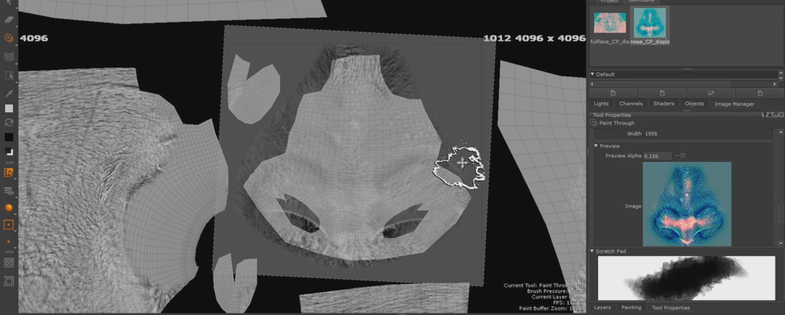    
继续   
    
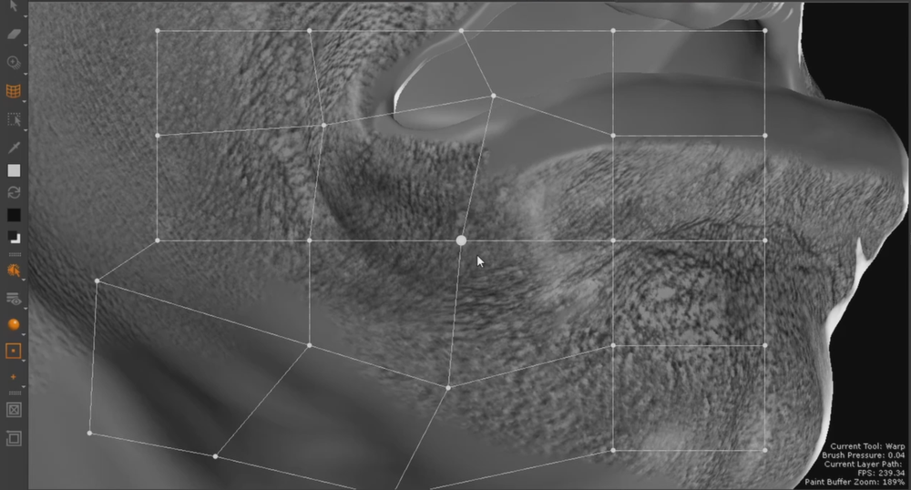    
用平铺节点填补    
    
    
用蒙版控制过渡      
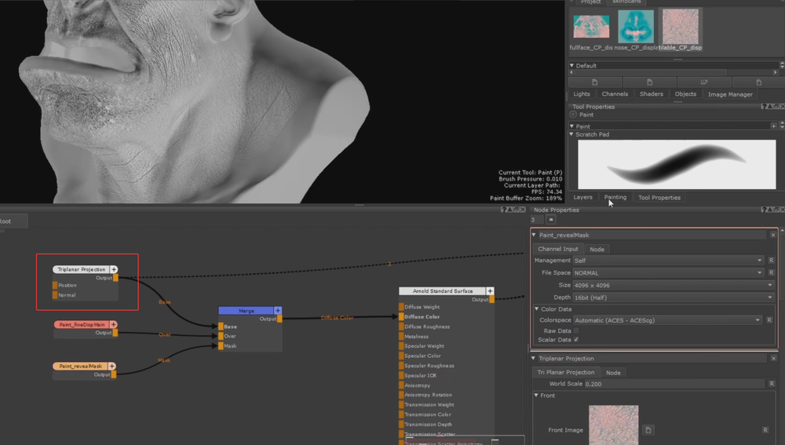     
眉毛部分的置换要注意不要有扫描的眉毛     
 
细心填补眼睛周围的置换    
    
耳朵部分要自己发挥一下，拿其他地方贴图贴一下    
    
最后填补完嘴巴的置换    
    
添加一个channel用于输出   
    
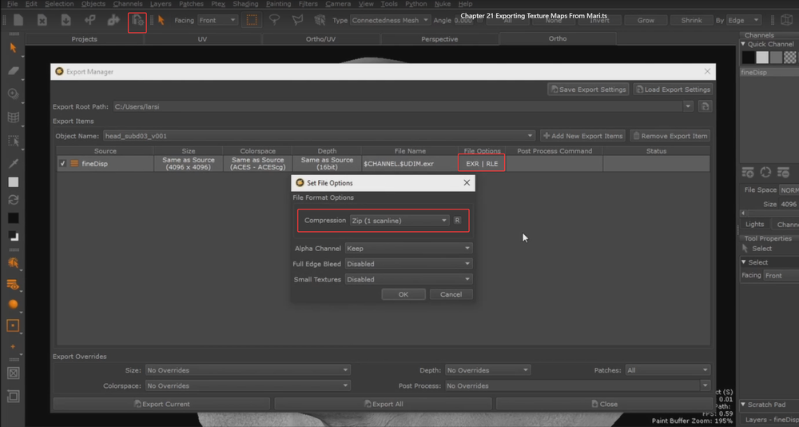   
## Arnold的置换材质效果   
物体的shape设置    
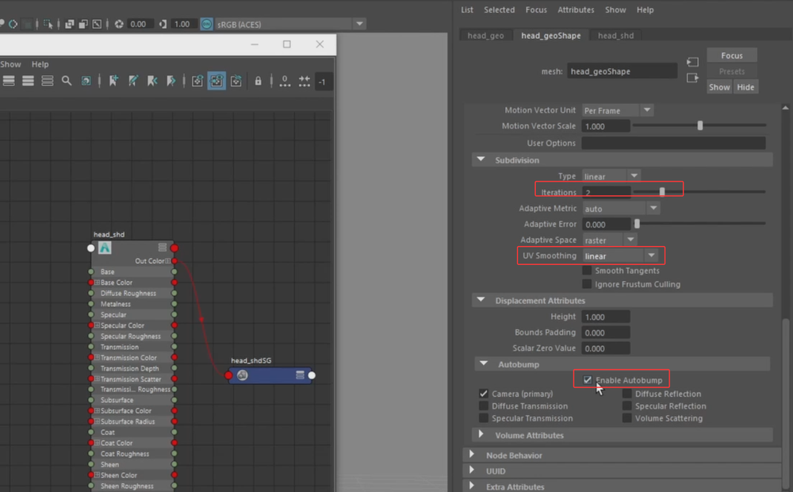    
连接置换节点   
    
贴图节点有ai自己的节点   
   
绘制观察的通道是R，就连接R通道    
    
对于没有udim选项的节点，最后输入 udim 才可以识别为udim   
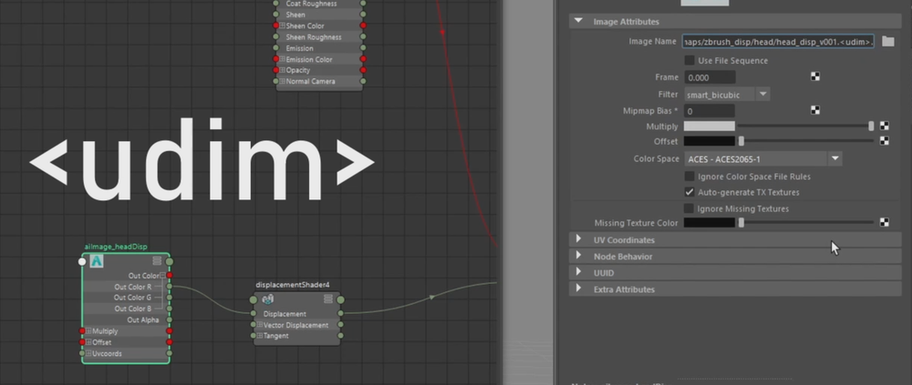    
    
TX Mannager  
这个是只是盲区    
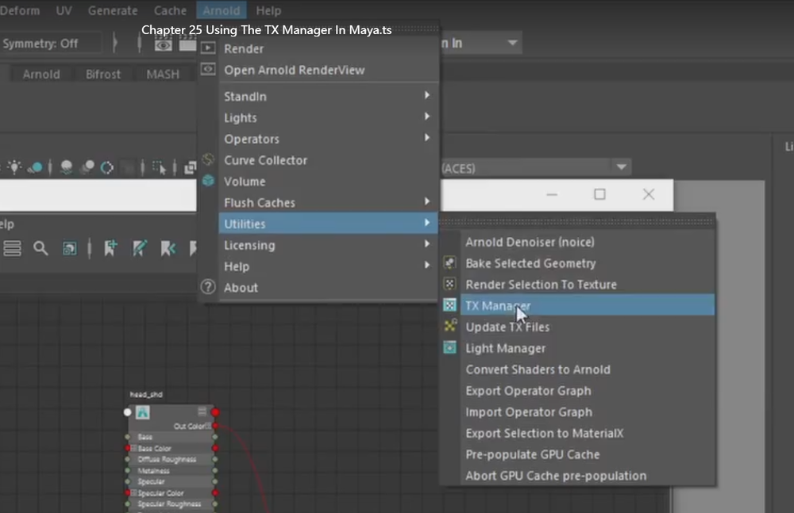    
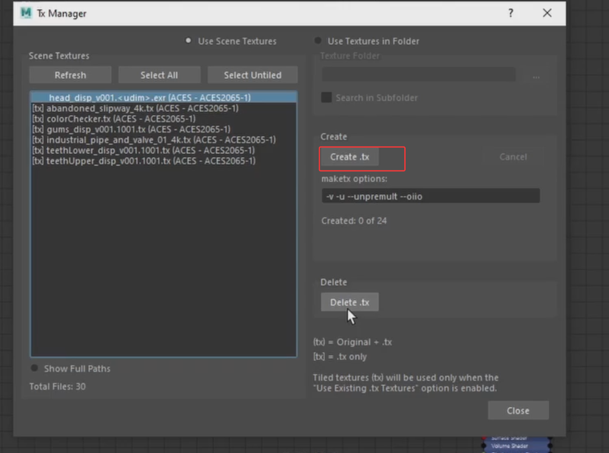    
渲染设置也有相关选项    
    
渲染   
    
可以关闭置换对比看看效果    
    
三个通道的法线效果合并  
把低频位移（大形状）和高频细节区分开，分别控制强度，然后合并 -> 更好控制置换强度与细节清晰度。   
不同细节编码在不同通道（R/G/B），使用 plusMinusAverage 可以把需要的通道提取、差值或做混合。   
缩放控制：aiMultiply 的作用常常是“把细节强度缩小到与粗置换匹配的量级”，避免细节过强导致网格爆炸。    
