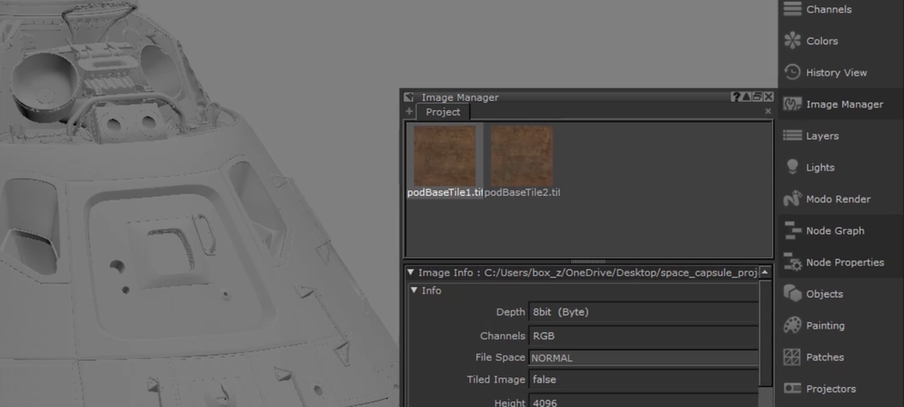
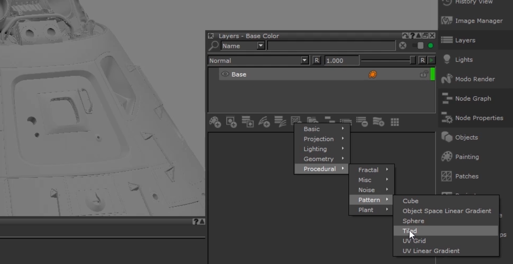
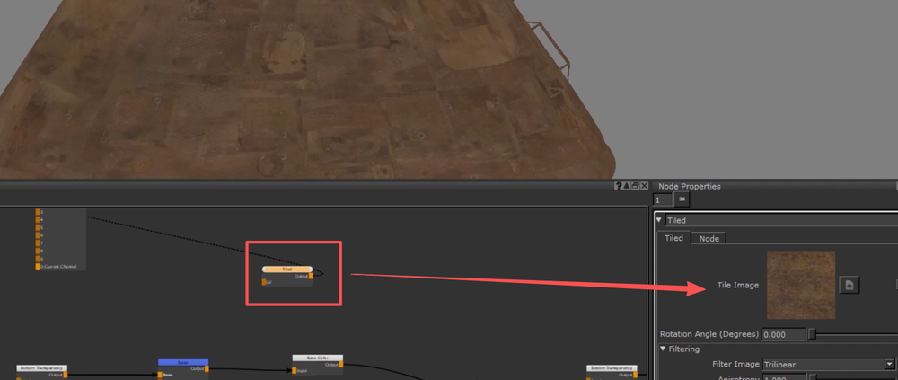
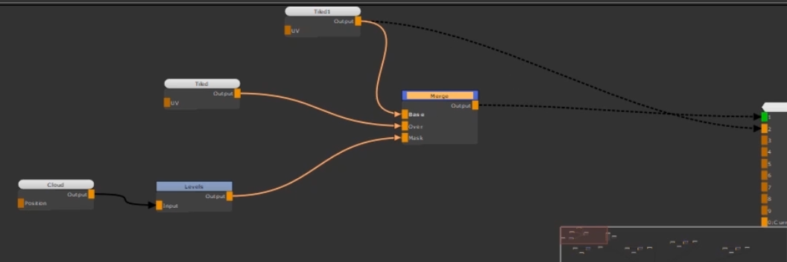
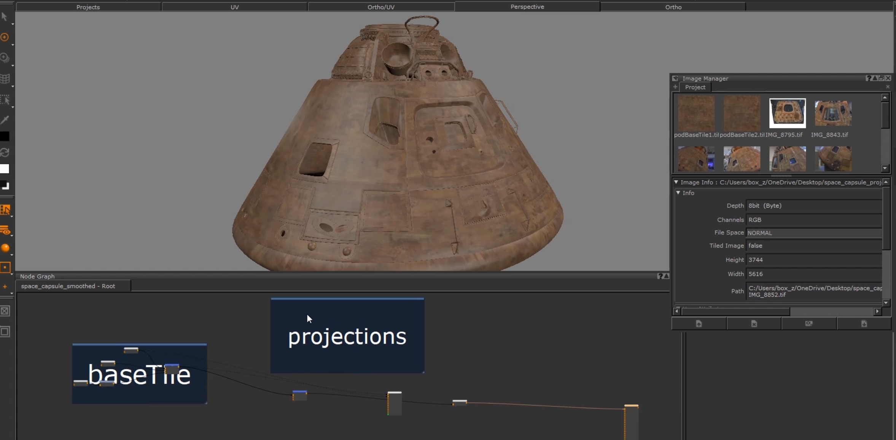
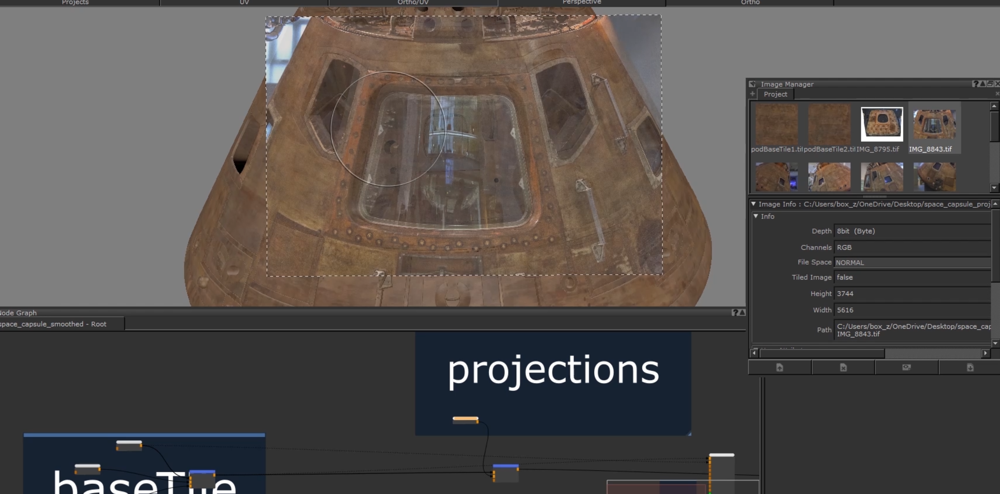
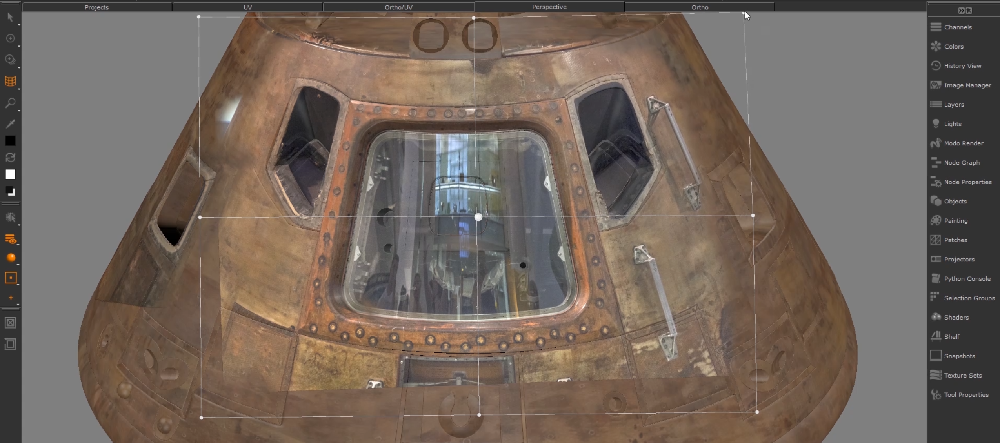
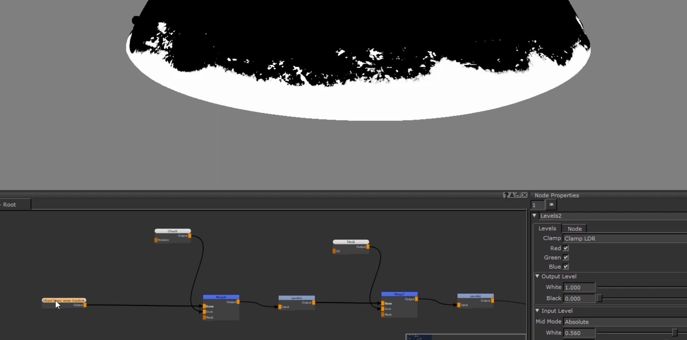

# Gumroad - Texturing Tutorial in Mari and Substance Designer - For Production By Zak Boxall
先处理好贴图，截取出整片的，去掉高光和阴影    
    
创建平铺节点   
    
链接贴图和节点   
    
用两张平铺纹理混合，Cloud-levels节点做mask,做基础的底层   
    
总体思路是基本平铺完成后，使用具体的照片进行局部投射绘制    
     
    
     
投射完成后，绘制渐变效果    
     
     