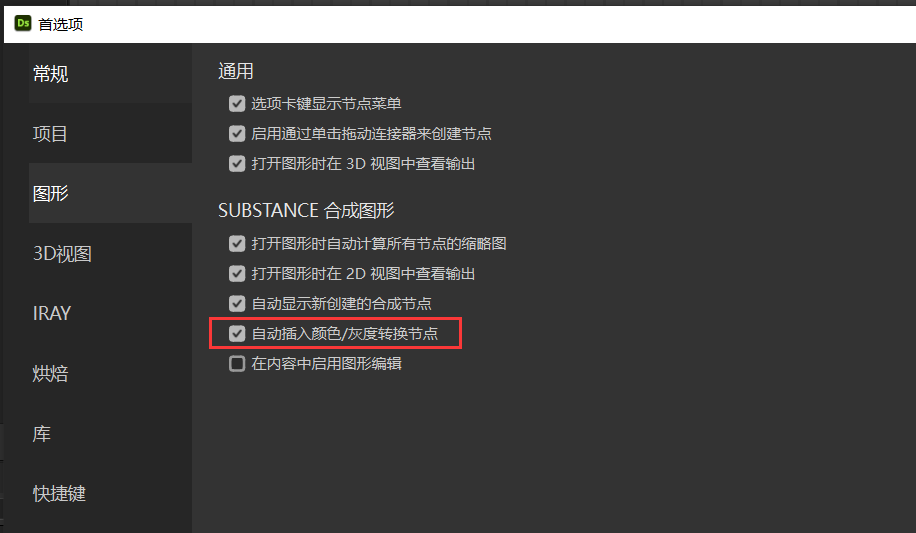
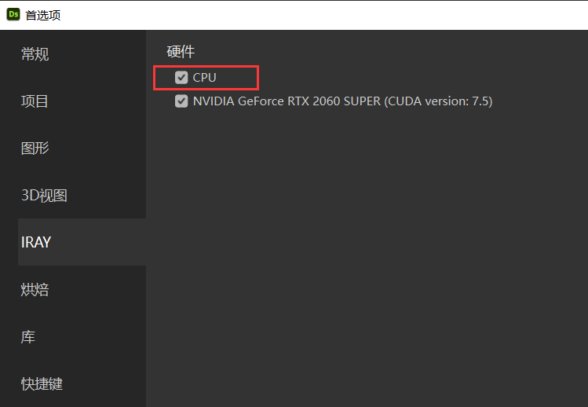
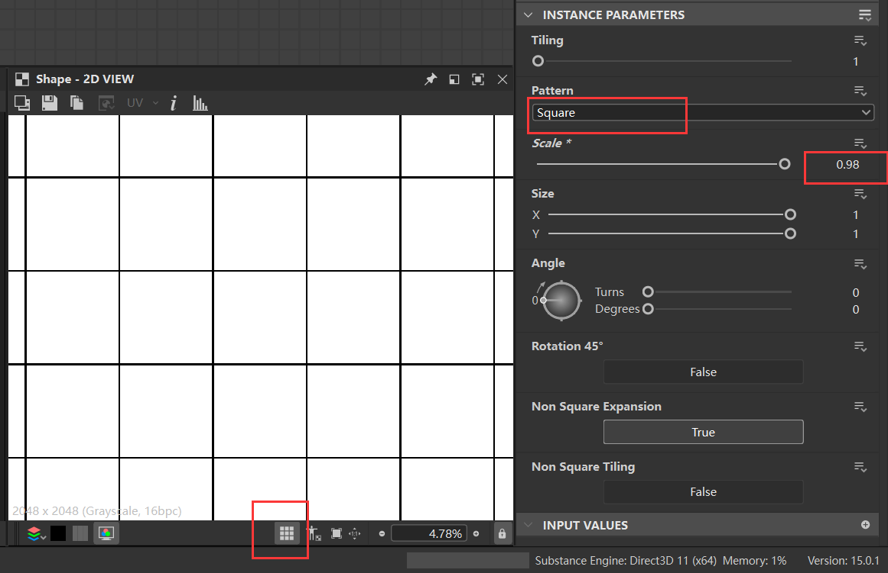

# Substance 3d Designer完全学习圣典  

**SBS与SBSAR文件对比**：

| **维度**         | **SBS文件**                          | **SBSAR文件**                        |
|------------------|--------------------------------------|--------------------------------------|
| 核心定位         | Substance Designer的**工程源文件**   | Substance资源的**成品发布格式**      |
| 可编辑性         | 支持完整节点流程、素材的编辑/修改    | 仅支持调整预设参数，无法修改节点逻辑 |
| 适用软件         | 仅能在Substance Designer中打开       | 支持Substance系列、Unity、UE、Blender等（需插件） |
| 文件体积         | 较大（包含所有编辑数据）             | 较小（仅打包成品资源）               |
| 用途场景         | 创作者进行内容的制作、迭代、修改     | 其他软件中调用资源、调整参数使用     |
| 交付对象         | 同团队的Substance设计师              | 美术、引擎开发者、其他项目成员       |

## 首选项设置
默认首选项里没有勾选，彩色节点转灰度的情况下，少一个手动步骤     
     
可以勾选CPU，加快渲染速度    
     
可以把采样提高   
     
开启GPU追踪    
    
## 程序纹理基础与生成  
### 简单图形    
可以生成基本几何图形   
    
可以在2D视图里点击按钮，预览平铺效果   
空格键 是快捷键  
    

## 程序纹理变换与调整  

## 材质相关效果 

## 实用案例   

