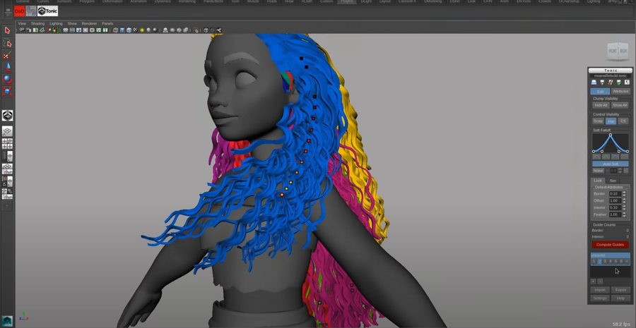

# Tube hair gen
### 参考文献：
[Disney's Hair Pipeline: Crafting Hair Styles From Design to Motion](https://disneyanimation.com/publications/disneys-hair-pipeline-crafting-hair-styles-from-design-to-motion/)
  
In this talk we will describe the hair pipeline utilized on Disney’s most recent full length animated feature, Frozen. Producing intricate hair styles is a challenging problem, spanning many departments. We focus on the generation of the hair groom and motion. This process starts by producing the groom, guided by 2D artwork from visual development and 3D proxies from modeling. We have developed a new intuitive interactive grooming tool, Tonic, which uses geometric volumes to procedurally groom the hairstyle. Once the hair volumes are sculpted, Tonic generates a set of guide curves within each Tonic hair tube. These tubes and guide curves are then passed to simulation which produces motion for a subset of the guide curves. The motion is controlled using an animation rig and a two-level simulation rig with the underlying dynamics calculated using our in-house solver. This motion is then mapped onto the full set of guide curves. In technical animation, cleanup and fine-tuning of the motion is done on a per-shot basis. Finally, the guide curves are interpolated and extra detail added using XGen, to produce the final set of curves sent to rendering. With this new workflow and toolset, the artists were able to create the almost 50 unique hair styles on Frozen.
***

### [tonic介绍](https://disneyanimation.com/technology/tonic/)


 
 
 
 
 

***
#### 原理说明
- 创建样条线，并拾取放样模型
- 修改样条线
- 生成毛发
#### version -1.0
```python
# -*- coding: utf-8 -*-

#风格化头发创建脚本

import maya.cmds as cmds

def set_curve_pivot_to_first_cv():
    # Get the selected objects
    selected = cmds.ls(sl=True)
    # Set the pivot to the first CV of each selected curve
    for node in selected:
        p = cmds.getAttr(node + ".cv[0]")
        cmds.xform(node, ws=True, piv=[p[0][0],p[0][1],p[0][2]])

def create_tube():
    # Create a cylinder and delete the faces
    cmds.polyCylinder(r=1, h=2, sx=20, sy=16, sz=0, ax=[0, 1, 0], rcp=0, cuv=3, ch=1, n='tube')
    cmds.select('tube*.f[320]')
    cmds.Delete()
    cmds.select('tube*.f[321]')
    cmds.Delete()

"""
First select the Cylinder created from the Creating Tube Script, then SHIFT+select the Curve in
that order. Cylinder first, Curve next.
After the Curve Warp is run, the cylinder should show up at the pivot point of the curve.
Now select the curve, in the Attribute Editor, goto CurveWarp tab then click select.
With the curve warp selected, click botton Modify curve warp
"""
def modify_curve_warp():
    # Modify Curve Warp settings
    selected = cmds.ls(sl=True)
    for node in selected:
        cmds.setAttr(node + ".keepLength", 0)
        cmds.setAttr(node + ".alignmentMode", 3)
        cmds.setAttr(node + ".scaleCurve[3].scaleCurve_Value", 0.09)
        cmds.setAttr(node + ".scaleCurve[0].scaleCurve_Value", 0.29)

def group_tube_curve():
    if cmds.objExists('GRP_Groom_Tube'):
        print "GRP_Groom_Tube already exists!"
    else:
        cmds.group(empty=True, name="GRP_Groom_Tube")
    cmds.parent("tube*", "GRP_Groom_Tube")
    cmds.parent("curve*", "GRP_Groom_Tube")

###################################   UI   #################################

cmds.window("Stylized Hair by TubeGroom",widthHeight=(700,140),s=0)
cmds.columnLayout( adjustableColumn=True )
cmds.text(label="Must be NUBS Curve.")
cmds.button(label = "Set curve pivot to first CV",width = 200,height=30,command = "set_curve_pivot_to_first_cv()")
cmds.button(label = "Create Tube",width = 200,height=30,command = "create_tube()")
cmds.text(label="select curve, in the Attribute Editor,CurveWarp tab then click select")
cmds.button(label = "Modify curve warp",bgc=[0, 0.5, 1],width = 200,height=30,command = "modify_curve_warp()")
cmds.text(label="extra")
cmds.button(label = "GRP_Groom_Tube",width = 200,height=30,command = "group_tube_curve()")
cmds.showWindow()    