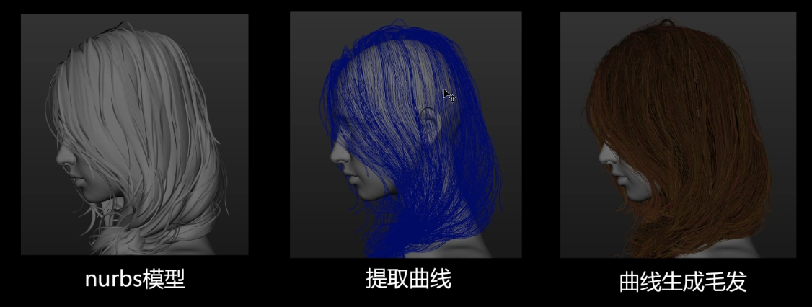
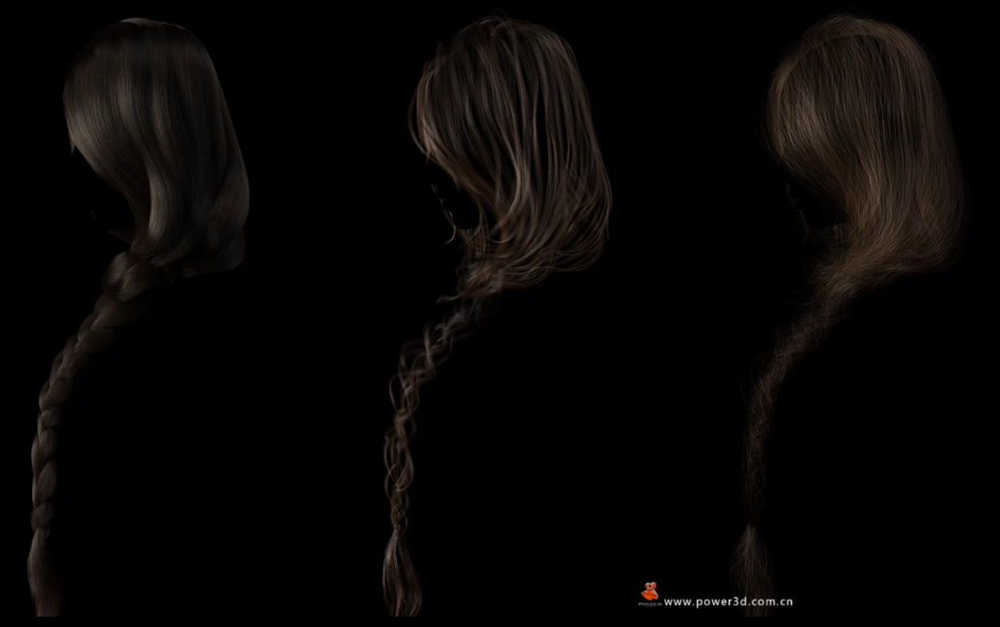
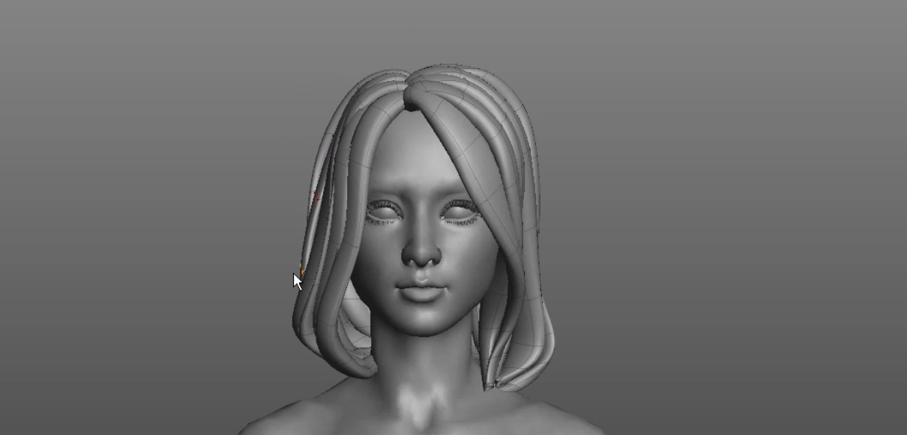
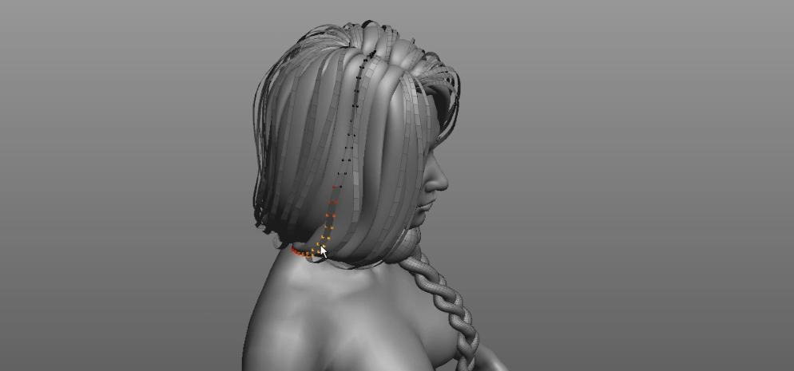
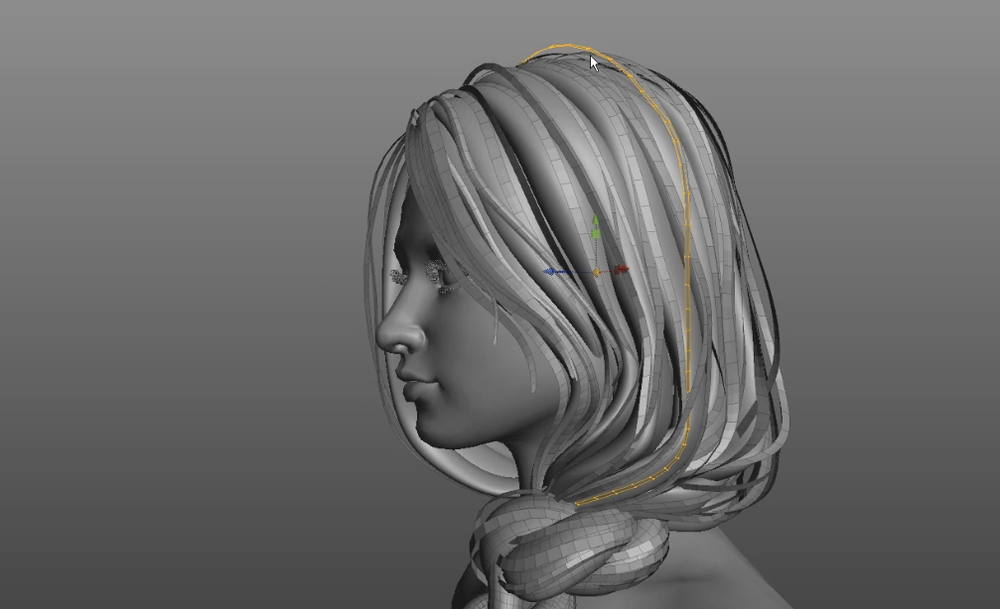
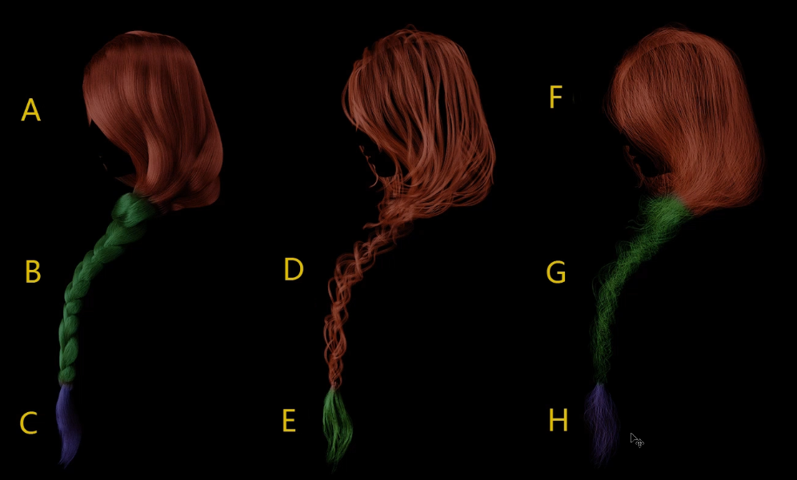

# 超真实毛发  
<https://www.cgtarian.com/online-courses/advanced-animation-courses/polishing-and-pro-level-animation-techniques.html>
教程比较早了，方法比较老。
但制作思路可以作为一个参考     
   

基本思路是面片提取曲线，曲线生成毛发   
   
基本操作流程   
分三层，做出层次差别  
  
三层对应的毛发表现   
底层打底，第二层是主要出效果的，第三层是表面的发丝  
   

底层模型制作   
   
第二层模型制作   
   
   
一层层转换生成毛发。有些毛发部分需要续接拼接    
    
