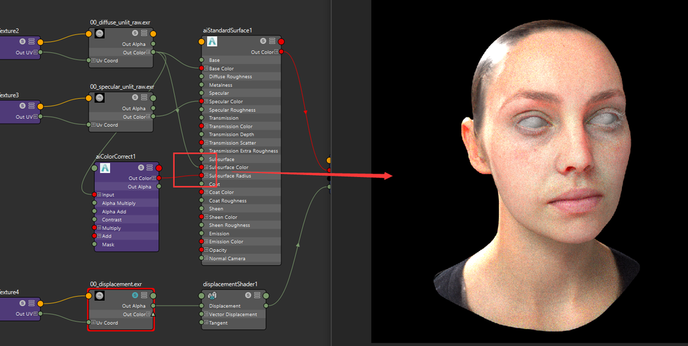
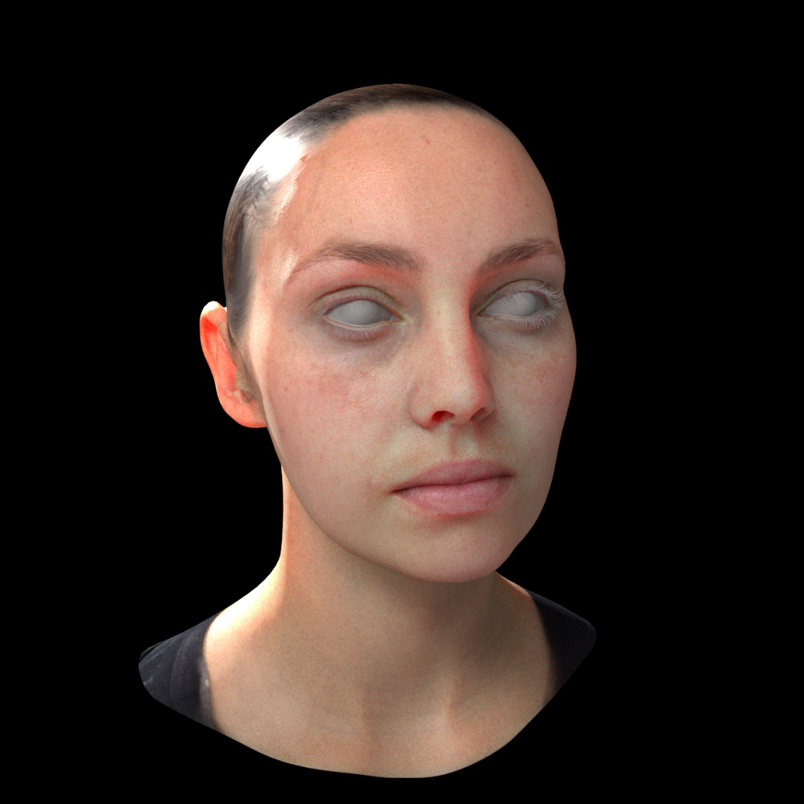

# Arnold 次表面散射材质 

案例下载地址：<https://vgl.ict.usc.edu/Data/DigitalEmily2/>   
   
此处可以修改置换贴图的强度   
    
次表面的参数打开   
Scale参数调整散射的范围   
   
一个颜色贴图调整节点的经验值。用于生成次表面的颜色    
  
调整好后设置节点连线及效果如上  
一个粗略的次表面散射效果。实际制作中要考虑骨头等对光线的遮蔽，不然整个皮肤会显得像明胶一样假   
   