# 皮克斯渲染器RenderMan 

## IT工具
渲染窗口操作：C键打开左边Catelog栏，T键，一直在最上层.R键重新启动渲染 .backspace键删除渲染图     
局部框选渲染。区域框还可以移动    
  
可以快速左右键预览切换渲染图。或者pagedown,pageup键操作   
   
在渲染图点击，可以选择物体  
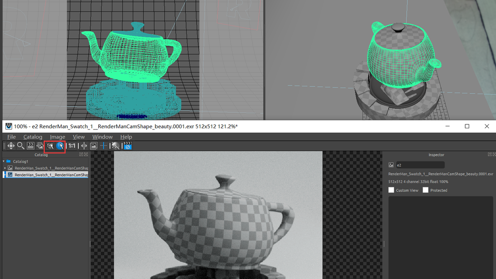  
1:1显示。快捷键HOME键     
   
扫描对比。把一张图标注为背景，然后切换到前景图，可以鼠标移动进行扫描对比   
   
降噪。      
   
可以作为最后噪点的一个优化      
   
但图质量本身低会模糊掉画面       
  
IT工具设置。主要是快捷键设置  
通道显示切换依次：A,S,D,F,G,H    
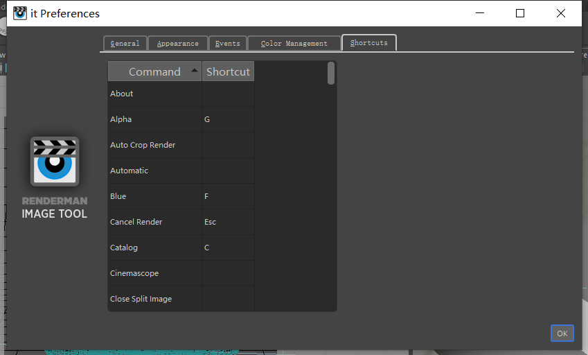   
IT工具还可以导入外部的图片及序列帧  
  
可以打开sequence control播放序列图   
   
可以保存catalog及session。也就是场景渲染的状态   
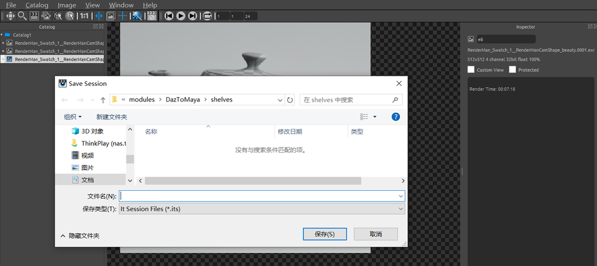   
Catalog选项里有关于渲染图切换显示的提示，主要区别是在不在AOV分层图里切换显示      
如果准确选择AOV某个通道，再pagedown,pagaeup,会在不同的catalog图之间同通道切换     
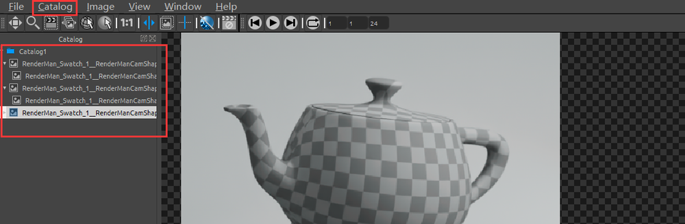  
窗口适配渲染图等操作 ctrl+F   
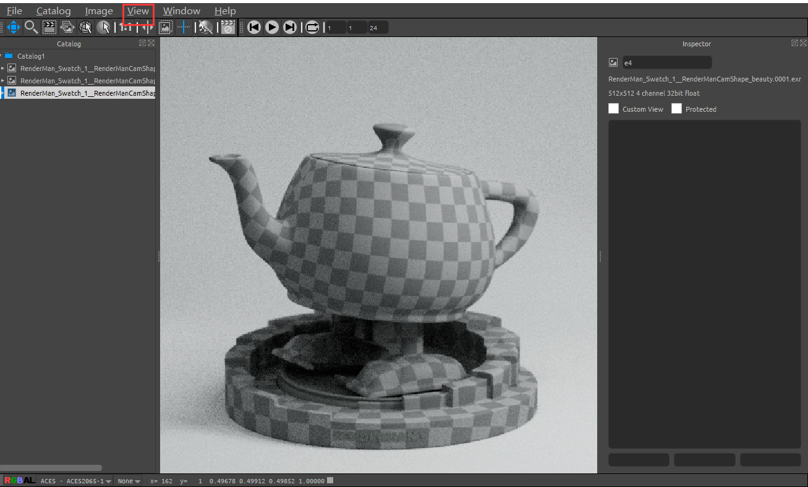   
Gamma等图像操作，可以分析渲染的一些信息  
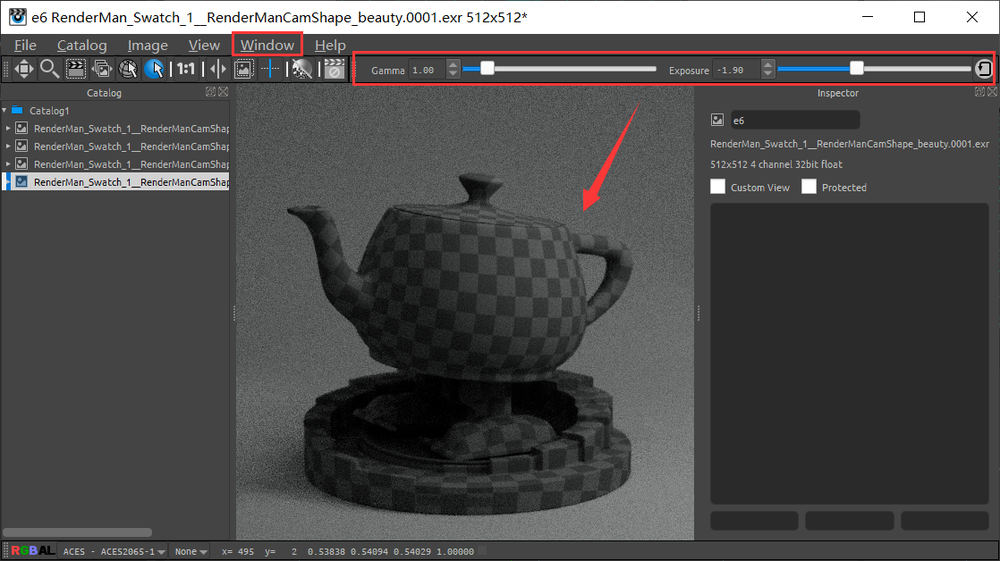   
view——looks模式可以显示更多图像信息，用于分析等   
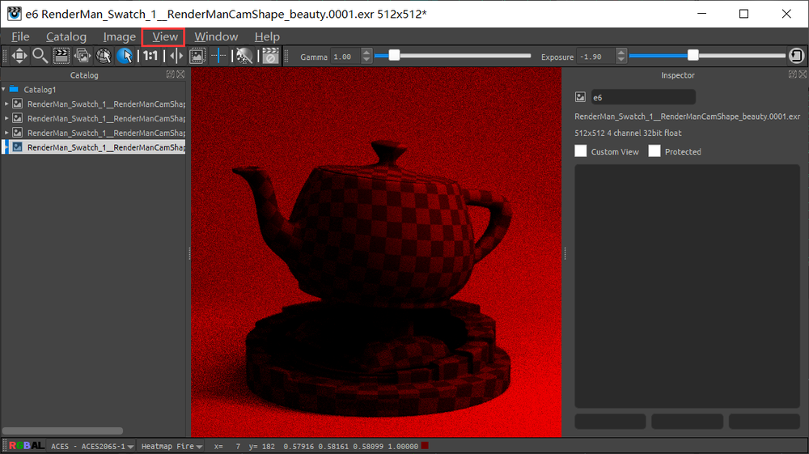   
view——rencent bucket markers 可以切换是否显示渲染扩散  
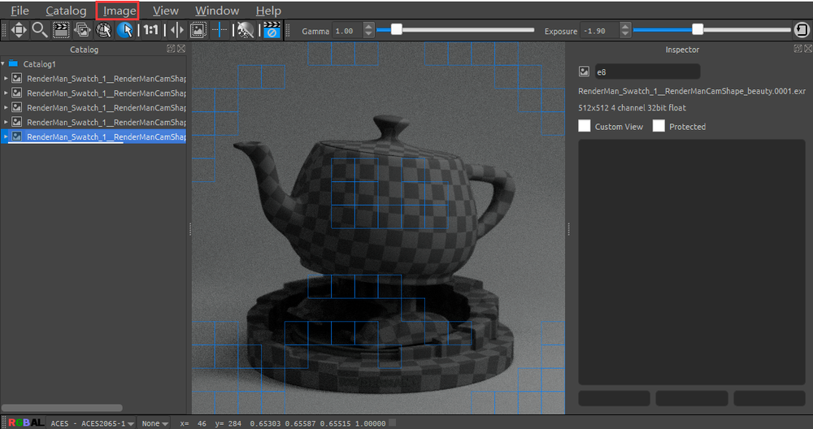   
V键显示渲染的采样，内存使用等数据   
   
IT工具栏中，这里显示的是存在的时间，不是渲染时长   
   
renderman的像素采样的次数，由前后渲染的梯度差来决定，所以每个像素的渲染采样次数是不同的。区别于arnold等渲染引擎   
## 采样算法
一个比较经济的采样算法，类似神经网络的梯度下降，梯度变化不明显了，就停止采样   
   
   
如果值为0，将使用固定采样，而不是自适应采样。   
数值越小，采样质量约苛刻，消耗更多，效果更好。   
在数值栏右键，可以重设为默认值      
   
线程设置。没有特殊原因不用动。   
-2是预留2个线程，可以用来选择移动等操作。batch渲染时，就没有预料多余线程操作  
   
简单总结：  
**Pixel variance**是一个采样继续深入的信号器  
**Max Samples**是采样精度控制的上限  
两者共同决定动态采样的最终效果  
总体而言，全局自适应采样存在一个边际效应递减的现象。后续的渲染成本要提高很多才有略微改善  
最好在后续用局部采样进行改善  
   
渲染时间的递增    
  
最小采样值会影响所有像素 
尤其对于特别稀碎的物体，如果最小采样不够，就会被略掉   
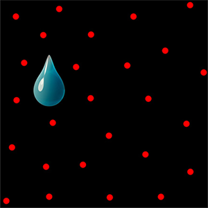   
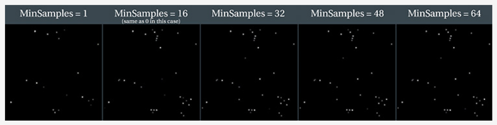   
应该适当提高最小采样值  
  
渐进式渲染，如果取消，只适合最终渲染的时候用   
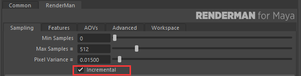   
此处设置决定渲染刷新的方式和单位大小   
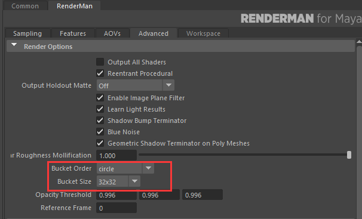   
预览渲染大场景时的一个优化值，O值不做优化   
   
此处是自适应采样的算法，目前默认是官方认为比较好的算法    
   
且可以单独为场景的物体设置不同的采样阈值Pixel variance    
   
在每个物体的renderman选项里，修改 **relativePixelVariance**值，这个值会和全局自适应值相乘    
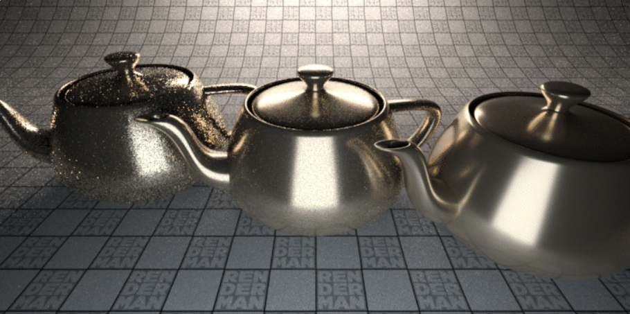   
渲染像素间的过渡算法，可以保持高斯模糊不变    
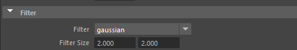   
### 批量渲染   
批量文件的形式   
本地/网络，Maya渲染序列/导出为RIB后执行的序列  
要发送渲染任务到renderman，需要把Spool Style改为RIB   
否则就用Maya Batch    
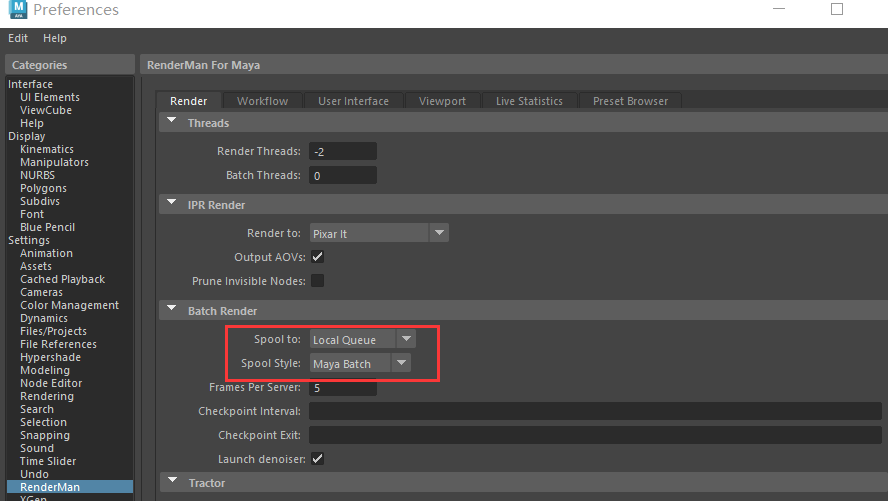  
图片格式是在AOV里设置   
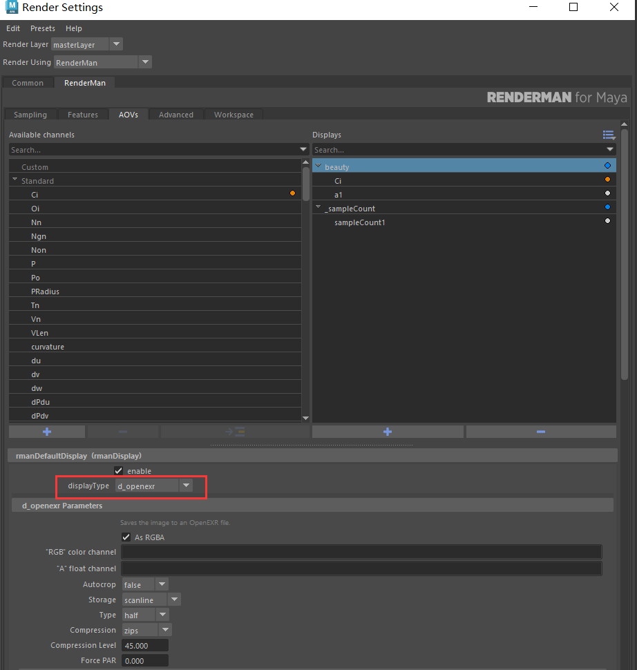   
如果勾选降噪，会额外再输出一套降噪过的序列图   
   
命名规则.点击眼睛可以预览命名的样例      
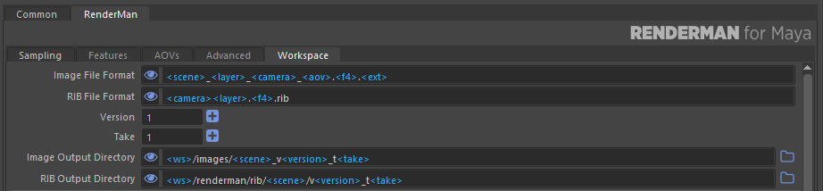   
官方给出的命名标识符.输入框右键，也会出现提示      
[String tokens in RfM](https://rmanwiki-26.pixar.com/space/RFM26/21037296/String+tokens+in+RfM)   
发送渲染序列，开始渲染   
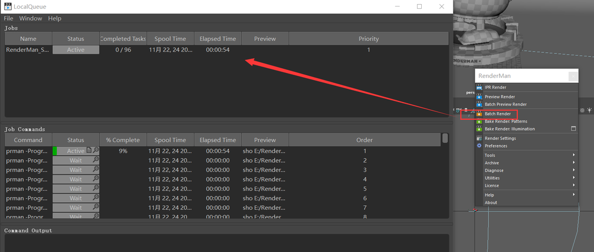   
渲染日志.level是代表缩略图精度  
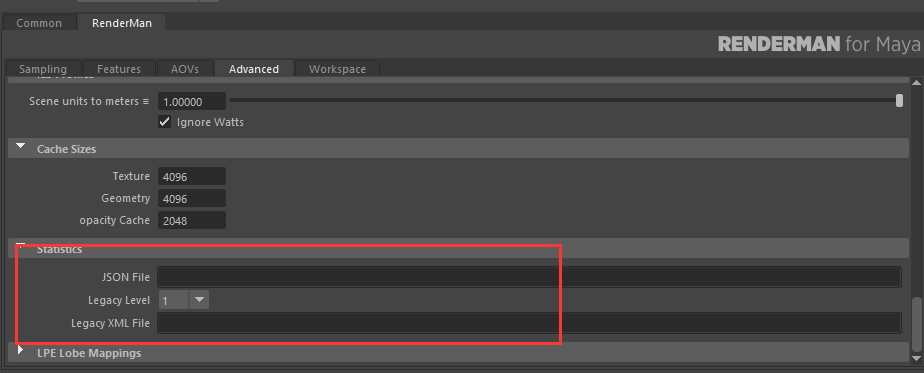  
可以在浏览器打开。主要用于渲染单帧进行分析     
   
实时分析报表   

## 正向渲染引擎 
皮克斯光线追踪引擎    
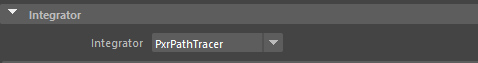   
### 反弹次数
**Max Indirect Bounces** 的值是间接反射的上限。  
其中又分成镜面反射和漫反射反弹两个值来分别控制  
  
### 采样细节  
在比较合理精细化的操作情况下，应该对相应的通道层进行不同的采样。而不是提高全局采样      
采样方式.bxdf是较为精简智能的  
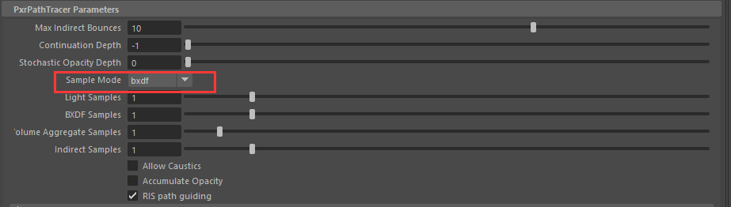   
切换为manual是手动，可以更详控制每个通道的采样，类似Arnold      
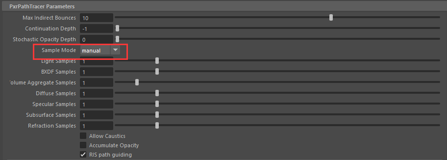  
Light Samples控制直接光照的采样质量    
官方推荐Light Samples和BXDF Samples保持一样  
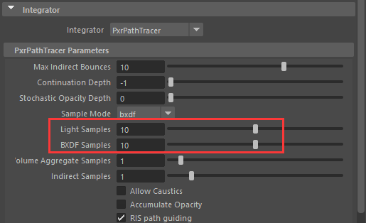  
采样值通道细节修改对比的情况.改善了直接光照的采样。实际操作会体验更细腻    
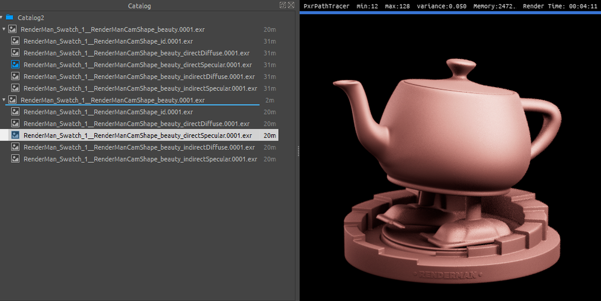   
提高间接光照采样   
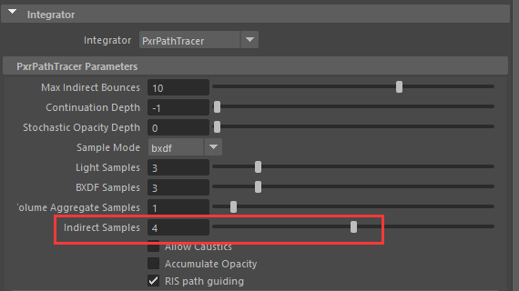   
间距光照产生的噪点最多，对比最明显    
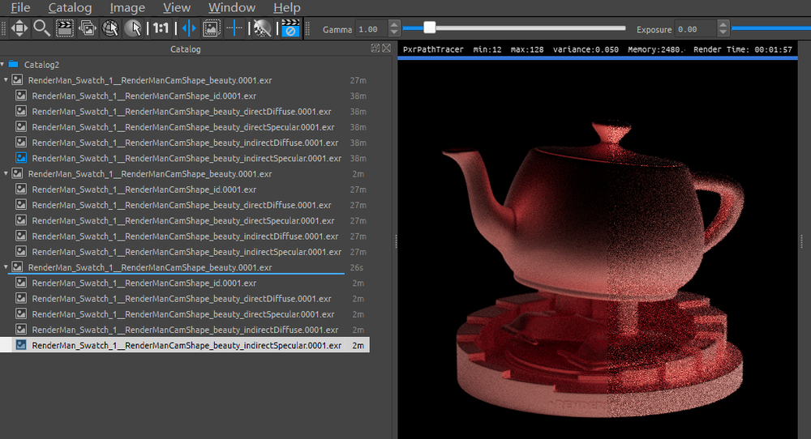   
影响间接光照效率的俄罗斯赌盘算法.会在触发采样深度的时候随机去掉采样   
Threshold的值是采样光线被干掉的概率。会影响变化的梯度       
  
manual方式主要对间接光线采样进行了拆分   
如果间接采样的区域有曝光，可以减小Lumainance值   
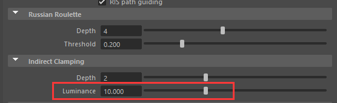   
## PxrVCM双向追踪渲染    
适用于大量间接光照的场景   
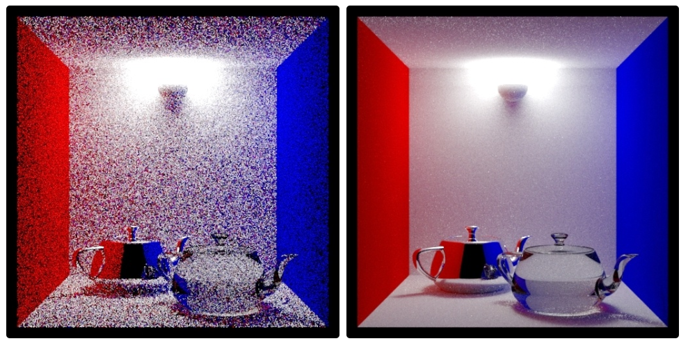       
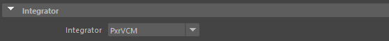   
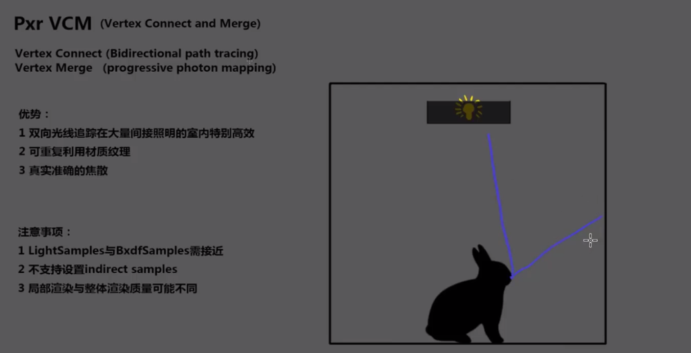    
焦散效果   
简单焦散的话，可以勾选      
   
一个很重要的前提是要把主光源开启 tace light paths    
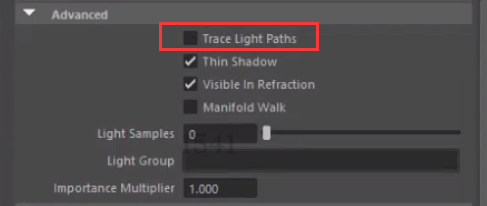   
如果要物理精确，需要切换渲染引擎   
焦散受限于光线的反弹次数，需要把反弹次数给大  
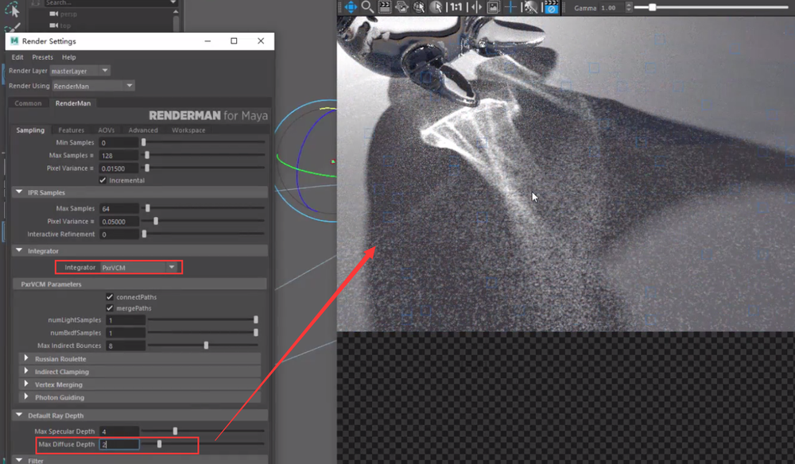   
影响焦散的锐利程度.值越大越模糊      
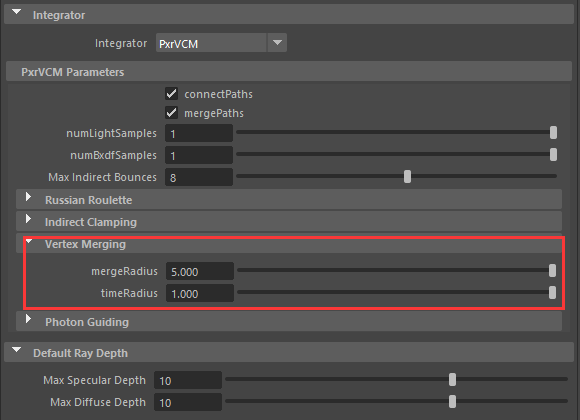  
## PxrUnifiled   
为动画片等大场景渲染而准备   
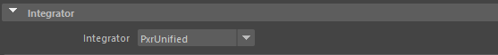   
使用反弹距离和次数控制大场景的渲染   
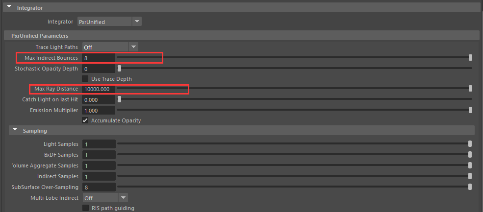   