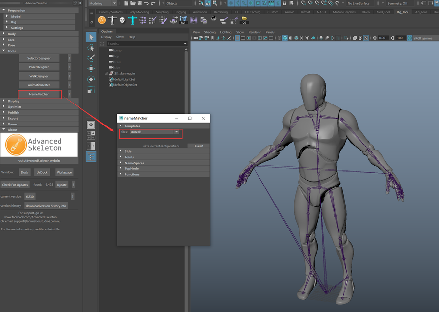
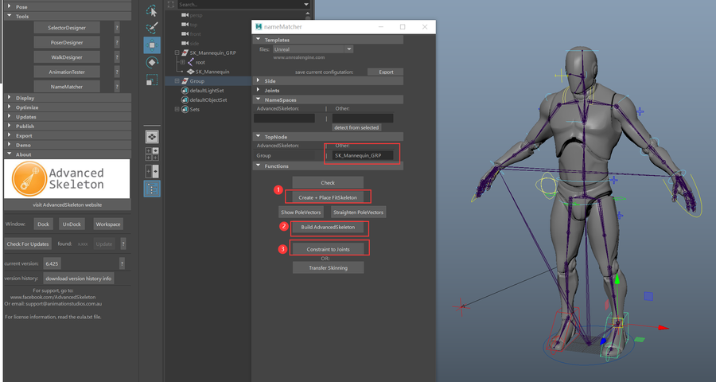
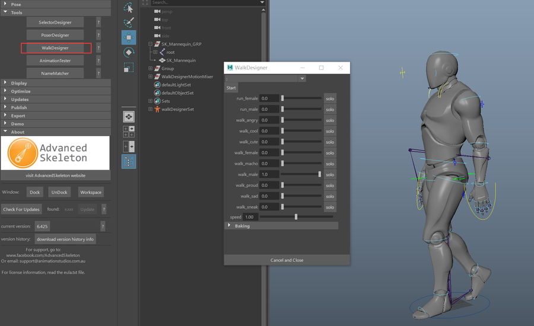
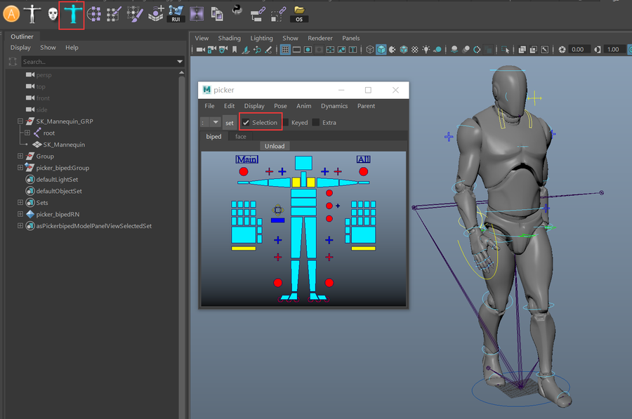
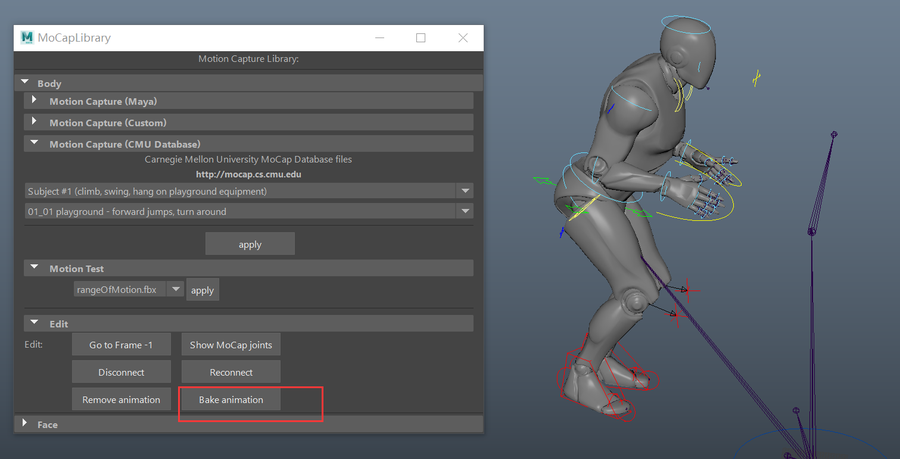
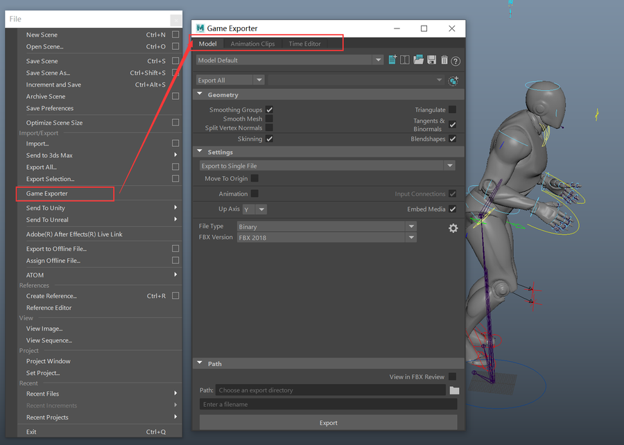

# ADV绑定Mannequins
   
到入模型后，需要对最外层的组的名字进行修改 **( SK_Mannequin_GRP )**，不然会报错如下：   
> AdvancedSkeleton.mel line 18245: More than one object matches name: SK_Mannequin   

   
绑定完成之后可以用参数化走路工具来做一个测试   
   
另一个利用外部动作捕捉数据的办法   
   
   
bake之后就可以进一步编辑动画   
  
Maya有专门的游戏格式导出选项，可以做动画切片的导出  
   
现在可以为符合虚幻引擎骨骼设置的文件重新快速设置绑定，并进行二次创作了   
   

<https://www.youtube.com/watch?v=Uf9i5HUixrk>