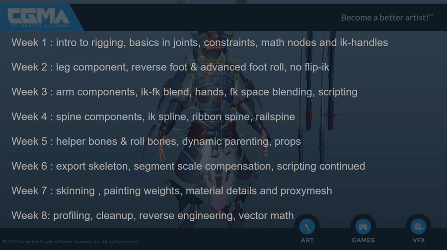
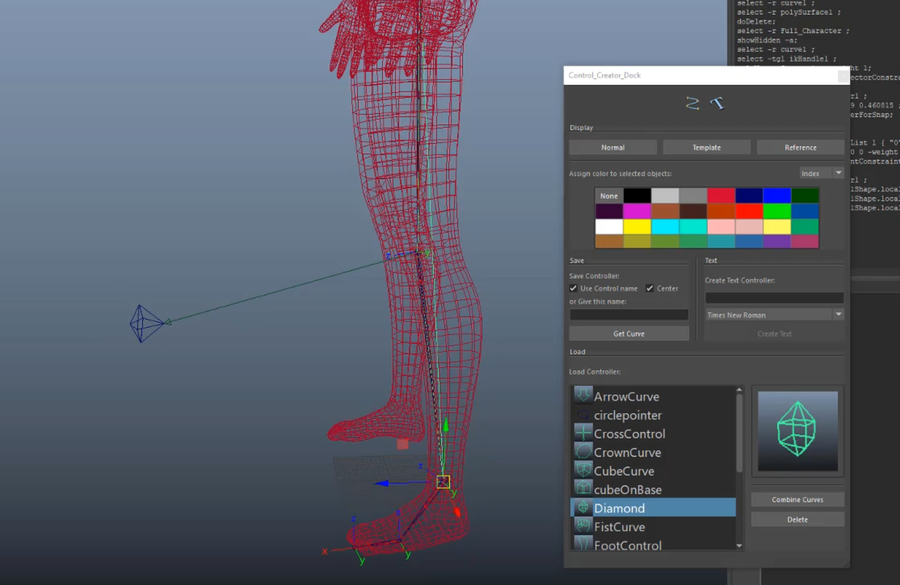
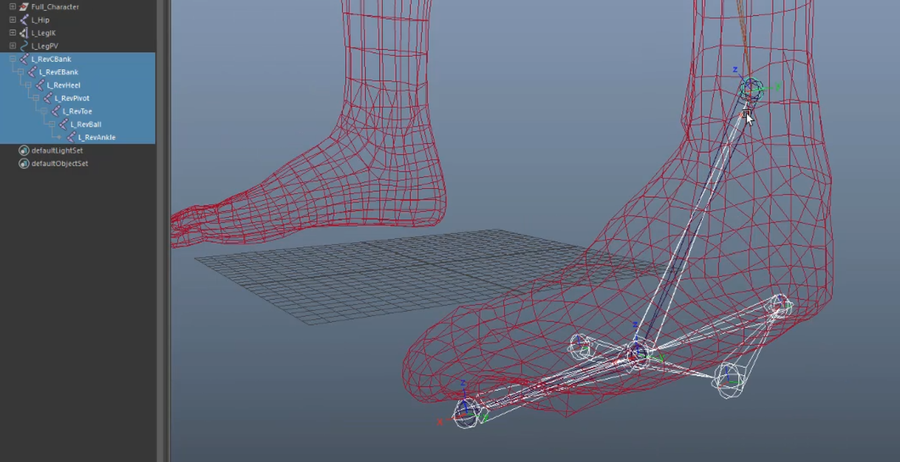
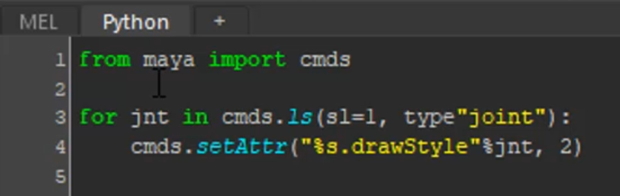
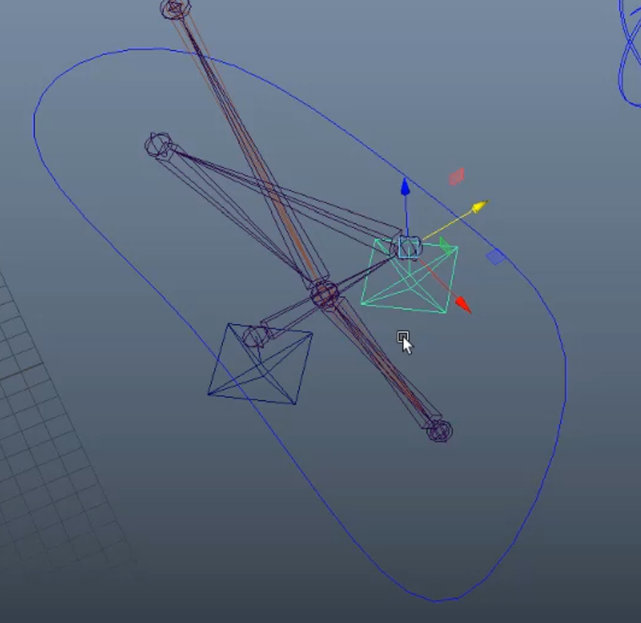
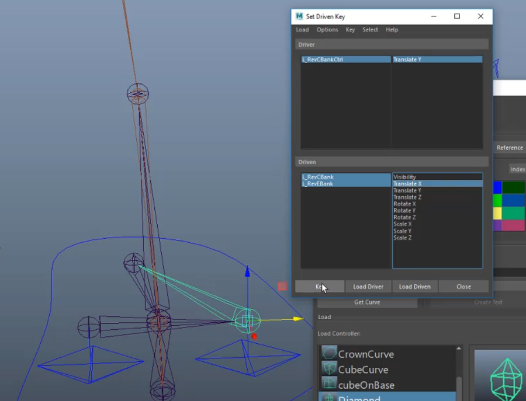
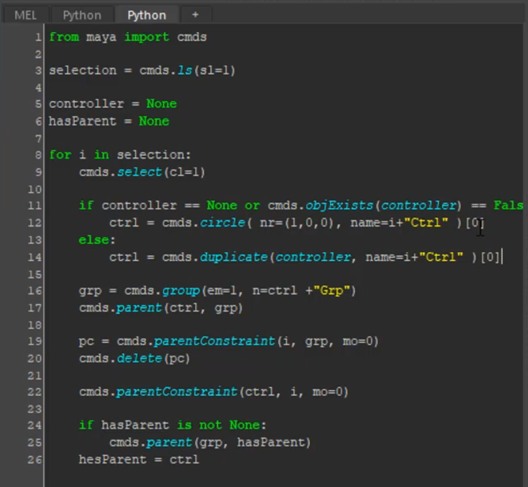
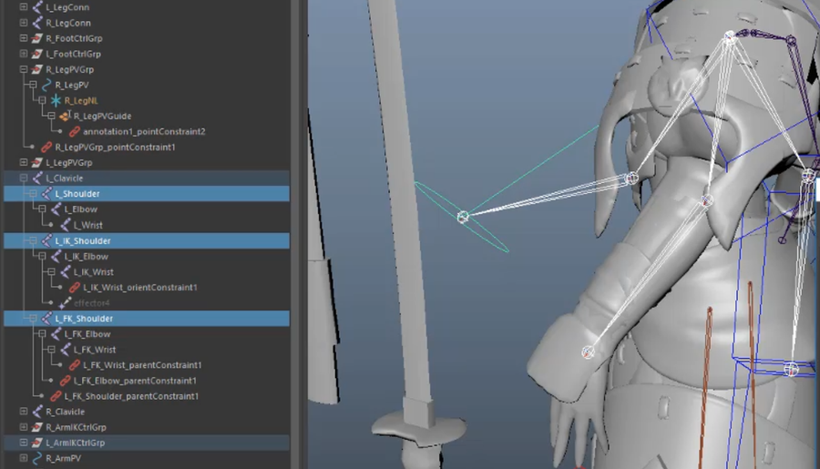

# CGMA Rigging for Games

## leg
创建脚骨骼，注意朝向   
   
   
创建极向量约束   
    
辅助控制骨骼和3个IK结合的方案   
   
   
添加脚旋转控制属性，关联控制器   
案例是新创建一个物体来控制，不是很集中。   
    
最后会把控制骨骼隐藏   
   
腿部无翻转IK
有插件处理   
   
另一种腿绑定
在IK解算器方面，同样脚部两个ik 是但链IK
也是脚部IK作为辅助控制骨的子物体    
    
创建辅助骨骼，并给上IK   
   
    
吸附到对应骨骼   
   
旋转骨骼再旋转辅助骨骼的IK，进行极向量约束，方向如果不对吗，IK解算器的Twistr的值可以180   
   
可以添加两个控制器，控制翻转脚的点，可以控制骨骼的长短进行微调   
    
层级结构上，作为骨骼的子物体     
    
使用驱动关键帧来关联，控制曲线是驱动物体，骨骼是被驱动物体   
    
这里需要多次进行驱动关键帧的计算，很考验理解和操作，可以多实践下   
   

# Arms
   
创建FK   
controller可以传入场景内虚拟体的字符串名字，执行脚本可以替换
controller = “cube”  

   
IK，FK的切换

肩膀

### 手

创建后执行脚本，创建FK控制   
   

手控制器约束
用绑定骨骼父子约束一个空组，轴心点在手腕。
手的控制器作为空组的子物体。这样FK和IK都可以控制手的控制器整体移动旋转