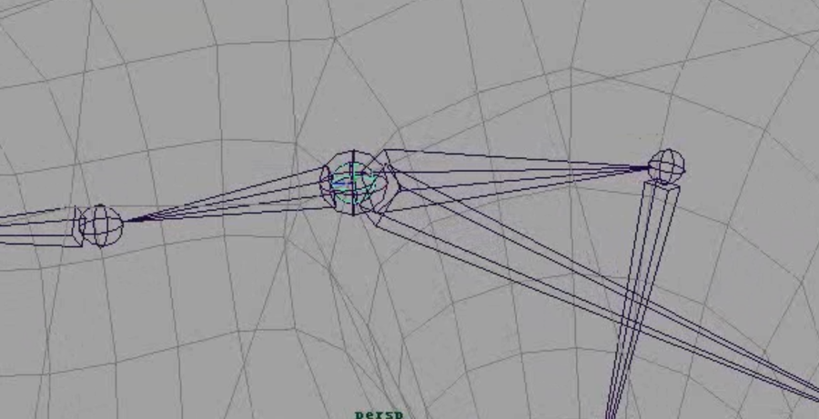
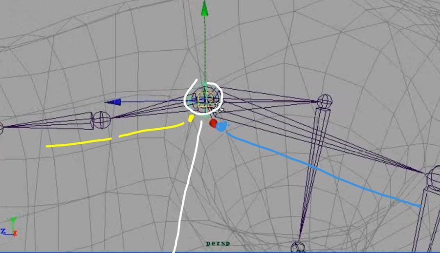
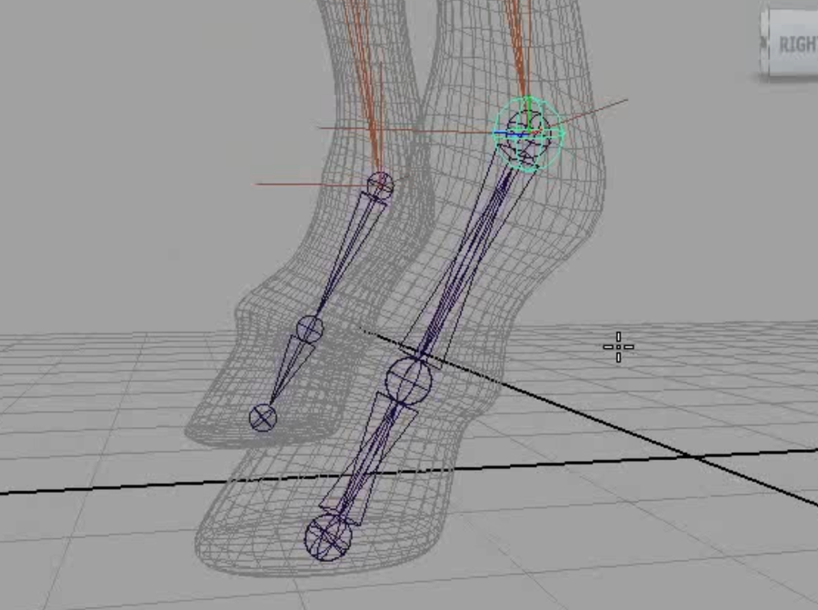
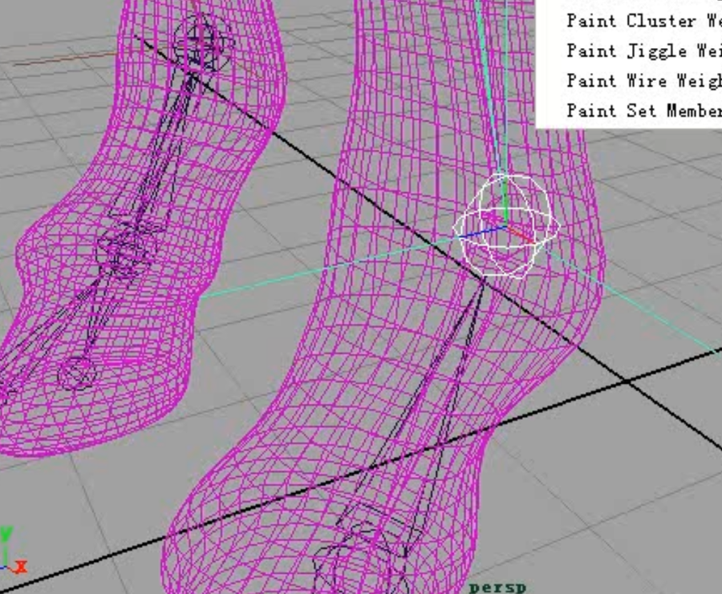
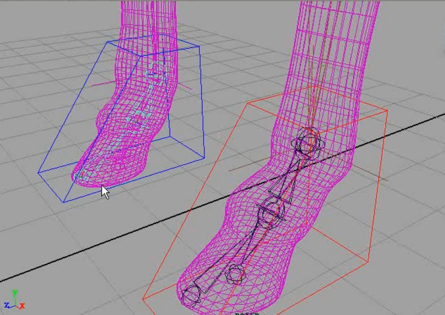
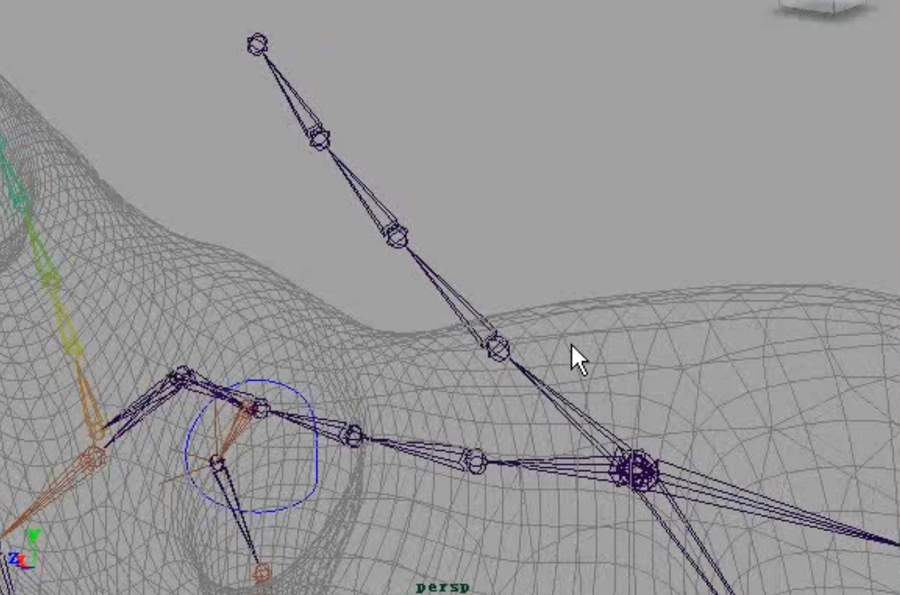
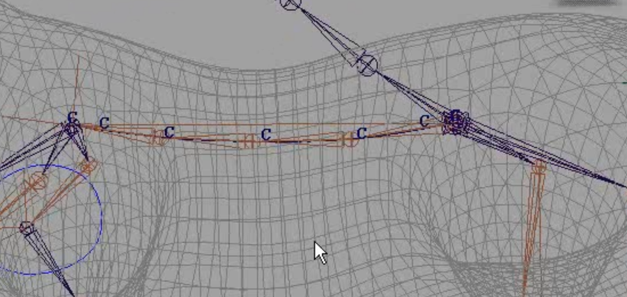

很古早的视频了。  

这种类型骨骼的关键在于后肢，需要马可以仰起抬腿，也需要满足腿跳起向后蹬，支撑点在骨盆出，类似有一个竖杆。 

其实是三个骨骼重叠在一起   

后退抬的时候，马尾还是垂下的。创建loc,吸附到马尾根骨，马尾骨骼打组，把轴心点吸附到loc.
loc作为后腿骨的子物体。loc点约束马尾骨骼组。
这样抬腿的时候可以马尾跟随，且马尾默认垂下。

创建IK，。注意起始点    

给脚部创建控制骨骼   

控制骨末端点约束IK。其余控制骨骼对应旋转约束绑定骨骼

把控制骨父端P给控制器，作为控制器的子物体。再把旋转属性给到控制器。
可以式样属性关联connection editor，不用设置驱动关键帧。

创建膝盖的极向量约束    

添加前腿肩甲部控制器，点约束IK，并旋转约束骨骼（黄色骨骼）  

复制前半身脊柱骨骼   

再脊柱上创建样条IK（从头往臀部方向创建），并把控制点转换成簇。
旋转所有簇，P给根骨骼，作为它的子物体

再用控制骨骼父子越苏簇点，实现用控制骨来旋转约束的效果

