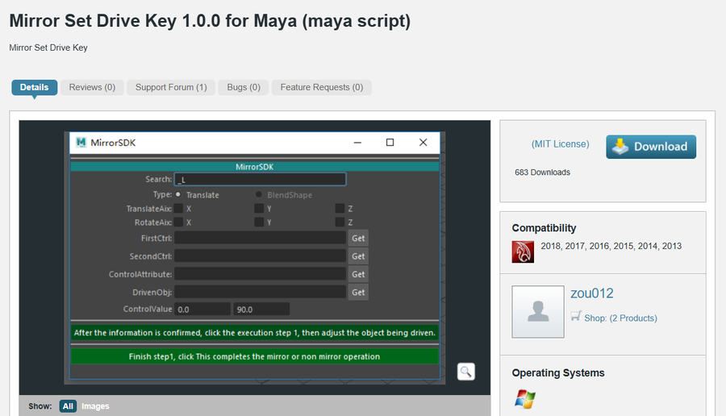
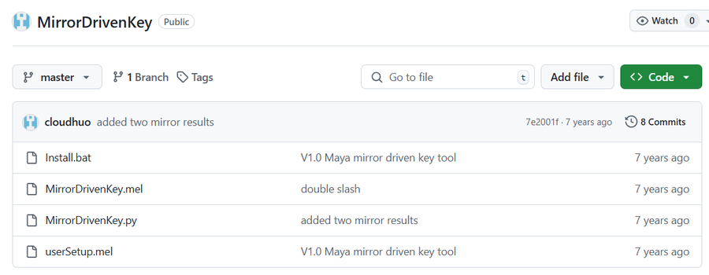

# MirrorSDK
收集了目前这颗星球上公开能找到的SDK工具 

[Mirror Set Drive Key 1.0.0 for Maya (maya script)](https://www.highend3d.com/maya/script/mirror-set-drive-key-for-maya)    
[MirrorDrivenKey](https://github.com/cloudhuo/MirrorDrivenKey)  
[ny_copySDK](https://github.com/nazmiprinter/ny_copySDK)  
BonusTools

## 使用说明
**MirrorDrivenKey** 是 Yunhao Huo 于 2017 年 4 月在佛罗里达互动娱乐学院创建的镜像驱动关键工具   
该工具专为解决面部绑定问题而设计   
痛点：当绑定师在 Maya 中使用 Set driven Key 工具设置角色左侧的所有运动控制时，他们总是必须将相同的通道值复制并粘贴到右侧，以便做出对称的面部表情（如微笑或冷笑）。整个过程很繁琐，可能会导致一些无意的错误。   
解决问题： 此工具只需单击几个按钮即可程序化整个过程。 

 driver 对象上的属性可以驱动一个对象上的多个属性（有时甚至多个对象）。所以 set driven key 相当复杂且难以管理。
