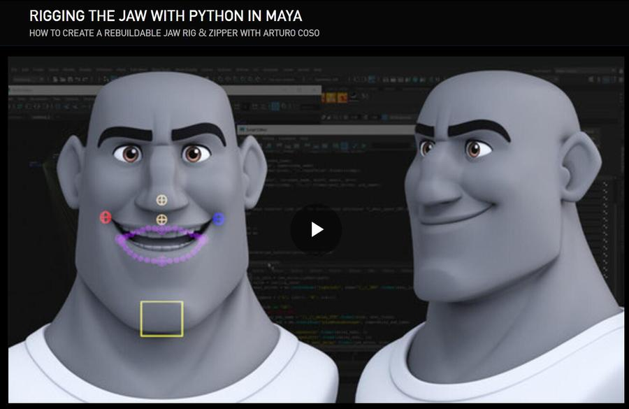

# rigging_the_jaw_with_python_in_maya
[rigging_the_jaw_with_python_in_maya](https://www.bilibili.com/video/BV1oQ4y1B7Yv/?spm_id_from=333.337.search-card.all.click&vd_source=9cdd98cc53d87aeb4190d2743832662b)

  

## 说明

## 步骤

## 代码
```python
# -*- coding: utf-8 -*-

#嘴部绑定
import maya.cmds as cmds

#物体类型
GROUP = 'GRP'
JOINT = 'JNT'
GUIDE = 'guide'
JAW = 'jaw'

#方向
LEFT = 'L'
RIGHT = 'R'
CENTER = 'C'


def creatGuides(numbers=5):
    #创建空组及层级
    jaw_guide_grp = cmds.createNode('transform',name='{}_{}_{}_{}'.format(CENTER,JAW,GUIDE,GROUP))
    loc_grp = cmds.createNode('transform',name='{}_{}_lip_{}_{}'.format(CENTER,JAW,GUIDE,GROUP),parent = jaw_guide_grp)
    lip_locs_grp = cmds.createNode('transform', name='{}_lipMinor_{}_{}'.format(CENTER, GUIDE, GROUP), parent = loc_grp)

    #创建定位器
    for part in ['upper','lower']:

        mid_loc = cmds.spaceLocator(name='{}_{}{}_lip_{}'.format(CENTER,JAW,part,GUIDE))[0]
        cmds.parent(mid_loc,lip_locs_grp)

        for side in [LEFT,RIGHT]:
            for x in range(numbers):
                multiplier = x+1


###################################   UI   #################################

cmds.window("Rigging Jaw v1.0")
cmds.columnLayout()
cmds.button(label="Creat Guides", width=350, height=30, command="creatGuides()")

cmds.showWindow()

#获取一个物体的坐标点

mesh_position = cmds.getAttr('pCube1.translate')
print (mesh_position)

```