# AdvancedSkeleton5 古风少女绑定动画【番剧动画基础制作流程】 
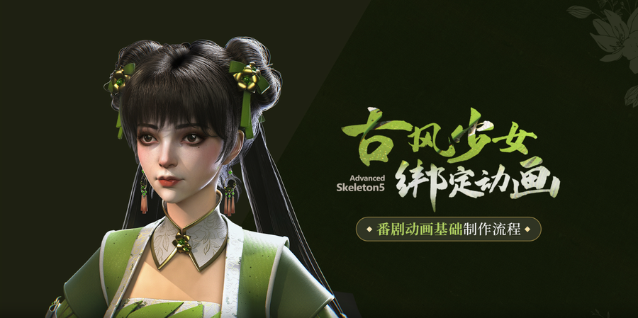   
先进行模型检查。先隐藏不必要的附属部件，只显示主体身体。
##  身体绑定
导入骨骼   
   
适配完成后，上臂，小臂，大腿启用次级骨骼   
   
蒙皮选择5，让影响更细腻   
   
可以隐藏次级控制器   
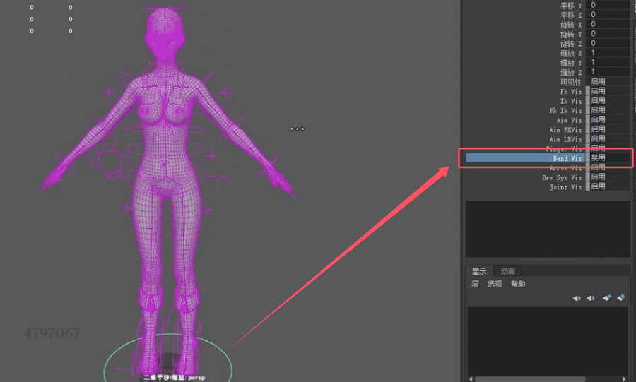
##  面部绑定
先对头部的整体权重进行调整   
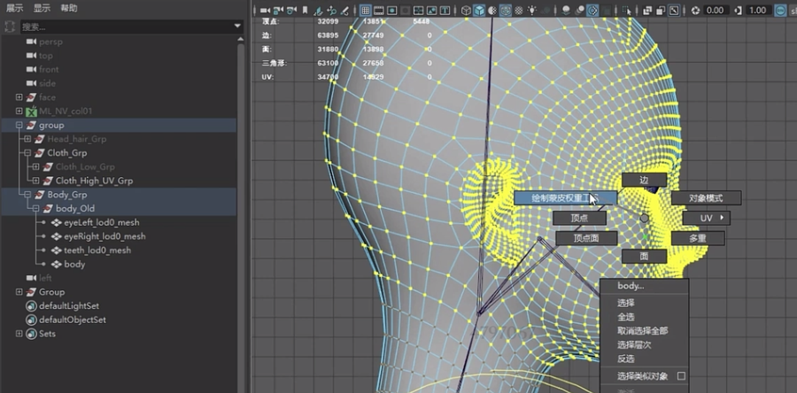   
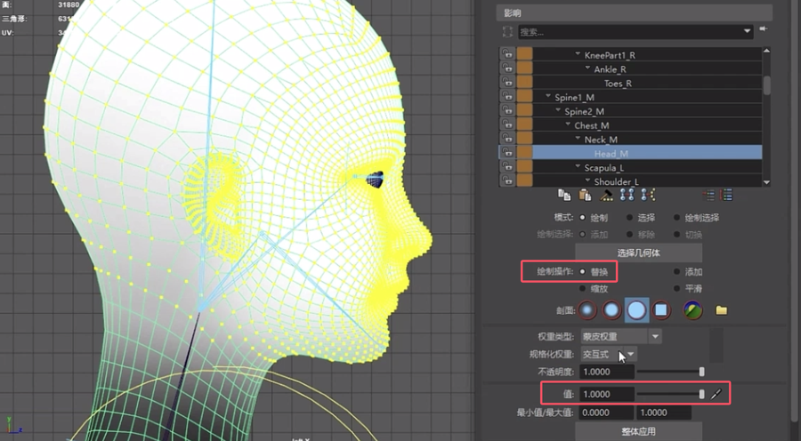   
眼睛同样给到头部骨骼全部的权重   

面部mask    
   
根据提示，一步步设置眼睛和嘴的细节   
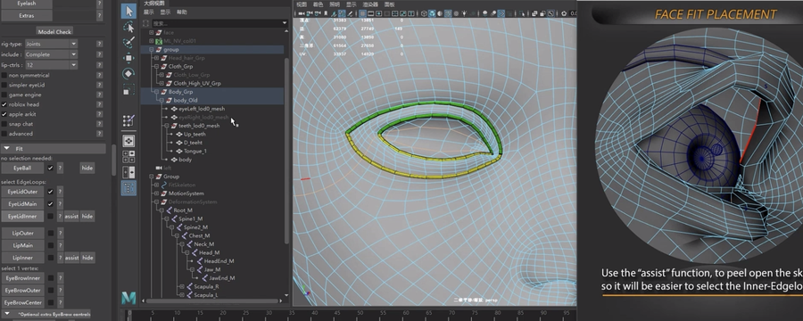   
   
继续添加眉毛细节    
   
继续添加额头，脸颊等区域细节   
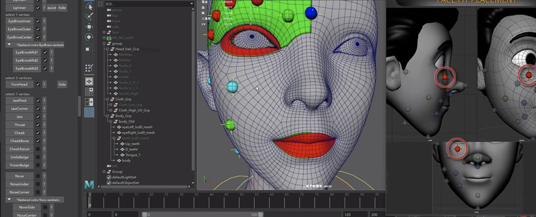   
    
添加瞳孔细节   
   
设置完成后，可以生成面部控制器   
   
可以进行蒙皮的测试    
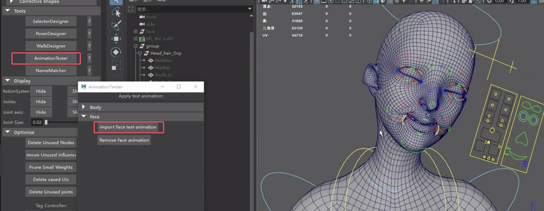    
现在可以使用插件进行蒙皮调整。可以用大致快速修正不合理的蒙皮   
## 身体权重处理   
先调整好左右影响的范围  
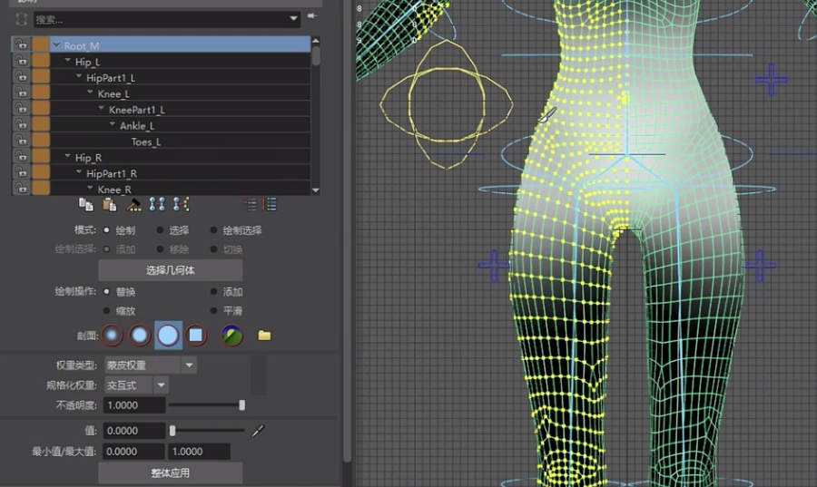  
调整蒙皮细节    
   
形体的缺失需要用BS来修正，权重比较难做到完美    
   
继续调整腿部   
   
对于结构比较复杂的部件，可以复制做一个简模，对简模绘制完权重后传递权重   
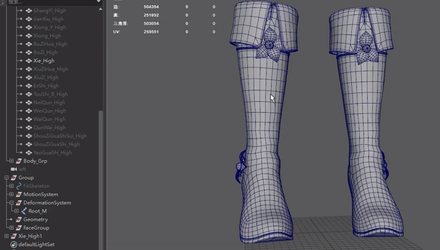   
先选择绘制好蒙皮的低模，再加选要粘贴权重的高模，进行权重拷贝   
      
粘贴回权重后进行检查和修改   
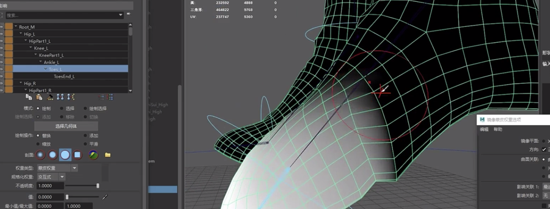   
继续调整身体权重  
   
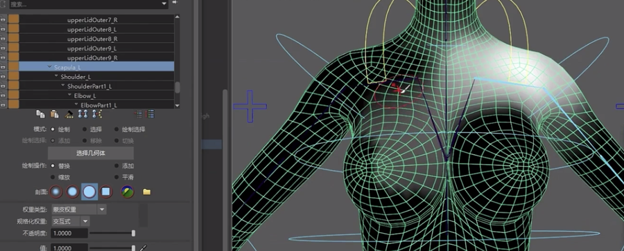   
继续调整脖子   
   
手臂权重  
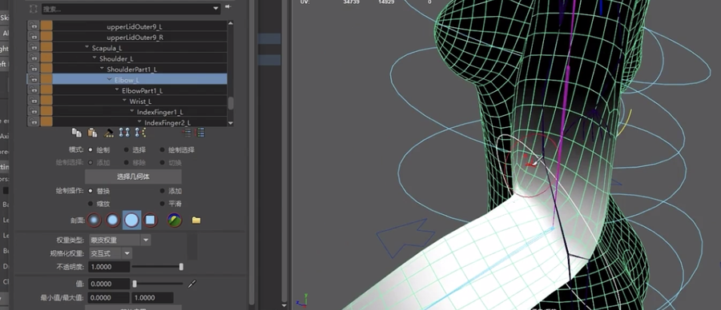   
手腕及手部权重调整  
   
   
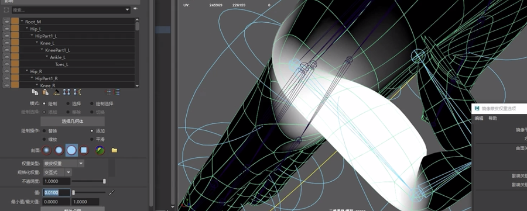
## 添加身体BS 
调整姿态到90° 选中姿态模型，创建BS   
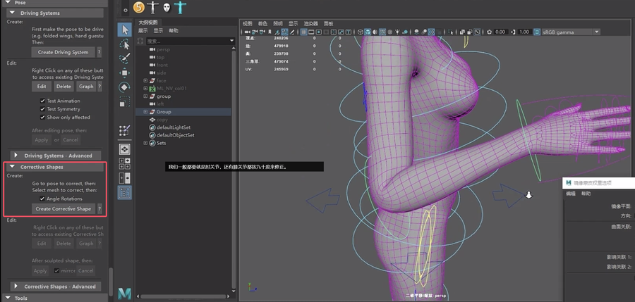   
进入顶点，调整模型     
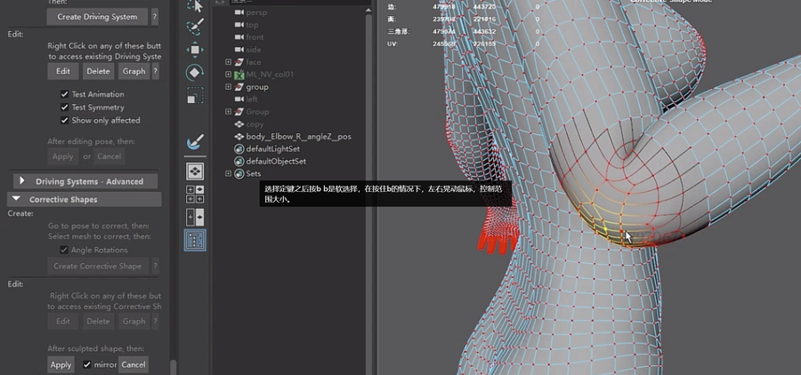   
结合雕刻工具，调整模型细节  
   
调整完后应用   
   
中间插值修改   
  
可以再添加一个中间状态  
   
ADV只能支持到90°的BS修型。超过的话需要单独添加     
   
重命名后在编辑状态激活的情况下进行编辑   
   
由于是自定义添加，控制器角度和BS之间还没关联上   
选中身体模型的BS节点后，把节点的对应属性作为被驱动物体   
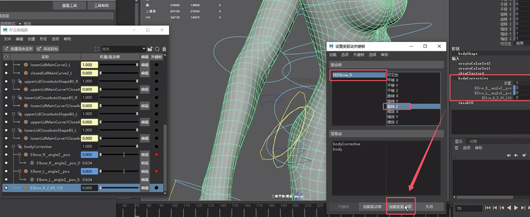   
需要在90-120的区间内设置驱动关键帧   
   
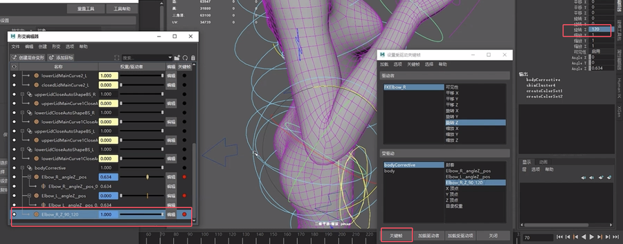   
自定义的BS部分没有自动镜像功能，需要手动操作.复制，改名，并翻转目标   

对BS驱动关键帧进行设置   
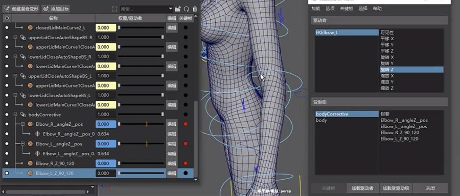   
手腕的BS创建及修型   
    
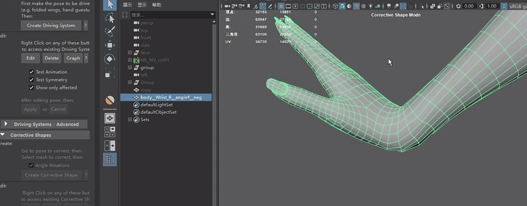   
反方向调整  
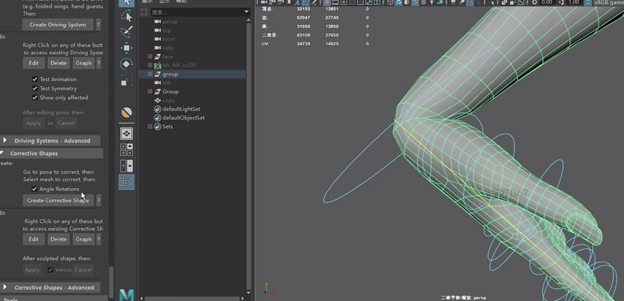   
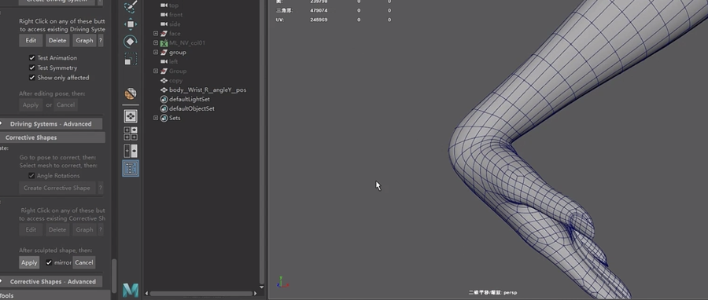   
旋转修正  
   

