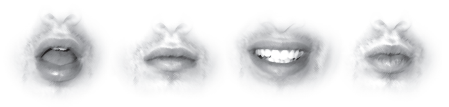
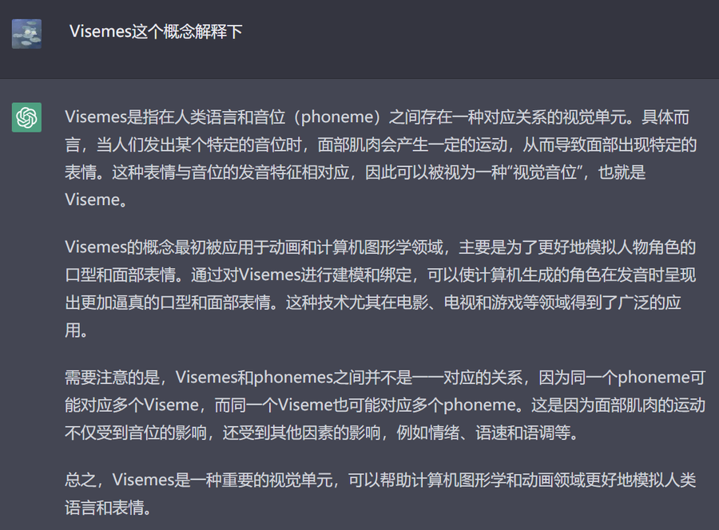

# 面部动画
### 口型同步要点
我们首先简化问题，并隔离不相关的。口型同步分为两个基本点：
>    Open/Closed, Wide/Narrow **张开/关闭，变宽/变窄**   
   
> 从本质上讲，这就是说话动画的全部内容。是创造言语幻觉所必需的。  
> 虽然可以映射说是某个音节发音，也是动画师的某种本能，但会把问题复杂化，过多细节会影响表演。  
> 在运动中是没法注意到这种程度的，只会记住运动的整体感受。  
> 口型同步是一种假象，往往不是物理上的准确。
### 分析做正确的事
> 慢下来较真分析说话，就会用力过猛，就会分析过度。  
> 比如pebble这个词放慢后会有很多肌肉的细微变化。但实际上呢，papa，mama和pebble的发音，在正常速率运动下看起来是一样的。  
> 我们不会做那种以为存在，实际上并不需要的动画。就像为角色的内脏制作动画一样。你看不到它们，所以为它们制作动画是一种愚蠢的浪费时间，口型同步也是一样。  
>正确的方式：搜索整体印象，并克制过快将自己埋没在细节中的冲动
***
### Speech Cycles 语音循环
> 其实音节没有固定的发音形状。
> 而是应该看作一个整体变化的一部分。这个整体有两个独立的循环：   
>    1.下巴上下的开合 open and closed, as in jaw movement  
>    2.嘴的左右宽窄挤压 narrow and wide, as in lip movement.

> 开合主要是发声。宽窄是变声  
> 体会对比下下面的变化细节：  
>    
> 这就是口型变化的核心。

‘ for good sync, you need shape keys that include things like G. ’  
在一些教程上会强调G发音的口型，是一个特殊重要的口型。
但实际上这样的情况很少出现。我们用一个瞬间去定义，往往都是局部片面的。口型总是处在语音的融合变化中。

***
###  Most Important: Visemes 视位

