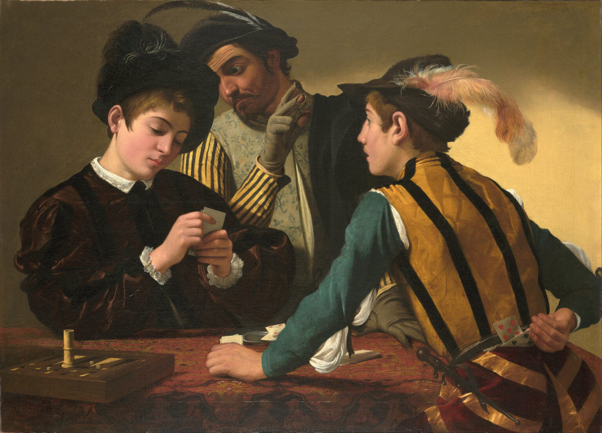
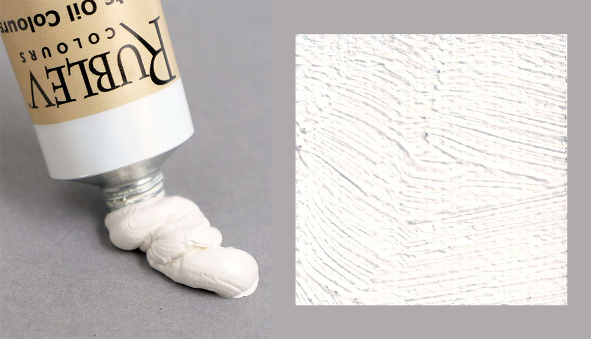
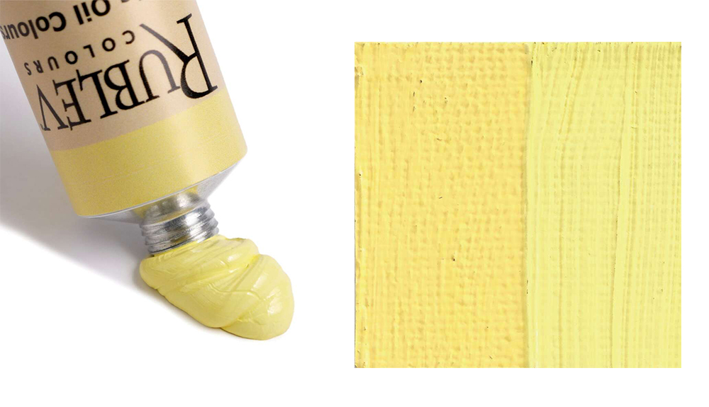
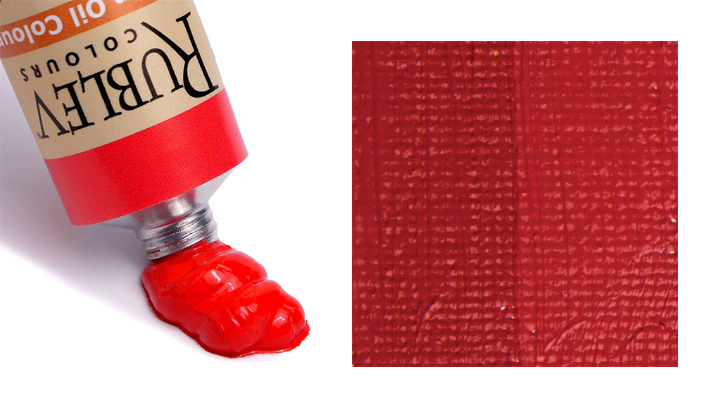
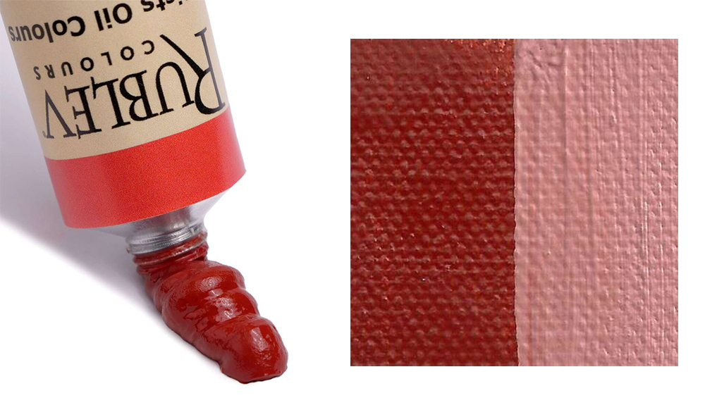

# 卡拉瓦乔
   
>  尺寸：94 cm × 131 cm (37 in × 52 in)   
>  [Kimbell Art Museum](https://kimbellart.org/collection/ap-198706)

   
> The Supper at Emmaus     

<https://www.nationalgallery.org.uk/paintings/michelangelo-merisi-da-caravaggio-the-supper-at-emmaus>

## 现代替代颜料对照表

| **卡拉瓦乔调色板颜色**    | **Rublev Colours**   (色号)           | **颜色样例**                                        | **鲁本斯（Rubens）**   (色号)  | **乔琴（Schmincke）**   (色号)  | **Pebeo 贝碧欧**   (色号)  |
|--------------------|---------------------------------------|-------------------------------------------------|--------------------------------|--------------------------------|----------------------------------------|
| **铅白**            | **Lead White #1**   (820-802)       |                      | **铅白**   (Rubens 254) | **铅白**   (Schmincke 168) | **铅白**   (Pebeo 400108)    |
| **铅锡黄**          | **Lead-Tin Yellow**   (820-309)     |                        | **铅锡黄**   (Rubens 408) | **铅锡黄**   (Schmincke 790) | **铅锡黄**   (Pebeo 400205)   |
| **黄赭**            | **Blue Ridge Yellow Ocher**   (820-303) |     | **黄赭**   (Rubens 200) | **黄赭**   (Schmincke 280) | **黄赭**   (Pebeo 400313)    |
| **铜绿**            | **Viridian**   (820-241)            |     | **翠绿色**   (Rubens 441) | **翠绿色**   (Schmincke 433) | **翠绿色**   (Pebeo 400204)    |
| **朱砂**            | **Cadmium Red Light**   (820-542)   |     | **镉红光**   (Rubens 520) | **镉红光**   (Schmincke 635) | **镉红光**   (Pebeo 400158)    |
| **红赭**            | **Venetian Red**   (820-504)        |     | **威尼斯红**   (Rubens 546) | **威尼斯红**   (Schmincke 646) | **威尼斯红**   (Pebeo 400352)    |
| **棕土**            | **Cyprus Raw Umber Medium**   (820-614) |     | **生土棕**   (Rubens 820) | **生土棕**   (Schmincke 358) | **生土棕**   (Pebeo 400151)    |
| **骨黑**            | **Bone Black**   (820-903)          |    | **骨黑**   (Rubens 849) | **骨黑**   (Schmincke 343) | **骨黑**   (Pebeo 400204)      |

### 备注：
- **铅白**（Lead White）：铅白是油画中最常用的白色，具有较好的覆盖力和柔和的调色效果。部分品牌可能也会提供 **锌白**（Zinc White）作为替代。
- **铅锡黄**（Lead-Tin Yellow）：是一种较为昂贵且稀有的颜色。如果不容易找到，也可以使用 **黄土**（Yellow Ochre）作为替代，但色调会稍微偏向棕色。
- **铜绿**（Viridian）：翠绿色是一种非常稳定的绿色，适合代替铜绿。由于铜绿易褐变，是更加稳定的替代选择。
- **朱砂**（Vermilion）：由于其稀缺性，使用 **镉红光**（Cadmium Red Light）作为替代是目前市场上最常见的做法。
- **威尼斯红**（Venetian Red）：这是一种温暖的红色，在许多经典油画中都有应用，所有品牌的高级系列都提供此色，效果非常接近。
- **棕土**（Raw Umber）：棕土是制作阴影和调和色的重要颜料。它是深色系中最常用的之一，各大品牌的高级系列都有提供。
- **骨黑**（Bone Black）：用于调和颜色，尤其是深色调。

## 淘宝上鲁本斯油画颜料对应

以下为卡拉瓦乔调色板颜色与鲁本斯色系中的可能对应色号：

| 卡拉瓦乔调色板颜色 | 鲁本斯色系中的对应色号         | 备注                           |
|--------------------|-------------------------------|------------------------------------|
| **铅白**          | 803 锡钛白                   | 可作为铅白的现代替代品         |
| **铅锡黄**        | 812 鲜黄 或 813 那不勒斯黄     | 接近传统铅锡黄的色调 |
| **黄赭**          | 861 土黄 或 862 土红           | 黄赭对应的暖色土系             |
| **铜绿**          | 857 中绿 或 859 翠绿           | 传统铜绿（Verdigris）不稳定，推荐使用 857 中绿或 859 翠绿      |
| **朱砂**          | 823 朱红 或 824 大红           | 镉红系列可替代传统朱砂         |
| **红赭**          | 863 赭石                     | 直接对应传统红赭               |
| **棕土**          | 864 深褐 或 865 熟褐           | 接近生赭（Raw Umber）的棕色系   |
| **骨黑**          | 874 煤黑                     | 骨黑的现代替代                 |
